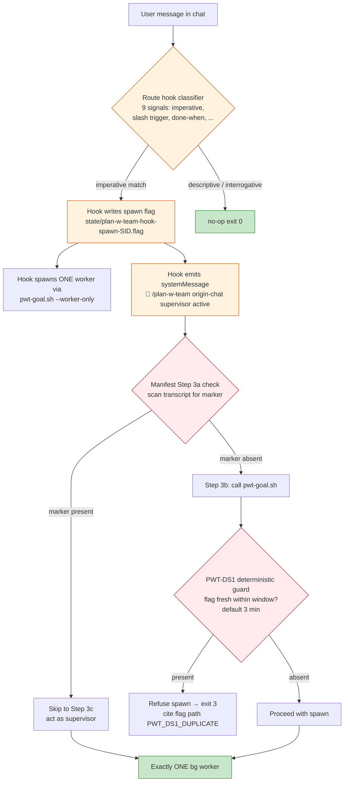
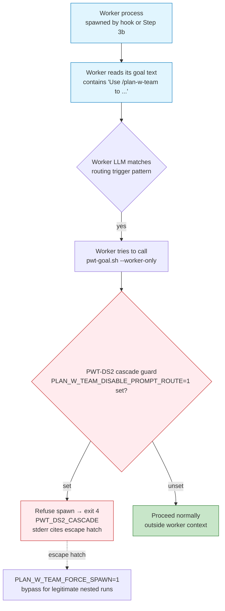
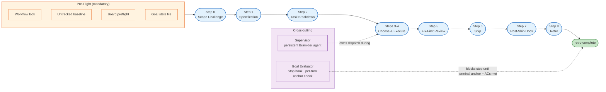

# Plan With Team Command

Full-lifecycle planning and execution workflow: scope challenge, specification, parallel implementation, fix-first review, ship pipeline, post-ship documentation, and quantitative retrospective. A single command that takes a feature from idea to shipped, reviewed, documented code.

Based on IndyDevDan's claude-code-hooks-mastery pattern, extended with gstack-inspired lifecycle stages (scope challenge, fix-first review, ship pipeline, retro), self-regulation heuristics, cognitive frameworks, and artifact handoffs between stages.

> **Design principles**: the governing principles behind this skill (spec-first gating, layered autonomy, no wall-clock caps, human-owned one-way doors, worktree isolation, self-regulation, …) are consolidated in [`docs/operations/plan-w-team-design-principles.md`](../../docs/operations/plan-w-team-design-principles.md). Read it before proposing structural changes — a change that weakens a principle needs a recorded scope-challenge verdict, not a silent edit.

## ⚠️ Routing Pre-Check (READ FIRST — runs before everything below)

**This pre-check has ABSOLUTE precedence over every other interpretation of "the user typed a slash command." If a trigger phrase matches, AUTO-LAUNCH and exit. No exceptions, no clarifying questions, no scope analysis, no "Skill is already loaded so this must be in-session" reasoning.**

### Step 1 — Trigger detection (do this FIRST, before any other reasoning)

Does the user's literal message match ANY of these patterns? (Case-insensitive substring match.)

- `use /plan-w-team to ...`
- `use our /plan-w-team to ...`
- `using /plan-w-team ...`
- `with /plan-w-team ...`
- `kick off /plan-w-team for ...`
- `start a /plan-w-team run to ...`
- Any message containing `definition of done` OR `done when` AND `/plan-w-team`

**If YES → AUTO-LAUNCH (see Step 3). Stop reading. Do not continue to Step 2.**

### Step 2 — In-session execution (ONLY when Step 1 did NOT match)

Continue in-session ONLY when one of these holds:

- **Bare slash invocation**: the message is essentially just `/plan-w-team <args>` with no natural-language verb wrapping (e.g., `/plan-w-team add auth flow` typed as the entire message).
- **Explicit in-session opt-in**: message says `in this session`, `right now in this session`, `run /plan-w-team here`, or equivalent.
- **Resume/ship/retro flags**: `--resume`, `--ship-only`, `--retro` present (those imply continuing existing work in this session).

If none of the above apply, RE-CHECK Step 1. Do not default to "in-session" — the trigger phrases above were chosen precisely because they always indicate autonomous intent.

### Step 3 — AUTO-LAUNCH action (when Step 1 matched) — `--worker-only` + origin-chat-supervisor protocol

The skill manifest Step 3 and the UserPromptSubmit route hook (`.claude/hooks/plan-w-team-route-prompt.sh`) MUST produce **exactly one** bg worker per user message, with the **originating chat acting as live supervisor**. Both paths use `pwt-goal.sh --worker-only` (NEVER `--launch` — that detached path was retired here; see BUG 2 in `docs/specs/pwt-route-hook-fixes.md`).

#### Step 3a — Double-spawn guard (READ FIRST)

If the route hook already fired on this turn, the Claude Code harness delivers its `systemMessage` field to your context as a `hook_system_message` attachment. The `additionalContext` field is silently dropped by the harness (confirmed 2026-05-21 in v2.1.148 — 0 of 20 expected `additionalContext` deliveries arrived; only `systemMessage` does). So the marker we check for is the systemMessage content the hook actually emits:

- If you see **`🚀 /plan-w-team origin-chat supervisor active`** (or the prefix `/plan-w-team origin-chat supervisor active`) already present in this turn's context → **DO NOT call `pwt-goal.sh`**. The worker is already spawned. Extract the worker SID from the systemMessage's `worker:  <SID>` line and skip directly to "Step 3c — Act as live supervisor" below. Use the inlined supervisor protocol in Step 3c — the full additionalContext protocol is dropped by the harness, so you cannot rely on it being delivered.
- If the marker is **NOT** present → the hook did not fire (possible reasons: classifier rejected as descriptive/interrogative, disabled via env/sentinel, hook path missing, or unusual harness). Proceed to Step 3b.

**History**: the original Bug 2 fix (commit `3790fca`) checked for the additionalContext marker `PWT-O1 origin-chat supervisor protocol`. That check NEVER fired because the harness drops additionalContext from UserPromptSubmit hooks. Result: every natural-language trigger produced double-spawn (hook spawn + manifest spawn). The systemMessage-based check above fires correctly because the harness DOES deliver systemMessage as a `hook_system_message` attachment.

**PWT-DS1 — process-level backstop (LLM-attention is first line, flag-file is backup):** the visual marker check above is the first line of defense, but LLM-attention is not load-bearing — an origin assistant can read the marker and still call `pwt-goal.sh --worker-only` anyway (the failure mode that produced commit `c9cfcd5`). The deterministic backstop is at the process level: when the route hook spawns a worker, it writes a flag file at `.claude/state/plan-w-team-hook-spawn-<parent_sid_short>.flag` containing the worker SID, parent SID, spawn timestamp, and trigger pattern. `pwt-goal.sh --worker-only` checks for this flag at startup; if a flag from the current parent SID is fresh within the `PWT_DOUBLE_SPAWN_WINDOW_MIN` window (default 3 minutes, mtime-based — the flag is not auto-deleted), it refuses to spawn (exit 3 (PWT_DS1_DUPLICATE label, code returns 3)) regardless of what the manifest narrative says. The flag is registered in `shared/state-artifacts.md`.

**PWT-DS2 — cascade guard (workers cannot self-multiply):** PWT-DS1 prevents the origin-chat double-spawn; PWT-DS2 prevents a different failure mode where a worker's own goal text contains `Use /plan-w-team to ...` (verbatim from the `pwt-goal.sh` template) and the worker's LLM matches the trigger pattern and calls `pwt-goal.sh` again. To stop the cascade, `pwt-goal.sh --worker-only` propagates `PLAN_W_TEAM_DISABLE_PROMPT_ROUTE=1` into the worker's environment; any subsequent `pwt-goal.sh` invocation (both `--worker-only` and `--launch`) detects this env signal and exits 4 (`PWT_DS2_CASCADE`). Escape hatch for legitimate nested runs: `PLAN_W_TEAM_FORCE_SPAWN=1` (documented in stderr of the refusal). See `shared/orchestrator-interception.md` §Cascade Guard for the full diagnostic chain that prompted commit `553ab85`.





#### Step 3b — Spawn worker (only if hook did not)

Execute exactly this:

```
Bash(.claude/scripts/pwt-goal.sh --worker-only "<user's literal message verbatim>")
```

The script:

- Spawns ONE `claude --bg` worker with the derived `/goal` directive.
- Sets `PLAN_W_TEAM_AUTO_APPROVE_PUSH=1` in the worker's environment so push-ack auto-clears.
- Emits exactly one machine-readable line on stdout: `worker_sid=<8-hex-sid>`.
- Returns synchronously (typically <1.5s).

Parse `worker_sid=<SID>` from stdout. If absent → fail open: emit one sentence explaining the launcher returned no SID, and stop (do NOT silently retry — the hook already had a chance, and the user can re-phrase).

#### Step 3c — Act as live supervisor (origin-chat-supervisor protocol)

The originating chat session (you) is now the live supervisor for the bg worker. This is the same protocol injected by the route hook (`shared/supervisor-protocol.md` §Parent-Child Terminal Propagation); inlined here so both entry paths produce identical behavior.

Supervisor responsibilities (perform in order, this turn):

1. **STATUS BLOCK** — emit a visible status block to the transcript within your next message:

   ```
   🚀 /plan-w-team routed → bg worker <SID>
      watching for stage transitions, pause-sites, supervisor decisions
   ```

2. **WAIT — event-driven by default** (do not guess a poll interval). Launch a background watcher that blocks until the worker reaches terminal/halt and wakes you the INSTANT it does — the harness re-invokes you when a `run_in_background` command exits:

   ```bash
   # Mark this origin chat as a supervisor so the goal-evaluator lets it YIELD
   # (sleep) instead of blocking its stop every turn (PWT-SUP-YIELD). The worker
   # never sets this (pwt-goal forces it to 0), so worker blocking is unchanged.
   export PLAN_W_TEAM_SUPERVISOR_SESSION=1
   # run_in_background: true
   .claude/scripts/plan-w-team-await-terminal.sh --slug "<SLUG>" --worker-sid "<SID>"
   ```

   It watches `plan-w-team-goal-<SLUG>.json`'s `terminal_state` (set by the evaluator for SUCCESS / USER_ESCALATION_HALT / LOW_CONFIDENCE_STREAK / API_HALT — sad path included) and worker liveness. The watcher is **worktree-aware (PWT-WT2)**: it resolves the goal-state each tick as explicit `--state-dir` → main `.claude/state/` → worktree fallback `.claude/worktrees/*/.claude/state/plan-w-team-goal-<SLUG>.json`, so a `--worker-only` worker isolated under `.claude/worktrees/<slug>/` is detected the INSTANT it flips terminal — not on the heartbeat. `<SLUG>` is the `SLUG_GUESS` under which `pwt-goal.sh --worker-only` **seeds** the goal-state at spawn (the always-on anti-skip anchor), so the worker idling at terminal without exiting is still detected via `terminal_state`. Exit `0` → terminal/halt (read it, emit the TERMINAL block); exit `3` → heartbeat re-arm (re-launch the wait — a heartbeat, NOT a wall-clock cap). This replaces active polling: no interval-guessing (no dev time lost between the worker finishing and you noticing), no turn burned per unchanged tick. Other observation primitives when you DO wake: `claude agents --json` (liveness), `claude logs <SID> --tail 200` (tail), `.claude/state/pwt-completion-summary-<SID>.md` (ship/retro summary).

   **Fallback** (event-driven wait unavailable, e.g. a cross-session gap): poll every ~30–60s via Bash + sleep, or `ScheduleWakeup` for idle gaps >5 min. Either way, surface every NEW transition; do not echo unchanged state.

3. **ESCALATION** — if the worker hits a hard-gate pause site (`push-ack`, `secret-scan-allow`, `scope-unlock-for-drift`) or logs 3 consecutive `confidence=low` supervisor decisions, surface a ⚠ HALT block and STOP polling — the user must respond. Note: `PLAN_W_TEAM_AUTO_APPROVE_PUSH=1` auto-clears `push-ack` inside the worker; expected progress past it is NOT a halt.

4. **TERMINAL BLOCK** — when the worker reaches terminal (SUCCESS / ESCALATION / DEAD), emit:

   ```
   ✅ /plan-w-team terminal: <SUCCESS|ESCALATION|DEAD>
      worker <SID>
      duration: <start→end>
      AC verdict: <pass/fail counts from spec>
      files changed: <stat>
      next action: <imperative>
   ```

   Also write the same content to `.claude/state/pwt-completion-summary-<SID>.md` for the archival hook.

5. **EXIT** — after the terminal block, you are done. Do not continue polling.

Hard rules:

- NEVER edit code, configs, or specs in supervisor mode. The worker does all implementation.
- NEVER spawn additional bg agents.
- NEVER push to remote — that is the worker + user's responsibility.
- If `claude agents --json` no longer lists the SID for >2 polls, treat it as DEAD and emit the terminal block.

### Worked failure mode (2026-05-20 cleanscale incident — DO NOT repeat)

User typed: `Use /plan-w-team to do a realistic audit for scope drift against advertised features on our cleanrev.io site...`

❌ **Wrong** (what happened): agent reasoned "this is direct slash invocation (not a re-route trigger), HOLD mode, 1-task audit, fast path qualifies" → ran pre-flight in-session → consumed the user's interactive session for a multi-minute audit. The agent saw `/plan-w-team` as a slash token and dismissed the surrounding `Use ... to do ...` natural-language envelope.

✅ **Right**: the message contains the substring `Use /plan-w-team to ` → Step 1 matches → run Step 3a's double-spawn guard. If the UserPromptSubmit hook already spawned the worker (`/plan-w-team origin-chat supervisor active` marker present in the turn's `hook_system_message`), skip to Step 3c (act as live supervisor); otherwise call `Bash(.claude/scripts/pwt-goal.sh --worker-only "Use /plan-w-team to do a realistic audit ...")`, then Step 3c. PWT-DS1 (process-level flag file) backstops the visual check; PWT-DS2 prevents the worker from cascading. Both paths land on the same single-worker + origin-chat-supervisor state.

**The slash presence in prose does NOT make the message a "direct slash invocation."** Direct slash invocation means the user typed `/plan-w-team` as the leading command token (alone or with bare args after it), NOT inside a natural-language sentence beginning with `Use` / `With` / `Using` / `Kick off` / `Start`.

A simple parser: if the user's message — stripped of the leading slash command if any — starts with a verb like `use`, `using`, `kick`, `start`, `do`, `try`, `have`, `let`, `please use`, etc. and contains `/plan-w-team` as an object of that verb, it's a re-route trigger. The slash command being present does not override that.

### Why this matters

The user's proven autonomous workflow (24+ hour runs in cleanscale) puts `/goal` as the outer loop with `/plan-w-team` as the executor. The autonomous-run pattern has no wall-clock or turn caps — it terminates only on goal-success or hard-gate halt. Consuming the user's foreground session for that work defeats the entire pattern: the user is now blocked on a multi-hour interactive session instead of being free to do other work.

See `.claude/commands/pwt-goal.md` for the derivation skill and `.claude/scripts/pwt-goal.sh` for the underlying script.

## Pipeline Overview

The skill is an 8-stage pipeline (Steps 0–8). The lead reads the stage file at the start of each step (unless the fast path applies — see "Fast Path" below) and executes it. Two cross-cutting concerns wrap the entire run: the **goal evaluator** (a Stop hook that fires per turn and blocks termination until terminal anchors appear) and the **supervisor** (a persistent Brain-tier agent that owns dispatch during Step 3-4 when the run uses parallel builders).



**Reading the diagram:**

- **Pre-flight** runs once per invocation. Each item is enforcing (workflow lock prevents duplicate runs on the same SLUG; baseline anchors the Step 5 ship gate; goal state file is the bridge to the evaluator hook).
- **Steps 0–8** run in sequence. Re-entry via `--resume`, `--ship-only`, `--retro` skips to the relevant step (see Flag Routing).
- **Supervisor** only activates when Step 3-4 chooses parallel builders. Lead-implements-directly and single-builder strategies skip the supervisor entirely.
- **Goal Evaluator** is always-on while the goal state file exists. It blocks `Stop` until the transcript contains both the generic SUCCESS anchors (`stage="retro-complete"` + `workflow_lock="done"`) AND every feature-specific `AC<N>: PASS` line derived in Step 1 §1.5. See `shared/goal-conditions.md` for the full state machine.

## Usage

```
/plan-w-team [feature description]
/plan-w-team --resume        # Resume incomplete work from task list
/plan-w-team --ship-only     # Skip to Step 5+ (review/ship/docs/retro)
/plan-w-team --retro         # Run retro only on recent shipped work
```

For simple parallel changes across files (same pattern, no spec needed), use `/batch` instead. `/plan-w-team` is for spec-first features with dependencies between tasks.

## Intent Detection

The user does NOT need to remember flags. Infer intent from natural language and route accordingly:

| User says something like...                           | Route to                |
| ----------------------------------------------------- | ----------------------- |
| "Add alerting system with email notifications"        | Full lifecycle (0-8)    |
| "Review the auth module I just finished"              | Steps 5-8 (review+ship) |
| "Deep review of my changes, don't ship yet"           | Step 5 only (review)    |
| "Ship what's on this branch"                          | Steps 5-8 (review+ship) |
| "How did that feature go? What are the metrics?"      | Step 8 only (retro)     |
| "Pick up where we left off on the alerting work"      | Resume (3-4 then 5-8)   |
| "Just update the docs and changelog for this release" | Steps 7-8 (post-ship)   |

When ambiguous, ask. When clear, just start the right step — no flag needed.

Explicit flags (`--ship-only`, `--retro`, `--resume`) still work as shortcuts.

## Scope Mode

Before starting, select a scope mode that controls planning intensity:

| Mode                 | When to Use                            | Behavior                                                       |
| -------------------- | -------------------------------------- | -------------------------------------------------------------- |
| **EXPAND**           | Greenfield, exploring possibilities    | Dream big, propose expansions, opt-in ceremony per addition    |
| **SELECTIVE EXPAND** | Have a plan, open to cherry-picking    | Hold core scope + present expansion options individually       |
| **HOLD** (default)   | Clear requirements, execute with rigor | Maximum scrutiny on current plan, no scope additions           |
| **REDUCE**           | Tight deadline, MVP focus              | Strip to essentials, flag everything non-critical for deferral |

If the user does not specify, default to **HOLD**. Ask only if the feature description is ambiguous.

## Process

Each step is defined in a separate stage file. **Read the stage file when you reach that step** — do not load all stages upfront.

### Fast Path — when stage-file Reads MAY be skipped

The default contract above (Read the stage file when you reach that step) exists because skill drift between conversation memory and the canonical stage file silently degrades pipeline quality. **One narrowly-defined exception applies:**

**Fast-path criterion (BOTH must hold):**

1. **Scope mode is HOLD** — no scope expansion, no exploratory mode, no REDUCE bargaining; the work is bounded by an explicit user-provided checklist.
2. **Task count ≤ 2** — the implementation expands to two or fewer discrete tasks in Step 2 (or, for pre-counted user requests, ≤ 2 distinct deliverables).

When BOTH hold, the lead MAY skip reading a stage file IF the lead has internalized that stage from the in-conversation skill load (initial Skill invocation) and is confident about its contract.

**Outside the fast path** (anything else — EXPAND/SELECTIVE EXPAND/REDUCE scope OR > 2 tasks): the lead MUST Read the stage file at each step.

**Bypass warning (MANDATORY when bypassing outside fast path):** If the lead decides to skip a stage-file Read AND the fast-path criterion does NOT hold, the lead MUST emit a warning to the transcript before proceeding. Warning format (grep-able by retros and supervisors):

```
⚠ stage-file-bypass: skipping <stage_name> — reason: <reason>
```

Where `<stage_name>` is one of `00-scope-challenge`, `01-specification`, `02-task-breakdown`, `03-execute`, `04-fix-first-review`, `05-ship`, `06-post-ship`, `07-retro` (or a shared/ stage). The `<reason>` should be one short clause (e.g., "already loaded in this turn", "trivial doc-only edit", "Step 5 review only references stage file by name").

**ALSO append the same line to the run's bypass log** so the marker is countable after compaction (the transcript is not reliably greppable from the retro stage):

```bash
printf '⚠ stage-file-bypass: skipping %s — reason: %s\n' "<stage_name>" "<reason>" \
  >> ".claude/state/plan-w-team-bypass-${SLUG}.log"
```

Step 8 retro **does** count these (§8j-octies) via `.claude/scripts/plan-w-team-bypass-rate.sh`, emitting a 1-5 `bypass_rate` quality signal into the retro JSON (0 bypasses = 5). This is a _floor_: it counts markers the lead actually emitted — a silently-skipped Read that never emitted a marker is not caught (true detection would need a hook diffing stage-file Read tool-calls). A run with multiple unjustified bypasses suggests the stage files need consolidation or the fast-path criterion needs widening. See audit P1 (`docs/operations/pwt-principles-enforcement-audit-2026-06-02.md`).

### Top-of-Pipeline Goal Activation (PWT-T5b)

Before Pre-Flight, **activate the self-hosted goal evaluator** by writing a goal state file. The evaluator is a Stop hook (`.claude/hooks/plan-w-team-goal-evaluator.sh`) that fires after every Claude turn while the state file exists. It deterministically grep-checks the transcript for terminal-state anchors and either lets Claude stop (terminal reached) or blocks the stop with guidance to keep working.

**Why a state-file activation instead of `/goal`:** the previous design wrapped Anthropic's `/goal` slash command, but slash commands are user-typed and the agent cannot invoke them on the user's behalf. State-file activation works in both interactive and agent-driven usage.

**Skip this block when** `PLAN_W_TEAM_DISABLE_GOAL=1` is set (kill switch — hook exits 0 without evaluation).

**Otherwise, write the goal state file:**

```bash
SLUG="<feature-slug>"   # same slug used by the rest of the pipeline
STATE_DIR=".claude/state"
mkdir -p "$STATE_DIR"

cat > "$STATE_DIR/plan-w-team-goal-${SLUG}.json" <<EOF
{
  "slug": "${SLUG}",
  "started_at": "$(date -u +%Y-%m-%dT%H:%M:%SZ)",
  "terminal_state": null,
  "terminal_reason": null
}
EOF
```

That's it. The hook activates automatically on the next Claude turn. The condition (3 terminal states — SUCCESS, USER_ESCALATION_HALT, LOW_CONFIDENCE_STREAK; **no wall-clock or turn caps by design**) is implemented in the hook — see `shared/goal-conditions.md` for the anchor patterns the evaluator looks for and how each lead stage / supervisor turn contributes signals.

**Feature-specific criteria (PWT-T5c):** Step 1 §1.5 (after the AC snapshot) injects `feature_specific_done_criteria` derived from the spec's `AC<N>:` entries into the goal state file. The hook then AND-checks the generic SUCCESS anchors with every feature criterion — SUCCESS fires only when both are satisfied in the transcript. This makes the "definition of done" feature-specific rather than generic. No action needed here at top-of-pipeline; Step 1 handles the injection.

**Block-cap consideration:** Claude Code defaults the Stop-hook block cap to 8 consecutive blocks. A full `/plan-w-team` run can exceed that. Set `CLAUDE_CODE_STOP_HOOK_BLOCK_CAP=200` in your shell environment (e.g., `~/.zshrc`) before invoking `/plan-w-team` so the hook can block through a complete pipeline run without being overridden. This is a one-time shell config, not a per-invocation step.

After the state file is written, proceed to Pre-Flight: Board Auto-Setup below. Each lead-driven stage emits a `status` block at end-of-stage via `.claude/scripts/plan-w-team-surface-status.sh`; the supervisor emits a `summary` block per turn during Step 3-4 (see `shared/supervisor-protocol.md`). The evaluator hook grep-matches both block types.

**Cleanup:** Step 8 retro deletes the goal state file as part of its cleanup on `RETRO_SUCCESS=1` (mirrors fleet log + baseline cleanup).

### Pre-Flight: Background Session Worktree (MANDATORY when `claude --bg`)

When `/plan-w-team` is invoked inside a background session (`claude --bg`, the `Agent` tool, or any non-interactive harness that will perform Edit/Write operations), the lead session MUST run inside its own git worktree BEFORE any file-edit stage. Verify with `pwd` — if the path contains `.claude/worktrees/`, the lead is already isolated. Otherwise, call `EnterWorktree` immediately after Pre-Flight: Workflow Lock (and before Step 0).

**Why this matters** (lessons from the 2026-05-20 holistic-check retro):

1. **State-file split** — without a worktree, state files written by the lead land in the main checkout, while the goal-evaluator (running in a different harness `$PWD`) looks for them elsewhere. The fallback added to `surface-status.sh` and `plan-w-team-goal-evaluator.sh` (worktree-aware lookup) mitigates but does not eliminate this; the safe default is "lead lives in worktree".
2. **Baseline pollution** — the Step 5 untracked-file gate captures the pre-run baseline once at preflight. Edits in the main checkout while a parallel session is also active produce a noisy baseline diff.
3. **Conflicting concurrent edits** — two background sessions on the same checkout will race on Edit/Write of the same file. Worktrees are the per-session isolation boundary.

**Invocation pattern:**

```
EnterWorktree({ name: "<feature-slug>" })   # if not already in a worktree
```

After EnterWorktree, the session's `$PWD` is the worktree path; all subsequent Pre-Flight steps (baseline, workflow lock, goal state) run inside it. ExitWorktree happens implicitly when the session ends (or explicitly after Step 8 retro if you want the main checkout to inherit the merge).

**Exception:** Interactive `claude` sessions (live user) that DO NOT plan file edits (e.g., `--retro` only on already-committed work, status checks) MAY skip this. Any path that will Write or Edit MUST be in a worktree under `--bg`.

### Pre-Flight: Board Auto-Setup (MANDATORY)

Before starting any step, **run the preflight script**. This is a single command, not optional:

```bash
.claude/scripts/board-preflight.sh
```

This script is idempotent — if the board already exists, it exits immediately. If not, it:

1. Copies `board.sh` to `scripts/` if missing
2. Detects the repo owner from the git remote
3. Creates a GitHub Projects v2 board via `board.sh init` (which attempts to **clone from a canonical org template** before falling back to from-scratch creation)
4. Commits `scripts/board.sh` and `.github/board.json`

If the script fails with an auth error, tell the user to run `! gh auth login` before continuing.

**Do not skip this step. Do not inline the logic. Just run the script.**

#### If the Preflight Fails

The preflight script prints a reference to `docs/operations/BOARD_TEMPLATE_RUNBOOK.md` with a specific failure mode (FM-1 through FM-11) on every error path. When this happens:

1. **Read the matching failure mode** in the runbook. It documents every known failure with a diagnosis command and an exact recovery procedure.
2. **Apply the recovery** before retrying the preflight. Do not retry blindly — the runbook tells you whether the fix is a token refresh, a `--no-template` override, a stale-cache clear, or a template re-creation.
3. **If the failure mode is not documented**, read §8 of the runbook (Failure Modes & Recovery) end-to-end, then fall back to §9.6 (Throwaway test procedure) to reproduce the issue on a disposable repo before attempting further recovery on the user's repo.
4. **Never delete `.github/board.json` as a first recovery step** — it is the only pointer to the board. Use §9.3 (Re-init an existing repo) if a reset is needed.

The runbook is the single source of truth for template-clone behavior, GraphQL constraints, and what `copyProjectV2` does and does not preserve. Read §7 (What Gets Inherited) before telling the user a board is "missing" something — Sprint fields, views, and workflow enabled-state are only inherited from templates, not created from scratch.

### Pre-Flight: Untracked Baseline Capture (MANDATORY)

Immediately after board preflight (and before Step 0), snapshot the current untracked file set. This is the anchor the Step 5 ship gate uses to distinguish pre-existing dirt from files the run itself introduces.

```bash
SLUG="<feature-slug>"  # same slug used for the spec file
mkdir -p .claude/state

# Ensure baseline/retro patterns are gitignored (idempotent — sync scripts don't touch .gitignore)
if ! grep -q "plan-w-team-untracked-baseline-" .gitignore 2>/dev/null; then
  printf '\n.claude/state/plan-w-team-untracked-baseline-*.txt\n.claude/state/plan-w-team-retro-*.json\n' >> .gitignore
  echo "✓ added /plan-w-team state patterns to .gitignore"
fi

git ls-files --others --exclude-standard | sort \
  > .claude/state/plan-w-team-untracked-baseline-"$SLUG".txt
```

**Why this runs here, not later**: Capturing at preflight is the only point that reliably excludes pre-existing dirt. Any later capture would miss Step 0-4 artifacts as "new" and force unnecessary classification prompts, or (worse) misclassify the feature's own spec file as pre-existing.

**Why this file lives under `.claude/state/`**: The baseline/retro patterns are gitignored (the preflight adds them if missing), the directory survives compaction, and the file is keyed by `<slug>` so parallel `/plan-w-team` runs on different features never collide.

The baseline is consumed by Step 5 (Ship) and deleted by Step 8 (Retro) on successful completion. Failed runs leave it intact so `--resume` can read it.

Full decision matrix, IGNORE pattern guidance, DISCARD value-carrier guard, and worked examples live in `.claude/commands/plan-w-team/shared/untracked-hygiene.md`. Read that file when you reach Step 5 — do not load it here.

### Pre-Flight: Workflow Lock (MANDATORY)

Immediately after baseline capture, acquire a per-SLUG workflow lock. This prevents two concurrent `/plan-w-team` sessions on the same SLUG from clobbering each other's state files (spec, tasks, retro, scope-lock). Per-SLUG (not global) so legitimate parallel features still work.

```bash
WORKFLOW_LOCK_DIR=".claude/state/plan-w-team-workflow-${SLUG}.lock"

# Stale-lock recovery: if the dir exists but its owner PID is dead, take it over.
if [ -d "$WORKFLOW_LOCK_DIR" ]; then
  STALE_PID=$(cat "$WORKFLOW_LOCK_DIR/pid" 2>/dev/null || echo "")
  if [ -n "$STALE_PID" ] && ! kill -0 "$STALE_PID" 2>/dev/null; then
    echo "⚠ stale workflow lock from dead PID $STALE_PID — reclaiming"
    rm -rf "$WORKFLOW_LOCK_DIR"
  fi
fi

if ! mkdir "$WORKFLOW_LOCK_DIR" 2>/dev/null; then
  OWNER_PID=$(cat "$WORKFLOW_LOCK_DIR/pid" 2>/dev/null || echo "unknown")
  echo "✗ another /plan-w-team session is active on SLUG=$SLUG (PID $OWNER_PID)"
  echo "  if that session is dead, run: rm -rf $WORKFLOW_LOCK_DIR"
  exit 1
fi
echo "$$" > "$WORKFLOW_LOCK_DIR/pid"

# Chain the release trap so it does NOT clobber any later EXIT handlers.
# (See shared/shell-safety.md for the trap-chain rationale.)
EXISTING_TRAP=$(trap -p EXIT | sed -E "s/^trap -- '(.*)' EXIT$/\\1/")
trap "${EXISTING_TRAP:+${EXISTING_TRAP}; }rm -rf \"$WORKFLOW_LOCK_DIR\"" EXIT
```

**Why per-SLUG and not global**: Two features can legitimately run in parallel (different specs, different worktrees). What must NOT race is two sessions both writing `plan-w-team-scope-lock-$SLUG.json`, `plan-w-team-retro-$SLUG.json`, etc. — the SLUG keying provides exclusivity per-feature.

**Why mkdir and not flock**: macOS lacks `flock(1)`. `mkdir` is atomic on every POSIX filesystem and survives compaction. Same pattern as `plan-w-team-push.lock` in Step 5 and `plan-w-team-friction-log.lock` in Step 8.

**Stale-lock recovery**: If a previous session crashed without releasing, the dir is reclaimed automatically when its owner PID is no longer alive. Manual override is the documented escape hatch in the error message.

**Resume contract**: `--resume` and `--ship-only` must reuse the same SLUG and re-acquire the lock here. If the lock is held by a different live PID, that's a real conflict — surface it; don't silently overwrite.

### Pre-Flight: Recursive Follow-Ups Carry-Forward (surfacing)

Surface any OPEN follow-ups that a PRIOR run's Step 8 retro queued (the
recursive-improvement loop, retro §8j-decies). This is the "informed retro → next run is
better" closure: findings captured last time are shown now so they get addressed, not
forgotten. Read-only and fail-open — never blocks the run.

```bash
FOLLOWUPS_LOG=".claude/state/plan-w-team-recursive-followups.jsonl"
if [ -f "$FOLLOWUPS_LOG" ] && command -v jq >/dev/null 2>&1; then
  OPEN=$(jq -rs '[.[] | select(.status=="open")] | length' "$FOLLOWUPS_LOG" 2>/dev/null || echo 0)
  if [ "${OPEN:-0}" -gt 0 ]; then
    echo "🔁 $OPEN open recursive-improvement follow-up(s) from prior retros — consider folding into this run's scope:"
    jq -rs '[.[] | select(.status=="open")] | .[-5:][] | "   • [\(.slug)] \(.text)"' "$FOLLOWUPS_LOG" 2>/dev/null || true
    echo "   (resolve one by appending a {status:\"done\"} row or editing it; this is advisory, not a gate.)"
  fi
fi
```

These follow-ups are advisory carry-forward, not a hard gate — the user decides whether a
given improvement belongs in this run's scope or a later one. The list is the durable memory
that makes the skill improve across runs rather than only within one.

### Step 0: Scope Challenge

Read `.claude/commands/plan-w-team/00-scope-challenge.md` and execute it.
Challenge the premise before writing any spec. Can kill bad ideas early.

### Step 1: Generate Specification

Read `.claude/commands/plan-w-team/01-specification.md` and execute it.
Create a persistent spec at `docs/specs/<feature-name>.md` with requirements, technical design, error maps, shadow paths, and test plan.

### Step 2: Create Task Breakdown

Read `.claude/commands/plan-w-team/02-task-breakdown.md` and execute it.
Decompose by feature into tasks with metadata, dependencies, scope tags, and bisectable ordering.

### Step 3-4: Choose Strategy & Execute

Read `.claude/commands/plan-w-team/03-execute.md` and execute it.
Select execution strategy, spawn parallel builders with worktree isolation, monitor progress, merge in bisectable order.

### Step 5: Fix-First Review

Read `.claude/commands/plan-w-team/04-fix-first-review.md` and execute it.
Two-pass review (CRITICAL blockers + INFORMATIONAL items). Auto-fix mechanical issues, batch ASK items for user.

### Step 6: Ship

Read `.claude/commands/plan-w-team/05-ship.md` and execute it.
Test suite, coverage audit, version bump, CHANGELOG, bisectable commits, push/PR.

### Step 7: Post-Ship Documentation

Read `.claude/commands/plan-w-team/06-post-ship.md` and execute it.
Documentation audit, cross-doc consistency, TODOS cleanup, deferred items check.

### Step 8: Retro

Read `.claude/commands/plan-w-team/07-retro.md` and execute it.
Quantitative retrospective with metrics, quality signals, streak tracking, self-assessment.

## Flag Routing

| Flag          | Steps Executed                              | Notes                                  |
| ------------- | ------------------------------------------- | -------------------------------------- |
| (none)        | 0 -> 1 -> 2 -> 3-4 -> 5 -> 6 -> 7 -> 8      | Full lifecycle                         |
| `--resume`    | 3-4 (with resume logic) -> 5 -> 6 -> 7 -> 8 | Read 03-execute.md, use Resume section |
| `--ship-only` | 5 -> 6 -> 7 -> 8                            | Assumes code is already implemented    |
| `--retro`     | 8 only                                      | Retro on recent shipped work           |

## Model Strategy (ACTIVE)

Split model tiers by cognitive demand to conserve daily allowance. Builder agents consume ~80% of total tokens but need execution speed, not deep reasoning. Reserve the newest model generation for roles where reasoning quality directly affects outcomes — and route by **task difficulty**, not just role: on hard multi-step work the cost equation inverts (a smaller model grinds through failed iterations, each one re-triggering Brain-tier review), so known-hard tasks go straight to the Opus lane (Anthropic: "knowing more vs. trying harder", claude.com/blog/claude-model-and-effort-level-in-claude-code).

| Role                | Tier  | Pinned Model      | Agent Definition                                  | Rationale                                                         |
| ------------------- | ----- | ----------------- | ------------------------------------------------- | ----------------------------------------------------------------- |
| Lead (you)          | Brain | Opus 4.8 (alias)  | invoking session default                          | Orchestration, judgment calls, scope decisions                    |
| Evaluator           | Brain | `claude-opus-4-8` | `.claude/agents/team/evaluator.md` frontmatter    | Independent quality assessment                                    |
| Fix-First Reviewer  | Brain | `claude-opus-4-8` | lead-invoked Pass 1/2 review                      | Security review, one-way door scrutiny                            |
| Validator           | Brain | `claude-opus-4-8` | `.claude/agents/team/validator.md` frontmatter    | Security-critical read-only review                                |
| Builder (hard lane) | Brain | `claude-opus-4-8` | `.claude/agents/team/builder-opus.md` frontmatter | `difficulty: hard` tasks — novel/cross-cutting/ambiguous/security |
| Builder agents      | Hands | `claude-sonnet-5` | `.claude/agents/team/builder.md` frontmatter      | Routine, well-specified implementation (default lane)             |
| Ship pipeline       | Lead  | lead session      | lead-invoked mechanical steps                     | Version bump, changelog, push (~5% of tokens)                     |
| Retro               | Lead  | lead session      | lead-invoked metrics phase                        | Metrics collection, streak tracking (minor)                       |

**This table is the single canonical tier→model-ID map for the skill.** Prose elsewhere should name the **tier** ("Brain tier" / "Hands tier") and point here; the literal model IDs live here and in agent-definition frontmatter only (see the frontmatter-pin exception below). A generation rollover is therefore a one-table edit here plus the unavoidable frontmatter-pin updates.

> **Generation note (2026-07-09, skill 1.51.0 — Model Tiering v2):** Brain tier is **Opus 4.8** (`claude-opus-4-8`, alias `opus`); the Hands **routine lane** is **Sonnet 5** (`claude-sonnet-5`) and the **hard lane** is Opus 4.8 via `team/builder-opus`. Opus 4.7 is retired from the tiers — it carries the same usage weight as 4.8 with worse output (Anthropic: 4.8's default effort beats 4.7 at comparable token usage), so the old 4.8/4.7 split saved nothing. Sonnet 5 is near-Opus on coding/agentic work, uses the same tokenizer as Opus 4.7/4.8 (briefs and budgets carry over), and on Max draws largely from the separate, larger Sonnet weekly bucket. Step 2 sets `difficulty: hard` per task to route to the hard lane (see `02-task-breakdown.md` §Model-Lane Routing). Step-5 reviewers (`test-gap-analyzer`, `security-gap-analyzer`) and the planning `system-architect` remain Brain-tier (4.8); `react-typescript-specialist` / `rust-backend-specialist` are Hands (Sonnet 5).

### How tier pinning works (IMPORTANT — read before editing Agent calls)

The Agent tool's `model` parameter **only accepts the aliases `opus` / `sonnet` / `haiku`**. It does NOT accept full model IDs like `claude-opus-4-7`. Passing a full ID will fail the tool's input validation.

To pin a specific generation or tier (Opus 4.8 vs Sonnet 5):

1. **Set the full model ID in the agent-definition frontmatter** (e.g., `model: claude-opus-4-8` in `.claude/agents/team/evaluator.md`).
2. **Do NOT set `model:` in the Agent tool call** — if you do, the alias will override the frontmatter pin and defeat the tier split.
3. **Effort pins (1.52.2)**: `team/builder.md`, `team/builder-opus.md`, and `team/evaluator.md` carry `effort: high` frontmatter. Subagent effort otherwise INHERITS the session effort (documented default), so a lead escalated to `/effort xhigh` or ultracode would silently bleed xhigh into the entire builder fan-out and the throughput-sensitive evaluator loop — the effort-axis twin of the Fable model-default incident. Per-task escalation still works via the prompt-phrasing rung (`ultrathink`, 04-fix-first REQ-3); Anthropic's guidance is to run each model's default effort for most work, and `high` IS the default for Sonnet 5 and Opus 4.8.
4. For mechanical work done directly by the lead (ship, retro), no pinning is needed — the lead's session model is used. These phases are short (~5% of total tokens combined), so running them on the lead's Brain-tier model is not a meaningful cost concern. If you want to force Hands-tier for ship/retro, delegate to a `builder`-type subagent for the mechanical steps.

When a new model generation ships (rollovers applied: Opus 4.8 on 2026-05-28; Model Tiering v2 / Sonnet-5 Hands on 2026-07-09):

- Update Brain-tier frontmatter pins to the new Opus generation (e.g., next time `claude-opus-4-8` → `claude-opus-4-9`). The hard-lane `team/builder-opus` pin tracks the **Brain** generation.
- Update the Hands routine lane to the current Sonnet generation (e.g., next time `claude-sonnet-5` → the next Sonnet). Do NOT demote the previous Opus into the Hands lane — a previous-generation Opus carries the same usage weight as the current one with worse output (strictly dominated), which is why Opus 4.7 was retired from the tiers.
- Brain agents to bump: `team/evaluator`, `team/validator`, `team/supervisor`, `team/silent-failure-hunter`, `team/builder-opus`, `research-planning/test-gap-analyzer`, `research-planning/security-gap-analyzer`, `research-planning/system-architect`. Hands agents (Sonnet generation): `team/builder`, `implementation/react-typescript-specialist`, `implementation/rust-backend-specialist`.
- `team/builder-opus.md` mirrors `team/builder.md` (deliberate divergences: frontmatter pin, Hard-Lane Role section, and the ABSENCE of builder.md's "Lead Consults (Advisor Pattern)" section — consult nudges are net-negative on Opus executors per Anthropic) — when editing other builder.md body sections, apply the same edit to builder-opus.md.
- The Sonnet lane additionally carries a **lead-consult protocol** (Anthropic advisor-tool pattern, 1.52.0): builders consult the Brain-tier lead before committing to a non-obvious approach, when stuck, or before closing a one-way-door task — a short consult is cheaper than a failed iteration that re-triggers Brain-tier review. See `team/builder.md` §Lead Consults and `03-execute.md` Execution item 9.

> **Frontmatter-pin exception — DO NOT centralize the pins.** The per-agent frontmatter `model:` pins are deliberately NOT collapsed into the canonical table above. The Agent tool accepts only the aliases `opus`/`sonnet`/`haiku`, so the full model ID MUST live in each agent's frontmatter to drive the Brain/Hands split — that frontmatter is the one place a literal model ID is load-bearing. A future maintainer who "helpfully" replaces the frontmatter pins with a pointer to this table would silently break the tier split (every agent would run on the lead's alias). Centralize the **prose** references to tier names; never centralize the **pins**.

### Opus 4.7/4.8 Practices

Lead and Brain-tier agents follow the Opus 4.7/4.8 patterns in `shared/opus-4-7-practices.md`:

- **Front-load task specification** — give the full task shape upfront (intent, constraints, AC, files).
- **Adaptive thinking** — guide intent ("think carefully" / "respond quickly"), don't fix a token budget.
- **Deliberate subagent spawning** — 4.7 is judicious; state "spawn N parallel builders" explicitly when parallelism is wanted.
- **Auto mode + completion hooks** — let runs proceed without polling; rely on desktop notifications.
- **Default effort: high** — drop to medium/low only for narrow cost/latency-sensitive tasks.
- **Delegate outcomes, not instructions** — Opus 4.7 is a capable engineer, not a line-by-line pair.

Read `shared/opus-4-7-practices.md` at the start of any Brain-tier stage (Step 0/1/5).

## Worktree Isolation

Each builder runs in its own git worktree, providing a complete isolated copy of the repository:

- **No file conflicts**: Builders can modify any file without coordinating exclusive ownership
- **Full repo access**: Every builder sees the complete codebase
- **Branch-per-builder**: Each worktree has its own branch for commits
- **Merge at end**: When builders complete, their worktree branches are merged to main via standard git merge in bisectable order
- **Conflict resolution**: Git handles most merges automatically. The lead resolves any git merge conflicts after all builders finish.

This replaces the old file assignment protocol. There is no need for `assigned_files` metadata or exclusive file ownership.

**Worktree disk hygiene**: worktrees are throwaway and reclaimed automatically — per-merge at Step 6 ship (§6h), per-subagent via the `SubagentStop` hook, per-run at Step 8 retro (§8j-septies), and repo-wide via a weekly launchd GC. The `plan-w-team-worktree-gc.sh` classifier (SAFE-PRUNE-MERGED / SAFE-PRUNE-IDLE / UNSAFE-KEEP / ORPHAN-ASK) and the companion-process GC (`pane-display.py` / `pwt-watch.sh` orphans) share strict safety invariants and default to dry-run. Full contract: [`docs/operations/worktree-lifecycle.md`](../../docs/operations/worktree-lifecycle.md).

## Session Awareness

When 3+ concurrent `/plan-w-team` sessions are detected (check for multiple active teams via TaskList), enable **re-grounding mode**: every question to the user includes:

- Project name and branch
- Which step we are in
- What was just completed
- What decision is needed

This prevents context confusion when running parallel planning sessions.

## Shared Resources

Stage files reference these shared components on-demand (only loaded when needed by the stage):

| Shared File                      | Used By                                                                        | Content                                                                                                                                                                                                                                                                                             |
| -------------------------------- | ------------------------------------------------------------------------------ | --------------------------------------------------------------------------------------------------------------------------------------------------------------------------------------------------------------------------------------------------------------------------------------------------- |
| `shared/self-regulation.md`      | 03-execute                                                                     | WTF-likelihood, fix caps, commits                                                                                                                                                                                                                                                                   |
| `shared/cognitive-frameworks.md` | 00-scope, 01-spec, 05-ship                                                     | Named frameworks reference                                                                                                                                                                                                                                                                          |
| `shared/artifact-storage.md`     | 05-ship, 07-retro                                                              | SLUG, paths, formats                                                                                                                                                                                                                                                                                |
| `shared/browser-qa.md`           | 04-review, 05-ship                                                             | Playwright MCP + browse binary QA                                                                                                                                                                                                                                                                   |
| `shared/board-integration.md`    | All stages (01-07)                                                             | GitHub Issues board sync, fire-and-forget                                                                                                                                                                                                                                                           |
| `shared/opus-4-7-practices.md`   | 00-scope, 01-spec, 03-execute, 04-review                                       | Cherny's Opus 4.7/4.8 patterns — front-load, adaptive thinking, deliberate subagents                                                                                                                                                                                                                |
| `shared/state-artifacts.md`      | 04-review (enforcing), 07-retro (metric)                                       | Authoritative registry of `.claude/state/plan-w-team-*` artifacts — checked by `plan-w-team-symmetry-check.sh`                                                                                                                                                                                      |
| `shared/shell-safety.md`         | all stage-file authors                                                         | Shell injection primer — safe/unsafe patterns, assert helpers                                                                                                                                                                                                                                       |
| `shared/secret-safety.md`        | 05-ship (§6a-ter), pre-commit, sync                                            | Secret-leak defense-in-depth: pattern catalog, placeholder rules, how to add a pattern, history-rewrite runbook                                                                                                                                                                                     |
| `shared/no-github-actions.md`    | 04-review (§5-0), 05-ship (§6b-bis)                                            | No-GH-Actions-for-build/CI/deploy governance rule; canonical local Makefile + admin-squash-merge path; exemptions                                                                                                                                                                                   |
| `shared/routines-examples.md`    | (opt-in, user-side automation)                                                 | Example Routines (cron/webhook) that compose with `/plan-w-team --retro` — strictly opt-in, not a skill behavior                                                                                                                                                                                    |
| `shared/deep-audit.md`           | 03-execute (opt-in), 07-retro (§8e)                                            | Opt-in Agent()-fan-out breadth analyzer; gated by `PLAN_W_TEAM_DEEP_AUDIT=1` (default OFF); Tier-1 (Agent tool only, Workflow tool deferred)                                                                                                                                                        |
| `shared/gotchas.md`              | all stage-file authors, any debugging                                          | Consolidated index of recurring cross-cutting failure points (double-spawn guards, `--bg` worktree, model-alias-only, `mkdir`-not-`flock`, CHANGELOG SHA, bash 3.2, sync skips) — read before editing skill internals or debugging a stuck run                                                      |
| `shared/grounding.md`            | 00-scope (§0a-pre), 01-spec (freeze gate), 04-review (§5a-ter), 07-retro (§8i) | Existing-System Grounding contract (GRD): enumerate + read canonical repo docs before planning, Grounding Ledger in the spec (CONFIRMED/ASSUMED rows), ENFORCING freeze gate + Step-5 adversarial re-verification via `plan-w-team-grounding-gate.sh` — closes the existing-repo drift failure mode |

All shared files are at `.claude/commands/plan-w-team/shared/`.

## Manual Branch Review with /ultra-review

For ad-hoc branch reviews **outside** the /plan-w-team lifecycle, Anthropic ships the user-facing `/ultra-review` slash command — it runs a multi-agent fan-out review on the current branch without spec/build/ship steps. Use `/ultra-review` for one-off PR review on branches that didn't go through /plan-w-team. /plan-w-team's Step 5 has its own lifecycle-integrated hybrid Pass 1 (see `04-fix-first-review.md` §5b-pre) — triggered by one-way doors or `quality_gate: ultra-review` spec frontmatter. Use whichever matches the workflow.

## Dynamic Workflows (`/workflows`) vs /plan-w-team

Claude Code 2.1.154 introduced **dynamic workflows** (the `Workflow` tool / `/workflows`): ask Claude to author a workflow and it orchestrates tens-to-hundreds of background subagents in a single session, verifying its own outputs — purpose-built for breadth (codebase-scale migrations, exhaustive audits, fan-out review) benchmarked against an existing test suite.

`/plan-w-team` and `/workflows` are complementary, not competing:

| Use `/plan-w-team` when…                                                          | Use `/workflows` when…                                                            |
| --------------------------------------------------------------------------------- | --------------------------------------------------------------------------------- |
| Spec-first feature with **dependencies between tasks** and a ship/retro lifecycle | **Embarrassingly-parallel breadth** over many files/sites with no inter-task deps |
| You need the 8-stage gates (scope → spec → review → ship → retro) + ACs           | You need scale (a migration, a sweep) and self-verification, not ceremony         |
| One-way-door scrutiny, governance tags, board sync, goal-evaluator anchors        | A discover → transform-each → verify pipeline you can express as a script         |

A common hybrid: scope inline, then a `/plan-w-team` task may itself fan out via `/workflows` for a mechanical breadth sub-step. Adopting the Workflow tool **into** the pipeline executor is deferred (research preview as of 2.1.154); revisit at GA. For now this is positioning guidance only.

## Example

```
/plan-w-team Add alerting system with email and in-app notifications

> Step 0: Scope Challenge
>   Premise: passes "regret in 10 years" test. Leverage existing notification_service.ts.
>   Dream state: CURRENT (in-app only) -> THIS PLAN (email + in-app) -> IDEAL (multi-channel)
>   Complexity: 6 files, 1 new service — passes smell check
>   Door labels: DB schema = one-way door. Taste calibration: auth_service.ts (good), legacy_mailer.ts (bad)
>   -> PROCEED with HOLD scope mode
>
> Step 1: Spec -> docs/specs/alerting-system.md (Error Map, Shadow Paths, State Matrix, Diagrams, Test Plan)
>
> Step 2: Tasks (5 total, unassigned, with metadata, bisectable ordering)
>   1. Alert rule engine (BACKEND, high, two-way) | human ~4h, AI ~20min
>   2. notification_preferences schema (DATABASE, one-way, blockedBy: [1])
>   3. Email channel (BACKEND, medium, blockedBy: [1])
>   4. In-app channel (FRONTEND, medium, blockedBy: [1])
>   5. Integration (high, blockedBy: [2,3,4])
>
> Step 3-4: Parallel builders, auto mode, worktree isolation
>   Pre-flight: clean tree, base fetched. Spawn 2 builders -> self-claim loop -> merge
>
> Step 5: Fix-First Review
>   Pass 1 CRITICAL: 0 issues. Pass 2: 3 auto-fixed (unused imports, stale comment)
>   Design Review Lite (task 4 FRONTEND): clean, no AI slop
>
> Step 6: Ship
>   47/47 tests passing. Coverage: 82% lines. Version: 1.3.0 -> 1.4.0 (MINOR)
>   CHANGELOG: "You can now receive alerts via email in addition to in-app notifications"
>
> Step 7: Post-Ship Docs (README updated, ARCHITECTURE diagram updated, 1 stale TODO flagged)
>
> Step 8: Retro (18 commits, 847 lines, fix ratio 11%, streak: 4 features, self-assessment: 9/10)
```

## Notes

- Specs are saved for future reference and can be used across sessions
- The validator is optional — use for security-critical or compliance tasks
- Builder must address all validator findings before proceeding
- Task metadata persists at `~/.claude/tasks/` for cross-session resumption
- Use `/btw` during execution for side-channel queries that don't interrupt the current task flow
- Use `/loop` or CronCreate for automated progress monitoring instead of manually polling TaskList
- For simple parallel changes (same pattern across files), prefer `/batch` over `/plan-w-team`
- Steps 6-8 can be run independently with `--ship-only` or `--retro` flags
- The self-assessment in Step 8 is a feedback loop — patterns that score below 8 should be investigated and the workflow updated
- All artifacts are stored under `~/.claude/plan-w-team/projects/<SLUG>/` for cross-session persistence
- Browser QA requires gstack's browse binary — install once, benefits all projects

## Autonomous Multi-Hour Runs with `/goal` + `pwt-goal`

For unattended runs spanning hours or days, use Anthropic's `/goal` as the outer autonomy loop with `/plan-w-team` as the executor. The `pwt-goal` helper derives a properly-formatted `/goal` directive from a natural-language request:

```bash
.claude/scripts/pwt-goal.sh "ship payment API with stripe webhook handling"
# Prints the /goal command; copy and paste at session start.

# Or launch directly:
.claude/scripts/pwt-goal.sh --launch "ship payment API with stripe webhook handling"
```

The derived directive embeds definition-of-done anchors and hard-gate escalation triggers appropriate for autonomous operation — and **no wall-clock or turn caps**: the only stopping points are goal-success (terminal SUCCESS anchors) and hard-gate halts (push-ack, secret-scan-allow, scope-unlock-for-drift, 3-consecutive low-confidence). See `shared/goal-conditions.md` §Quick-start for template variants (feature, refactor, bugfix, docs) and interactive mode.

When `/goal` is active, **both** Anthropic's Haiku evaluator AND our self-hosted Stop hook fire per turn. Either blocking → Claude continues. This is belt-and-braces autonomy: Anthropic's evaluator judges your custom condition semantically; ours deterministically checks pipeline terminal anchors + feature ACs. See `shared/architecture-layers.md` for how all 4 layers compose.

## Background Execution (Claude Code 2.1.139+)

`/plan-w-team` is safe to launch as a background session: `claude --bg "/plan-w-team <feature>"`. The per-SLUG workflow lock (acquired in pre-flight) makes parallel runs on different features non-racing. Monitor and peek-reply with `claude agents` — the agent-view dashboard shows live state for every running plan-w-team session across all projects.

`pwt-goal.sh` spawns the bg worker with `claude --bg --worktree <slug>` (PWT-WT1), so the worker starts INSIDE `.claude/worktrees/<slug>` and its edits can never touch the main checkout — deterministic principle-#6 isolation, not left to the worker's LLM calling `EnterWorktree` mid-session. (Earlier docs claimed `--bg` "auto-creates a worktree" on its own; `claude --help` shows isolation requires the explicit `-w/--worktree` flag — without it the worker edited main and could clobber a concurrent in-session editor, the 2026-06-02 incident.) Opt-out: `PWT_DISABLE_WORKER_WORKTREE=1`. The skill's own builder worktrees (Step 3-4) nest correctly inside; the pre-flight `worktree.baseRef` guard (see `03-execute.md`) still applies and will push the spec to origin before fan-out if the active baseRef is `fresh` (the 2.1.133+ default).
