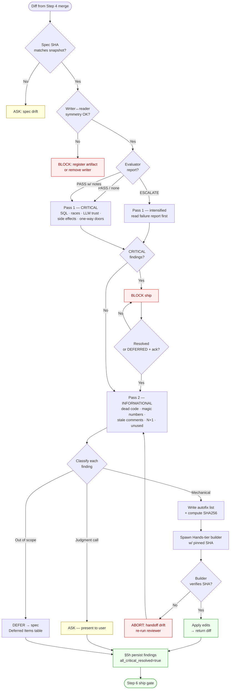

# Step 5: Fix-First Review

**Opus 4.7 tip**: Pass 1 (CRITICAL) benefits from deep adaptive thinking ("think carefully about security implications"). Pass 2 (INFORMATIONAL) benefits from terse thinking ("prioritize responding quickly — just list findings"). See `shared/opus-4-7-practices.md` §2.

After builders complete, worktrees are merged, and the evaluator loop (Step 4b) has run, perform a two-pass review on the full diff.

## Board Update (Auto)

Move the feature card to Review and add a review summary comment. Fire-and-forget — failures must NOT block the review.

```bash
scripts/board.sh move "<feature-name>" "Review" || true
```

After the review completes (Pass 1 + Pass 2), add findings as a comment:

```bash
scripts/board.sh comment "<feature-name>" "## Review Complete

### Pass 1 — Critical Findings
<list of blockers found and fixed, or 'None'>

### Pass 2 — Informational
<list of non-blocking observations, or 'None'>

### Auto-Fixed
<count> items auto-fixed (dead code, unused imports, etc.)

### Evaluator Report
<PASS | PASS with notes | ESCALATE | N/A>

**Reviewed:** $(date -u +%Y-%m-%dT%H:%M:%SZ)" || true
```

## 5-pre. Evaluator Report Input (if available)

If the evaluator loop ran in Step 4b, check task metadata for the evaluator report:

```
TaskGet -> metadata.evaluator_report
```

| Evaluator Outcome                                                     | Review Adjustment                                                                                                                                                                                                                                                     |
| --------------------------------------------------------------------- | --------------------------------------------------------------------------------------------------------------------------------------------------------------------------------------------------------------------------------------------------------------------- |
| **All PASS** (all criteria met)                                       | Standard review. The evaluator validated criteria; it does NOT check security, race conditions, LLM trust boundaries, or one-way door safety. Never skip Pass 2 — informational items (dead code, stale comments, magic numbers) flag drift the evaluator cannot see. |
| **PASS with notes** (criteria met but evaluator flagged observations) | Standard review, but prioritize evaluator's flagged areas in Pass 1.                                                                                                                                                                                                  |
| **ESCALATE** (evaluator couldn't get builder to pass)                 | Intensify review — read evaluator's failure report first. The failures it flagged are likely real issues. Present to user as ASK items.                                                                                                                               |
| **No report** (evaluator skipped or no contract)                      | Standard review — full Pass 1 + Pass 2 (backward compatible).                                                                                                                                                                                                         |

The evaluator report is an input to the review, not a replacement for it. The review still catches classes of issues the evaluator doesn't check (security, race conditions, one-way door validation).

## 5a. Fetch Latest Base and Compute Diff

```bash
git fetch origin <base> --quiet
git diff origin/<base>...HEAD
```

### Spec Integrity Check (ENFORCING — runs before any review passes)

Step 1 captured a SHA256 snapshot of the spec and its Acceptance Criteria section at `.claude/state/plan-w-team-ac-snapshot-$SLUG.md`. Verify the live spec still matches — a mid-flight spec edit that relaxed AC would bypass the evaluator's contract.

```bash
SNAPSHOT=".claude/state/plan-w-team-ac-snapshot-$SLUG.md"
SPEC="docs/specs/${SLUG}.md"

if [ ! -f "$SNAPSHOT" ]; then
  echo "⚠ No AC snapshot at $SNAPSHOT — skipping integrity check (likely pre-snapshot feature)"
else
  SNAPSHOT_SPEC_SHA=$(awk '/^spec_sha256:/{print $2}' "$SNAPSHOT")
  LIVE_SPEC_SHA=$(shasum -a 256 "$SPEC" | awk '{print $1}')

  if [ "$SNAPSHOT_SPEC_SHA" != "$LIVE_SPEC_SHA" ]; then
    cat <<EOF
✗ SPEC DRIFT DETECTED
  Snapshot SHA: $SNAPSHOT_SPEC_SHA
  Live SHA:     $LIVE_SPEC_SHA
  The spec was edited after Step 1. If the edit tightened AC, re-snapshot via Step 1.
  If the edit loosened AC, this is a RED FLAG — present to user as ASK.
EOF
    # Flag as ASK item — do not auto-fail; legitimate tightening is possible
  else
    echo "✓ spec integrity verified"
  fi
fi
```

The check is **advisory** (ASK) because tightening AC mid-flight is legitimate. The point is to surface the edit, not to block it.

### Writer↔Reader Symmetry Check (ENFORCING — runs before review passes)

Every `.claude/state/plan-w-team-*` artifact declared in `shared/state-artifacts.md` must have both a writer and a reader in code (unless explicitly flagged `mode: audit-trail`). This prevents the "write-only by accident" defect class: a stage file that writes a state artifact but promises enforcement in prose without a wired reader.

```bash
if .claude/scripts/plan-w-team-symmetry-check.sh; then
  echo "✓ writer↔reader symmetry verified"
else
  code=$?
  case "$code" in
    1)
      cat <<'EOF'
✗ ENFORCING/HANDOFF ORPHAN — a registered artifact has no reader in code.
  This is a governance bug: the workflow writes a file nothing consumes.
  FIX BEFORE SHIP: either (a) wire the reader, or (b) downgrade the
  registry entry to `mode: audit-trail` with justification.
  Do NOT relax the reader_grep pattern to make the check pass — that
  defeats the purpose of the registry.
EOF
      exit 1  # fail-closed
      ;;
    2)
      cat <<'EOF'
✗ STALE REGISTRY ENTRY — a registered artifact has no writer in code.
  Likely causes: a writer was renamed, moved, or removed, but the
  registry entry was left behind.
  FIX BEFORE SHIP: remove the stale registry entry, or fix the
  writer_grep pattern if the writer was renamed.
EOF
      exit 1  # fail-closed
      ;;
    3)
      echo "✗ symmetry check environment failure — investigate before ship"
      exit 1
      ;;
  esac
fi
```

**Why this is enforcing, not advisory**: The check has zero false-positive tolerance because every orphan is a governance defect by definition — the registry explicitly declared `enforcing`/`handoff` intent. An `audit-trail` artifact is the escape hatch for write-only-by-design cases; use it, don't bypass the checker.

**If the check blocks review on a legitimate new artifact**: Add the entry to `shared/state-artifacts.md` in the same commit as the writer, with appropriate `writer_grep`, `reader_grep`, and `mode`. Re-run; the check now passes.

## Two-Pass Review Decision Tree

> See diagram below — describes the route every diff line takes from raw evaluator handoff through Pass 1 / Pass 2 classification to the AUTO-FIX / ASK / DEFER terminal states.



The diagram is the contract: every diff line that passes `Persist` is provably either auto-fixed, user-acknowledged, or deferred with context. A path that ends anywhere else is a workflow bug.

## 5b. Pass 1 — CRITICAL (blockers, must fix before ship)

| Check                      | What to Look For                                                                                                                                                                                                                                                                                                        |
| -------------------------- | ----------------------------------------------------------------------------------------------------------------------------------------------------------------------------------------------------------------------------------------------------------------------------------------------------------------------- |
| SQL safety                 | Raw string interpolation in queries, missing parameterization                                                                                                                                                                                                                                                           |
| Race conditions            | TOCTOU (time-of-check-time-of-use) patterns, shared mutable state                                                                                                                                                                                                                                                       |
| LLM trust boundaries       | User input passed directly to prompts without sanitization                                                                                                                                                                                                                                                              |
| Conditional side effects   | Database writes, API calls, notifications buried in conditionals                                                                                                                                                                                                                                                        |
| Time window safety         | Operations assuming time relationships without handling timezone, clock skew, DST                                                                                                                                                                                                                                       |
| One-way door validation    | Extra scrutiny for tasks tagged `door_type: "one-way"`                                                                                                                                                                                                                                                                  |
| Error handling             | Catch-all handlers, swallowed errors, missing error types from Error & Rescue Map                                                                                                                                                                                                                                       |
| Test-harness fragmentation | **REJECT** any PR that adds a second test framework, parallel runner, or test entry-point alongside `make test-skill` / `tests/skill/run.sh` / bats. The single canonical entry-point is the only thing that makes the pre-commit gate reliable. See `docs/specs/plan-w-team-followups.md` §Anti-Fragmentation Lock-In. |

### UI-TDD Checks (CRITICAL — UI repos only)

Runs only when `.claude/qa-profile.json` exists in the target repo. Each check below is Pass 1 CRITICAL — a hit blocks merge and invokes the fix-first heuristic from §5d.

| Check                    | What to Look For                                                                                                                                                                                                                                                                                                 |
| ------------------------ | ---------------------------------------------------------------------------------------------------------------------------------------------------------------------------------------------------------------------------------------------------------------------------------------------------------------- |
| Inline locators in specs | Any `page.locator(...)`, `page.getByRole(...)`, `page.getByTestId(...)`, or sibling getter called directly in a `.spec.ts` file (i.e., NOT via a page-object method). **REJECT** and route to fix-first. Page-object-only is non-negotiable per `shared/ui-tdd-enforcement.md`.                                  |
| Missing `data-testid`    | Any interactive element (`<button>`, `<input>`, `<a href>`, `<form>`, custom role=button components) added in the diff without `data-testid`. The ESLint rule should catch this pre-merge — if it surfaces in review, the rule was disabled or the file is excluded. Investigate both.                           |
| Wrong testid attribute   | Diff contains `data-test=`, `data-cy=`, `data-qa=`, or `testid=` (without the `data-` prefix). Migrate to `data-testid` — the scaffolded Playwright config pins `testIdAttribute: 'data-testid'` and will not see the others.                                                                                    |
| Malformed testid shape   | `data-testid` value does not match `^[a-z][a-z0-9]*(-[a-z0-9]+)+$` (kebab-case, at minimum `<feature>-<element>` with an action segment for interactive elements). Per `shared/ui-tdd-enforcement.md` §naming.                                                                                                   |
| Paired task skipped      | A `N.b` (implementation) task landed without its `N.a` (tests) counterpart merged first, OR `N.a` ships without any failing-then-passing evidence in its commit history. **REJECT** — the contract was skipped, even if the UI works.                                                                            |
| Tier evidence missing    | A FRONTEND task's TaskUpdate metadata is missing `tier_evidence`, or declared tiers from `qa_profile` in `.claude/qa-profile.json` are marked ❌ with no `### Waived Tiers` section in the spec. Either fix the evidence or explicitly waive with justification in the spec's UI Tier Profile & Test Plan block. |

For each Pass 1 UI-TDD hit, §5d auto-fix vs ask logic applies the same way as existing Pass 1 checks: two-way doors (e.g., renaming a testid, extracting an inline locator into a page object) → auto-fix via Hands-tier subagent; one-way doors or ambiguous cases (e.g., skipped paired task with merged implementation) → ASK user.

## 5c. Pass 2 — INFORMATIONAL (fix or note, not blockers)

| Check                  | What to Look For                                                         |
| ---------------------- | ------------------------------------------------------------------------ |
| Dead code              | New functions never called, unreachable branches introduced in this diff |
| Magic numbers          | Unexplained numeric literals                                             |
| Missing error handling | Unhappy paths not covered                                                |
| Stale comments         | Comments that no longer match the code                                   |
| N+1 queries            | Database queries in loops                                                |
| Unused imports         | Imports added but not used                                               |

## 5d. Fix-First Heuristic — Classify Each Finding

| Classification | Action                         | Examples                                                                                                                                                                       |
| -------------- | ------------------------------ | ------------------------------------------------------------------------------------------------------------------------------------------------------------------------------ |
| **AUTO-FIX**   | Fix immediately without asking | Unused imports, stale comments, missing indexes (non-schema-changing), trivial N+1 queries that don't alter API shape                                                          |
| **ASK**        | Present to user for decision   | **Dead code removal** (callers may be dynamic or in other repos), security policy decisions, race condition fixes that change behavior, architectural changes, design patterns |

**Why dead code is ASK, not AUTO-FIX**: The reviewer sees only this repo. A function that looks unreferenced here may be called by a sibling repo, a dynamic dispatch table, a test harness, or a public API. Deleting it is a one-way door. Show the user, let them confirm.

**Missing error handling is ASK-leaning**: Only AUTO-FIX when the fix is mechanically obvious (e.g., wrap an `await` in try/catch with `throw`). Policy changes (logging vs swallowing vs escalating) are ASK.

Auto-fix all AUTO-FIX items. Batch remaining ASK items and present them together.

### Auto-fix must run in a separate Hands-tier subagent

The reviewer (Brain tier) analyzes and classifies. It **does not** perform the auto-fix edits itself. Spawn a Hands-tier subagent (`builder` agent, Opus 4.6) to apply AUTO-FIX items:

1. Reviewer writes the auto-fix list to `.claude/state/plan-w-team-autofix-$SLUG.md` — one heading per file, bulleted change list.
2. Reviewer **freezes the handoff file** by computing its SHA256 and recording the digest in the spawn prompt. This guards against the race where a second reviewer pass overwrites the file mid-flight while a builder is reading it:
   ```bash
   AUTOFIX=".claude/state/plan-w-team-autofix-$SLUG.md"
   AUTOFIX_SHA=$(shasum -a 256 "$AUTOFIX" | awk '{print $1}')
   # Builder will re-verify this digest before reading; mismatch = abort.
   ```
3. Reviewer spawns a builder subagent with: "Apply the mechanical edits listed in `.claude/state/plan-w-team-autofix-$SLUG.md`. **Before reading**, run `shasum -a 256 .claude/state/plan-w-team-autofix-$SLUG.md` and verify it matches `$AUTOFIX_SHA` — if it differs, abort and report 'autofix-handoff drift'. Do not invent fixes. Do not touch files outside the list. Return a diff summary."
4. Reviewer re-reads the diff after the builder returns and confirms no out-of-scope edits occurred.

**Why digest, not file-lock**: a `cp file file.locked` guard would also work, but it doubles the audit trail (now there are two files) and a stale `.locked` blocks the next run with no clear recovery. A SHA256 in the spawn prompt is the lightweight equivalent: the builder either sees the version the reviewer intended, or it aborts cleanly. No cleanup needed.

**Why**: Brain-tier reviewers should not hand-edit files — they lose their neutral-reviewer frame when they touch code, and their per-token cost is 4-6x a Hands tier subagent's. This also creates a clean audit trail (the autofix-$SLUG.md file) if an AUTO-FIX later causes a regression.

### Spawning Fix Agents

When spawning parallel agents to fix review findings:

1. **Re-record BASE_SHA**: `BASE_SHA=$(git rev-parse HEAD)` — the main branch has moved since the original build phase. Fix agents MUST branch from the current HEAD, not the original base.
2. **Prune old worktrees first**: `git worktree prune` to remove any leftover build-phase worktrees.
3. **Assign shared files to ONE fix agent**: If multiple fixes touch the same file, group them into one agent. Do NOT split fixes for the same file across multiple agents — this was the #1 source of merge coordination pain in the factory-orchestrator retro.
4. **Prefer fixing on main directly** for small fixes (1-3 lines): spawning a worktree for a one-line fix adds overhead. Only use worktree isolation when the fix is substantial enough to benefit from parallel execution.

## 5e. Review Suppressions — Do NOT Flag These

1. Redundancy that aids readability (e.g., explicit type annotations TypeScript could infer)
2. Threshold comments that will rot ("TODO: adjust this threshold")
3. Consistency-only changes (changing something just to match style elsewhere with no functional benefit)
4. Test code style (tests can be verbose and repetitive for clarity)
5. Generated code style
6. Framework boilerplate
7. Import ordering preferences
8. Comment density preferences
9. Variable naming that follows existing codebase conventions

## 5f. Design Review Lite (conditional)

Only run if any task has `scope: "FRONTEND"`. Skip entirely for backend-only changes.

If the browse binary is available, read `shared/browser-qa.md` for browser-based visual testing instructions.

If triggered, check for AI Slop — these 10 anti-patterns indicate generic AI-generated design:

1. Purple gradients (the default "AI aesthetic")
2. 3-column feature grids (lazy landing page pattern)
3. Icons in colored circles (clip-art energy)
4. Centered everything (no visual hierarchy)
5. Uniform bubbly border-radius (looks like a toy)
6. Decorative blobs/shapes (filling space without purpose)
7. Emoji as design elements (substituting for real iconography)
8. Colored left-border cards (Bootstrap default)
9. Generic hero copy ("Welcome to the future of...")
10. Cookie-cutter section rhythm (alternating left-right layouts with identical spacing)

Use design critique vocabulary for findings:

- "I notice..." (observation, no judgment)
- "I wonder..." (question, opens exploration)
- "What if..." (suggestion, non-prescriptive)
- "I think...because..." (opinion with evidence)

## 5g. E2E Failure Blame Protocol

If any test fails during review, NEVER claim "not related to our changes" without proving it by running the same test on the base branch first. Confirmation bias is the enemy.

## 5h. Persist Review Findings (handoff to Step 6)

Step 6 (ship) needs to verify every CRITICAL Pass-1 finding was resolved before pushing. If the session compacts between Step 5 and Step 6, in-conversation findings are lost. Persist them to a state artifact so Step 6 can re-read regardless of session boundary.

```bash
SLUG="<feature-slug>"   # same slug used for baseline/scope-lock/ac-snapshot
FINDINGS=".claude/state/plan-w-team-review-findings-$SLUG.md"
mkdir -p .claude/state

cat > "$FINDINGS" <<EOF
---
slug: $SLUG
reviewed_at: $(date -u +%Y-%m-%dT%H:%M:%SZ)
base_sha: $(git rev-parse origin/${BASE_BRANCH:-main})
head_sha: $(git rev-parse HEAD)
critical_count: 0
informational_count: 0
auto_fixed_count: 0
ask_count: 0
all_critical_resolved: true
---

## Pass 1 — CRITICAL (blockers)

<!-- One bullet per finding. Every CRITICAL must end "→ resolved in <commit-sha>" or "→ DEFERRED with user ack" before Step 6 will ship. -->

- (none)

## Pass 2 — INFORMATIONAL

- (none)

## Auto-Fixed (mechanical)

<!-- Cross-reference plan-w-team-autofix-\$SLUG.md for the exact diff list. -->

- (none)

## ASK Items (presented to user)

- (none)

## Evaluator Report

- Outcome: <PASS | PASS-with-notes | ESCALATE | N/A>
- Snapshot: \`.claude/state/plan-w-team-ac-snapshot-${SLUG}.md\`
EOF

echo "✓ review findings persisted: $FINDINGS"
```

**Why persist**: Step 6's `6a. Review Readiness Check` greps this file's frontmatter for `all_critical_resolved: true`. If the file is missing or that flag is `false`, ship blocks. This converts the verbal "review is done" handoff into a re-readable contract.

**What goes in the file**: every Pass-1 CRITICAL bullet, every Pass-2 INFORMATIONAL bullet, every AUTO-FIX line (cross-referenced to `plan-w-team-autofix-$SLUG.md`), and every ASK item with the user's decision. Mark each CRITICAL with its resolution: `→ resolved in <commit-sha>` or `→ DEFERRED (user ack: <reason>)`. If any CRITICAL lacks a resolution marker, set `all_critical_resolved: false` in the frontmatter.

**Update on subsequent passes**: re-write the file (not append) at the end of every review iteration so the frontmatter counts stay accurate.
