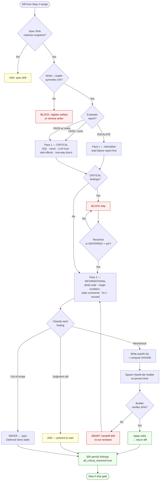

# Step 5: Fix-First Review

<!-- PWT-T2 Orchestrator Retrofit (2026-05-18)
     Pause sites in this file routed via .claude/scripts/plan-w-team-orchestrator-route.sh
     Classifier: shared/orchestrator-interception.md

     | Call-site label           | Verdict      | Original behavior                                |
     | ------------------------- | ------------ | ------------------------------------------------ |
     | pass-2-ask                | orchestrator | Pass-2 ASK findings (dead code, design choices)  |
     | review-autofix-vs-defer   | orchestrator | Auto-fix vs defer classification                 |

     Safe-fail: if router unavailable, falls through to AskUserQuestion.
     Kill switch: PLAN_W_TEAM_DISABLE_ORCHESTRATOR=1
-->

**Opus 4.7 tip**: Pass 1 (CRITICAL) benefits from deep adaptive thinking ("think carefully about security implications"). Pass 2 (INFORMATIONAL) benefits from terse thinking ("prioritize responding quickly — just list findings"). See `shared/opus-4-7-practices.md` §2.

**Effort-escalation trigger (REQ-3 — autonomous, NO workflows).** When a reviewer/fix
returns **`confidence: low` twice on the same task**, OR the task carries a **HARD**-tagged
sub-problem, the lead **re-spawns THAT single task with an elevated thinking budget**
(`ultrathink` / `/effort xhigh`) rather than retrying at default effort. This is the
fix-stage twin of the supervisor's STALL-ALERT effort rung (`shared/supervisor-protocol.md`).
It trades tokens for depth in place; it does **not** re-enable the Workflow tool for bg
workers (`CLAUDE_CODE_DISABLE_WORKFLOWS=1` / PWT-WF1 stays — workflows are operator-only).

After builders complete, worktrees are merged, and the evaluator loop (Step 4b) has run, perform a two-pass review on the full diff.

## 5-0. Fix-Immediately, Never Defer (ENFORCING — governs every pass)

This rule governs the entire review/ship/retro lifecycle, not just this stage. It
codifies the memory `feedback_fix_defects_and_flaky_immediately`.

**A worker MUST fix any flagged issue — a real defect OR a flaky test — immediately,
and may NEVER advance past a red or a merely-"noted" screen/check.** "Noted and move
on" is not an allowed disposition for a defect or a flaky test.

The required sequence for every flagged defect/flaky item is:

```
fix → deploy (apply the fix) → retest → verify GREEN → note (record what was fixed)
```

The `note` step is the LAST step (a record of the completed fix), never a substitute
for it. A finding logged as "noted" with no preceding fix→retest→GREEN is a process
violation that the supervisor reverses at the next check-in (see
`shared/supervisor-protocol.md` §Fix-Now Audit).

### Real defects

Any behavior bug, broken test, type error, lint error, failed assertion, or off-policy
drift (e.g. a GitHub-Actions build/deploy path — see `shared/no-github-actions.md`) is a
real defect. Fix it now via the sequence above. Do not defer to "a follow-up task" and
do not advance the pipeline while it is red.

### Flaky tests — repair by removing non-determinism

A flaky test is fixed by **removing the source of non-determinism**, never by masking it:

| Source of non-determinism                             | Correct repair                                        |
| ----------------------------------------------------- | ----------------------------------------------------- |
| Live network / DB / clock-dependent vendor call       | Mock or stub the live dependency                      |
| Unpinned random seed / `Date.now()` / `Math.random()` | Pin the seed; inject a fixed clock                    |
| Shared mutable state across tests                     | Isolate state (fresh fixture per test, reset between) |
| Ordering / race between async steps                   | Await the actual condition, not a sleep               |

**FORBIDDEN flaky "fixes"** (these mask non-determinism, they do not remove it):

- Loosening or deleting an assertion so the test passes more often.
- Adding a retry wrapper / `--retries` / re-run-until-green.
- Adding `.skip` / `xfail` / commenting the test out.
- Widening a timeout to paper over a race.

A repaired flaky test MUST pass **repeatedly (100/100 runs)** before it is considered
fixed. Record the 100/100 evidence in the fix note.

### Red-gate bypass — narrow, proven, and queued

A red gate may be bypassed ONLY after proving the failure is **pre-existing AND
non-deterministic**, via:

```
git stash → run the gate on clean main → observe the identical failure → git stash pop
```

If (and only if) the same failure reproduces on untouched main, it is pre-existing and
may be bypassed for THIS run — but it is **queued for immediate repair** (record it as a
fix-now item, not a permanent "known flaky" exception). A failure that does NOT reproduce
on clean main was introduced by this run and MUST be fixed now (no bypass).

## Board Update (Auto)

Move the feature card to Review and add a review summary comment. Fire-and-forget — failures must NOT block the review.

```bash
scripts/board.sh move "<feature-name>" "Review" || true
```

After the review completes (Pass 1 + Pass 2), add findings as a comment:

```bash
scripts/board.sh comment "<feature-name>" "## Review Complete

### Pass 1 — Critical Findings
<list of blockers found and fixed, or 'None'>

### Pass 2 — Informational
<list of non-blocking observations, or 'None'>

### Auto-Fixed
<count> items auto-fixed (dead code, unused imports, etc.)

### Evaluator Report
<PASS | PASS with notes | ESCALATE | N/A>

**Reviewed:** $(date -u +%Y-%m-%dT%H:%M:%SZ)" || true
```

## 5-pre. Evaluator Report Input (if available)

If the evaluator loop ran in Step 4b, check task metadata for the evaluator report:

```
TaskGet -> metadata.evaluator_report
```

| Evaluator Outcome                                                     | Review Adjustment                                                                                                                                                                                                                                                     |
| --------------------------------------------------------------------- | --------------------------------------------------------------------------------------------------------------------------------------------------------------------------------------------------------------------------------------------------------------------- |
| **All PASS** (all criteria met)                                       | Standard review. The evaluator validated criteria; it does NOT check security, race conditions, LLM trust boundaries, or one-way door safety. Never skip Pass 2 — informational items (dead code, stale comments, magic numbers) flag drift the evaluator cannot see. |
| **PASS with notes** (criteria met but evaluator flagged observations) | Standard review, but prioritize evaluator's flagged areas in Pass 1.                                                                                                                                                                                                  |
| **ESCALATE** (evaluator couldn't get builder to pass)                 | Intensify review — read evaluator's failure report first. The failures it flagged are likely real issues. Present to user as ASK items.                                                                                                                               |
| **No report** (evaluator skipped or no contract)                      | Standard review — full Pass 1 + Pass 2 (backward compatible).                                                                                                                                                                                                         |

The evaluator report is an input to the review, not a replacement for it. The review still catches classes of issues the evaluator doesn't check (security, race conditions, one-way door validation).

## 5a. Fetch Latest Base and Compute Diff

```bash
git fetch origin <base> --quiet
git diff origin/<base>...HEAD
```

### Spec Integrity Check (ENFORCING — runs before any review passes)

Step 1 captured a SHA256 snapshot of the spec and its Acceptance Criteria section at `.claude/state/plan-w-team-ac-snapshot-$SLUG.md`. Verify the live spec still matches — a mid-flight spec edit that relaxed AC would bypass the evaluator's contract.

```bash
SNAPSHOT=".claude/state/plan-w-team-ac-snapshot-$SLUG.md"
SPEC="docs/specs/${SLUG}.md"

if [ ! -f "$SNAPSHOT" ]; then
  echo "⚠ No AC snapshot at $SNAPSHOT — skipping integrity check (likely pre-snapshot feature)"
else
  SNAPSHOT_SPEC_SHA=$(awk '/^spec_sha256:/{print $2}' "$SNAPSHOT")
  LIVE_SPEC_SHA=$(shasum -a 256 "$SPEC" | awk '{print $1}')

  if [ "$SNAPSHOT_SPEC_SHA" != "$LIVE_SPEC_SHA" ]; then
    # PWT-T2: Route spec-drift assessment through orchestrator.
    # Orchestrator analyzes the diff between snapshot and live spec to determine
    # if AC was tightened (OK) vs loosened (RED FLAG requiring user decision).
    DRIFT_VERDICT=$(route_orchestrator pass-2-ask "$SLUG" \
      "finding_type=spec-drift" \
      "snapshot_sha=$SNAPSHOT_SPEC_SHA" \
      "live_sha=$LIVE_SPEC_SHA" \
      "options=tightened-OK,loosened-RED,ambiguous-ASK" 2>/dev/null || echo "ambiguous-ASK")
    if [ "$DRIFT_VERDICT" = "loosened-RED" ] || [ "$DRIFT_VERDICT" = "ambiguous-ASK" ]; then
      cat <<EOF
✗ SPEC DRIFT DETECTED
  Snapshot SHA: $SNAPSHOT_SPEC_SHA
  Live SHA:     $LIVE_SPEC_SHA
  The spec was edited after Step 1. If the edit tightened AC, re-snapshot via Step 1.
  If the edit loosened AC, this is a RED FLAG — present to user as ASK.
EOF
    else
      echo "✓ spec drift detected but orchestrator assessed as tightened (OK)"
    fi
    # Original: Flag as ASK item — do not auto-fail; legitimate tightening is possible
  else
    echo "✓ spec integrity verified"
  fi
fi
```

The check is **advisory** (ASK) because tightening AC mid-flight is legitimate. The point is to surface the edit, not to block it.

### Writer↔Reader Symmetry Check (ENFORCING — runs before review passes)

Every `.claude/state/plan-w-team-*` artifact declared in `shared/state-artifacts.md` must have both a writer and a reader in code (unless explicitly flagged `mode: audit-trail`). This prevents the "write-only by accident" defect class: a stage file that writes a state artifact but promises enforcement in prose without a wired reader.

```bash
if .claude/scripts/plan-w-team-symmetry-check.sh; then
  echo "✓ writer↔reader symmetry verified"
else
  code=$?
  case "$code" in
    1)
      cat <<'EOF'
✗ ENFORCING/HANDOFF ORPHAN — a registered artifact has no reader in code.
  This is a governance bug: the workflow writes a file nothing consumes.
  FIX BEFORE SHIP: either (a) wire the reader, or (b) downgrade the
  registry entry to `mode: audit-trail` with justification.
  Do NOT relax the reader_grep pattern to make the check pass — that
  defeats the purpose of the registry.
EOF
      exit 1  # fail-closed
      ;;
    2)
      cat <<'EOF'
✗ STALE REGISTRY ENTRY — a registered artifact has no writer in code.
  Likely causes: a writer was renamed, moved, or removed, but the
  registry entry was left behind.
  FIX BEFORE SHIP: remove the stale registry entry, or fix the
  writer_grep pattern if the writer was renamed.
EOF
      exit 1  # fail-closed
      ;;
    3)
      echo "✗ symmetry check environment failure — investigate before ship"
      exit 1
      ;;
    4)
      cat <<'EOF'
✗ ORPHAN READER — code references a .claude/state/plan-w-team-* artifact
  that has no registry entry. This is the inverse governance bug (and more
  severe than a missing reader): the workflow consumes a file whose
  writer↔reader contract was never declared, so nothing audits it.
  FIX BEFORE SHIP: register the artifact in `shared/state-artifacts.md`
  (writer_grep, reader_grep, mode) in the same commit as the reader, or
  remove the stray reference.
EOF
      exit 1  # fail-closed
      ;;
    *)
      echo "✗ symmetry check unknown exit $code — investigate before ship"
      exit 1
      ;;
  esac
fi
```

**Why this is enforcing, not advisory**: The check has zero false-positive tolerance because every orphan is a governance defect by definition — the registry explicitly declared `enforcing`/`handoff` intent. An `audit-trail` artifact is the escape hatch for write-only-by-design cases; use it, don't bypass the checker.

**If the check blocks review on a legitimate new artifact**: Add the entry to `shared/state-artifacts.md` in the same commit as the writer, with appropriate `writer_grep`, `reader_grep`, and `mode`. Re-run; the check now passes.

## Two-Pass Review Decision Tree

> See diagram below — describes the route every diff line takes from raw evaluator handoff through Pass 1 / Pass 2 classification to the AUTO-FIX / ASK / DEFER terminal states.


```mermaid
flowchart TD
    Start([Diff from Step 4 merge]) --> Integrity{Spec SHA<br/>matches snapshot?}
    Integrity -->|No| AskDrift[ASK: spec drift]
    Integrity -->|Yes| Symmetry{Writer↔reader<br/>symmetry OK?}
    Symmetry -->|No| BlockSym[BLOCK: register artifact<br/>or remove writer]
    Symmetry -->|Yes| EvalIn{Evaluator<br/>report?}
    EvalIn -->|ESCALATE| Pass1Hot[Pass 1 — intensified<br/>read failure report first]
    EvalIn -->|PASS / none| Pass1[Pass 1 — CRITICAL<br/>SQL · races · LLM trust ·<br/>side effects · one-way doors]
    EvalIn -->|PASS w/ notes| Pass1
    Pass1Hot --> Findings1
    Pass1 --> Findings1{CRITICAL<br/>findings?}
    Findings1 -->|Yes| BlockShip[BLOCK ship]
    BlockShip --> Resolve{Resolved<br/>or DEFERRED + ack?}
    Resolve -->|No| BlockShip
    Resolve -->|Yes| Pass2
    Findings1 -->|No| Pass2[Pass 2 — INFORMATIONAL<br/>dead code · magic numbers ·<br/>stale comments · N+1 · unused]
    Pass2 --> Classify{Classify each<br/>finding}
    Classify -->|Mechanical| AutoFix[Write autofix list<br/>+ compute SHA256]
    Classify -->|Judgment call| Ask[ASK — present to user]
    Classify -->|Out of scope| Defer[DEFER → spec<br/>Deferred Items table]
    AutoFix --> Spawn[Spawn Hands-tier builder<br/>w/ pinned SHA]
    Spawn --> ShaCheck{Builder<br/>verifies SHA?}
    ShaCheck -->|No| Drift[ABORT: handoff drift<br/>re-run reviewer]
    ShaCheck -->|Yes| Apply[Apply edits<br/>→ return diff]
    Drift --> Pass2
    Apply --> Persist[§5h persist findings<br/>all_critical_resolved=true]
    Ask --> Persist
    Defer --> Persist
    Persist --> ShipGate([Step 6 ship gate])

    classDef block fill:#fee,stroke:#c00,color:#900;
    classDef pass fill:#efe,stroke:#080;
    classDef ask fill:#ffd,stroke:#a80;
    class BlockSym,BlockShip,Drift block
    class Persist,ShipGate,Apply pass
    class AskDrift,Ask ask
```

The diagram is the contract: every diff line that passes `Persist` is provably either auto-fixed, user-acknowledged, or deferred with context. A path that ends anywhere else is a workflow bug.

## 5b-pre. Pass 1 Routing — Single Reviewer vs Hybrid Multi-Agent Fan-Out

Per Anthropic's 2026 Claude Code presentation, the most effective code-review pattern at scale is **multi-phase, multi-agent**: spin up a team of reviewers to look at independent aspects of the diff, then verify findings before reporting. /plan-w-team's Pass 1 was originally single-reviewer; this routing block decides whether this run should fan out instead.

### Trigger Conditions

Enable the hybrid fan-out if **either** of the following is true:

1. **One-way door present**: any task or design decision in this feature is tagged `door_type: "one-way"` (per Step 0 §0d / Step 2 task metadata).
2. **Explicit opt-in**: the spec frontmatter sets `quality_gate: ultra-review` (see snippet below).

```yaml
# In docs/specs/<slug>.md frontmatter:
---
quality_gate: ultra-review # forces multi-agent Pass 1 even on all-two-way-door features
---
```

If neither trigger fires, skip to **§5b (single-reviewer Pass 1)** unchanged — the existing path remains the default for low-risk, all-two-way-door features.

### Fan-Out Roster

Spawn **three parallel reviewers**, each focused on an independent dimension. Use `Agent` calls with `run_in_background: true` and rely on completion notifications (per `shared/opus-4-7-practices.md` §4). Reviewers are **Brain-tier** (`model: opus` → Opus 4.8 — e.g. `security-expert`, `code-review-expert`; pinned via the agent's frontmatter, **not** via the Agent tool's `model` parameter, which only accepts aliases per the rule in `plan-w-team.md` Model Strategy). Reviewers read and report; they do not synthesize. Synthesis is the lead's job.

| Slot | Agent (frontmatter-pinned)             | Focus                                                                                                                                                                            | Skip If                                                                      |
| ---- | -------------------------------------- | -------------------------------------------------------------------------------------------------------------------------------------------------------------------------------- | ---------------------------------------------------------------------------- |
| 1    | `security-expert`                      | SQL safety, auth, secrets, LLM trust boundaries, OWASP top-10                                                                                                                    | Never (always include — security is the highest-cost class to miss)          |
| 2    | `code-review-expert`                   | Test coverage gaps, complexity, dependency audit, technical debt, **cross-codebase reuse / duplication** (new code that re-implements an existing function/helper/util/constant) | Never                                                                        |
| 3    | **Domain specialist (lead picks one)** | Feature-specific quality (see selection table below)                                                                                                                             | Skip if no task has matching scope tag — fall back to fan-out of 2 reviewers |

**Domain specialist selection** (lead chooses based on the feature's scope tags from Step 2):

| If any task has scope tag…                                                                            | Pick                                              | Why                                                                                                                                                                      |
| ----------------------------------------------------------------------------------------------------- | ------------------------------------------------- | ------------------------------------------------------------------------------------------------------------------------------------------------------------------------ |
| `FRONTEND` (UI repos)                                                                                 | `style-theme-expert`                              | Catches AI Slop, design-system drift, accessibility regressions                                                                                                          |
| `DATABASE` / `BACKEND` w/ schema change                                                               | `database-expert`                                 | Catches index gaps, denormalization mistakes, migration safety                                                                                                           |
| `DEVOPS` / `INFRA`                                                                                    | `terraform-specialist` or `kubernetes-specialist` | Catches misconfig, drift, blast-radius issues                                                                                                                            |
| Docs-heavy (>50% of diff is `.md`)                                                                    | `documentation-expert`                            | Catches stale cross-refs, broken links, info-architecture drift                                                                                                          |
| API-shape change                                                                                      | `api-expert`                                      | Catches breaking changes, REST/GraphQL contract drift                                                                                                                    |
| LLM/AI prompts or tool use                                                                            | `llm-application-specialist`                      | Catches prompt-injection, tool-call boundary issues                                                                                                                      |
| Diff contains new `try`/`catch`, `.catch(`, `throw`, error callbacks, retry loops, or fallback chains | `silent-failure-hunter`                           | Catches empty catches, broad exception swallowing, fallback masking, retry-exhausted-silently, `?.` hiding failures (see `.claude/agents/team/silent-failure-hunter.md`) |
| (no matching tag)                                                                                     | omit slot 3                                       | Fan out 2 reviewers — over-fitting a third would generate noise                                                                                                          |

### Spawn Pattern

```
Agent #1 (security-expert)        — run_in_background: true
Agent #2 (code-review-expert)     — run_in_background: true
Agent #3 (domain specialist)      — run_in_background: true   [if applicable]
```

Each reviewer receives an identical context envelope:

```
You are reviewing a diff against origin/<base>...HEAD as a <ROLE> specialist.
Repo: <project-name>
Spec: docs/specs/<slug>.md   (you may read this for context, but DO NOT trust it for AC — read .claude/state/plan-w-team-ac-snapshot-<slug>.md if you need the frozen AC)
Diff: see `git diff origin/<base>...HEAD`
Your remit: <slot-specific focus from the table above>
What to report:
  - A list of CRITICAL findings (blocks ship) with file:line refs and a one-sentence justification each
  - A list of INFORMATIONAL findings (nice to fix, not blocking) — keep this short
  - Findings OUTSIDE your remit MUST be reported as "out of remit: pass to another reviewer" (the lead synthesizes)
What NOT to do (each trap paired with the desired shape — keep the negative, write the positive):
  - Do not edit files. Do not auto-fix. Read-only review.
    - Good: report `file:line` + a one-sentence fix in prose; the lead or the auto-fix builder applies it.
  - Do not duplicate the diff in your response — file:line + one sentence is enough.
    - Good: `src/api/jobs.ts:142 — missing tenant predicate on the by-id update`.
  - Do not score the AC contract — that's the evaluator's job (Step 4b).
    - Good: stay in your remit; surface anything AC-shaped as `## Out of Remit` for the lead to route.
Return format: structured markdown with `## CRITICAL`, `## INFORMATIONAL`, `## Out of Remit` headings.
```

### Verifier Synthesis (Lead)

When all reviewers return (completion notifications fire — do not poll; per §4 of opus-4-7-practices.md), the lead synthesizes:

1. **Union the CRITICAL findings** across all three reports.
2. **Dedupe by file:line + issue-class** — if two reviewers flagged the same line, keep one entry with both citations.
3. **Verifier filter**: for each CRITICAL, ask: _"Is this finding genuinely a blocker, or did the reviewer over-flag?"_ Drop findings where:
   - The "issue" is actually intended behavior documented in the spec
   - The line is already covered by an existing test that the reviewer didn't see
   - The risk is conditional on a code path the diff doesn't introduce
4. **Promote out-of-remit findings** to the matching reviewer slot for the next pass if substantive — usually they're noise (a security reviewer commenting on style); drop them.
5. **Persist the synthesized CRITICAL list to** `.claude/state/plan-w-team-pass1-synthesis-$SLUG.md` (so retro can audit the fan-out).

The synthesized CRITICAL list is the input to **§5b (Pass 1 — CRITICAL)** below. The rest of Pass 1 (block-ship gate, ASK loop) runs unchanged on the synthesized list.

### Cost Discipline

Three parallel Brain-tier reviewers consume context. To keep this bounded:

- Reviewers must be told "file:line + one sentence" per finding — verbose review prose is the cost spike.
- Skip Slot 3 when no matching scope tag exists (table above).
- For diffs <50 lines, **skip the fan-out entirely** even when triggered — the marginal value is below the agent-spawn overhead. Note this in `.claude/state/plan-w-team-pass1-synthesis-$SLUG.md` as `skipped_reason: small-diff`.
- Track `pass1_reviewer_tokens` in retro §8e "Retroactive-Coverage Closure & Gap-Analyzer Cost" — warning threshold: >40k tokens cumulative across reviewers.

### Manual Branch Review Outside /plan-w-team

For ad-hoc reviews of any branch (not driven by /plan-w-team), use the user-facing `/ultra-review` slash command. It is Anthropic's official multi-agent review command and runs an equivalent fan-out without the rest of the lifecycle. /plan-w-team's hybrid Pass 1 is the lifecycle-integrated variant; `/ultra-review` is the standalone variant. Use whichever matches the workflow.

### Rollback

To revert to single-reviewer Pass 1 globally, delete this §5b-pre block. The existing §5b is the fallback path and remains intact. No code outside this file references the fan-out.

## 5b. Pass 1 — CRITICAL (blockers, must fix before ship)

| Check                                               | What to Look For                                                                                                                                                                                                                                                                                                                                                                                                                                                                                                                                                                                                                                               |
| --------------------------------------------------- | -------------------------------------------------------------------------------------------------------------------------------------------------------------------------------------------------------------------------------------------------------------------------------------------------------------------------------------------------------------------------------------------------------------------------------------------------------------------------------------------------------------------------------------------------------------------------------------------------------------------------------------------------------------- |
| SQL safety                                          | Raw string interpolation in queries, missing parameterization                                                                                                                                                                                                                                                                                                                                                                                                                                                                                                                                                                                                  |
| Race conditions                                     | TOCTOU (time-of-check-time-of-use) patterns, shared mutable state                                                                                                                                                                                                                                                                                                                                                                                                                                                                                                                                                                                              |
| LLM trust boundaries                                | User input passed directly to prompts without sanitization                                                                                                                                                                                                                                                                                                                                                                                                                                                                                                                                                                                                     |
| Conditional side effects                            | Database writes, API calls, notifications buried in conditionals                                                                                                                                                                                                                                                                                                                                                                                                                                                                                                                                                                                               |
| Time window safety                                  | Operations assuming time relationships without handling timezone, clock skew, DST                                                                                                                                                                                                                                                                                                                                                                                                                                                                                                                                                                              |
| One-way door validation                             | Extra scrutiny for tasks tagged `door_type: "one-way"`                                                                                                                                                                                                                                                                                                                                                                                                                                                                                                                                                                                                         |
| Mutation testing (TO2 default-on for one-way doors) | If ANY task in this run is tagged `door_type: one-way` with `mutation_required: true` (set by Step 2 §TO2 Mutation Default-On for One-Way-Door PRs), detect the mutation runner (`stryker.config.{ts,js,mjs}`, `mutmut.cfg`, `pitest.xml`) and run it on the touched files. **Mutation-survived rate >5% = CRITICAL**, blocking merge. Threshold override: `mutation-survival-floor: <pct>` in `.claude/state/coverage-policy.txt`. Absence of a mutation runner on a one-way-door code-changing PR raises INFORMATIONAL (offer to install or to record the gap in `.claude/state/coverage-policy.txt`).                                                       |
| Error handling                                      | Catch-all handlers, swallowed errors, missing error types from Error & Rescue Map                                                                                                                                                                                                                                                                                                                                                                                                                                                                                                                                                                              |
| Test-harness fragmentation                          | **REJECT** any PR that adds a second test framework, parallel runner, or test entry-point alongside `make test-skill` / `tests/skill/run.sh` / bats. The single canonical entry-point is the only thing that makes the pre-commit gate reliable. See `docs/specs/plan-w-team-followups.md` §Anti-Fragmentation Lock-In.                                                                                                                                                                                                                                                                                                                                        |
| Broken access control (content signal)              | Scan the diff (not filenames) for CS-1…CS-4 — privilege-bearing field writes; request-body spread into ORM update/insert; bypass/QA/service-token-gated handlers; where/query-by-id without a tenant/owner predicate (`shared/owasp-top10-mapping.md` §Content-Signal Triggers). Verify the per-endpoint rubric in `shared/access-control-invariants.md` (INV-1…INV-5). A **confirmed high-severity** finding in the diff's own touched code (A01 / API1 / API3 / API5 — IDOR, privilege-field, or bypass-token) is **Pass-1 CRITICAL, blocks ship** — gating, not a retroactive `N.t` task. See the §5b Access-Control Content-Signal Scan and §5d-ter below. |

### UI-TDD Checks (CRITICAL — UI repos only)

Runs only when `.claude/qa-profile.json` exists in the target repo. Each check below is Pass 1 CRITICAL — a hit blocks merge and invokes the fix-first heuristic from §5d.

| Check                    | What to Look For                                                                                                                                                                                                                                                                                                 |
| ------------------------ | ---------------------------------------------------------------------------------------------------------------------------------------------------------------------------------------------------------------------------------------------------------------------------------------------------------------- |
| Inline locators in specs | Any `page.locator(...)`, `page.getByRole(...)`, `page.getByTestId(...)`, or sibling getter called directly in a `.spec.ts` file (i.e., NOT via a page-object method). **REJECT** and route to fix-first. Page-object-only is non-negotiable per `shared/ui-tdd-enforcement.md`.                                  |
| Missing `data-testid`    | Any interactive element (`<button>`, `<input>`, `<a href>`, `<form>`, custom role=button components) added in the diff without `data-testid`. The ESLint rule should catch this pre-merge — if it surfaces in review, the rule was disabled or the file is excluded. Investigate both.                           |
| Wrong testid attribute   | Diff contains `data-test=`, `data-cy=`, `data-qa=`, or `testid=` (without the `data-` prefix). Migrate to `data-testid` — the scaffolded Playwright config pins `testIdAttribute: 'data-testid'` and will not see the others.                                                                                    |
| Malformed testid shape   | `data-testid` value does not match `^[a-z][a-z0-9]*(-[a-z0-9]+)+$` (kebab-case, at minimum `<feature>-<element>` with an action segment for interactive elements). Per `shared/ui-tdd-enforcement.md` §naming.                                                                                                   |
| Paired task skipped      | A `N.b` (implementation) task landed without its `N.a` (tests) counterpart merged first, OR `N.a` ships without any failing-then-passing evidence in its commit history. **REJECT** — the contract was skipped, even if the UI works.                                                                            |
| Tier evidence missing    | A FRONTEND task's TaskUpdate metadata is missing `tier_evidence`, or declared tiers from `qa_profile` in `.claude/qa-profile.json` are marked ❌ with no `### Waived Tiers` section in the spec. Either fix the evidence or explicitly waive with justification in the spec's UI Tier Profile & Test Plan block. |

For each Pass 1 UI-TDD hit, §5d auto-fix vs ask logic applies the same way as existing Pass 1 checks: two-way doors (e.g., renaming a testid, extracting an inline locator into a page object) → auto-fix via Hands-tier subagent; one-way doors or ambiguous cases (e.g., skipped paired task with merged implementation) → ASK user.

### Access-Control Content-Signal Scan (CRITICAL — diff content, not filename)

This is the executable machinery behind the "Broken access control (content signal)" row above — and the reason it is GATING, not prose. Broken Access Control is OWASP #1 and dominates the API Security Top 10 (API1 BOLA, API3 BOPLA/mass-assignment, API5 BFLA), yet it hides in ordinarily-named route files (`qa-sim.ts`, `jobs.ts`) that the filename-glob layer never matches. This scan runs on **every** Pass 1, regardless of whether any file matched an OWASP glob.

**Step 1 — scan the diff hunks (not filenames) for the four content signals** (`shared/owasp-top10-mapping.md` §Content-Signal Triggers):

- **CS-1 privilege-bearing field write** — an assignment to `role`, `platformRole`, `tenantId`/`orgId`, `isQaUser`, `ownerId`, `isAdmin`, `permissions`, `passwordHash`, `balance`, `*Cents` (or any field the spec's §Threat Model declared privilege-bearing).
- **CS-2 request-body spread into an ORM update/insert** — `.set({ ...body })`, `.values({ ...input })`, `...req.body`, `Object.assign(row, input)`.
- **CS-3 service / bypass / QA / admin-token-gated handler** — a handler reachable via `QA_SIM_TOKEN`, a `*_BYPASS_*` env var, or a service-token / `x-*-bypass` header check that performs a mutation.
- **CS-4 where/query-by-id without a tenant/owner predicate** — `where(eq(table.id, …))` / `findById` / `WHERE id = $1` with no sibling tenant/owner predicate.

**Run the deterministic scanner as the detection FLOOR** (audit P9c — detection must not be LLM-only; a deterministic gate is only as good as the detection feeding it):

```bash
# Greps the diff's ADDED hunks for CS-1..CS-4 token shapes; deny-by-default.
.claude/scripts/access-control-content-scan.sh --slug "$SLUG"
# exit 3 = suspect(s) found (adjudicate each in Steps 2-4 below);
# exit 0 = clean; exit 2 = could not scan → treat as review-required.
```

You **MUST NOT** record `access_control_high_unresolved: 0` (Step 4) while any CS suspect over a data-mutating endpoint remains un-adjudicated. Step 6 §6c-ter re-runs this exact scanner and fails closed if a `0` count contradicts a live signal — so a missed detection cannot quietly become a clean ship. The scanner is a floor, not a substitute for judgment: it can over-flag (adjudicate and clear those with a one-line rationale) and cannot prove the absence of a cleverly-written violation (Steps 2-3 still apply).

**Step 2 — for each data-mutating endpoint touched by the diff, answer the five invariants** in `shared/access-control-invariants.md`: INV-1 object ownership (BOLA), INV-2 function/role authorization (BFLA), INV-3 mass-assignment / privilege-field guard (BOPLA), INV-4 bypass/test-token scoping, INV-5 tenant isolation under writes + JOINs. "Cannot tell from the diff" counts as **not satisfied** (deny-by-default). If `security-expert` ran as a Pass-1 reviewer (§5b-pre), it produces the per-endpoint verdict table; otherwise the lead runs the rubric inline.

**Step 3 — classify and gate.** A **confirmed** high-severity access-control finding in the diff's own touched code — a real, exploitable A01 / API1 (cross-tenant IDOR · INV-1) / API3 (privilege-field or mass-assignment · INV-3) / API5 (bypass-token · INV-4) violation — is a **Pass-1 CRITICAL that blocks ship**. Severity (not the invariant id) is the gate. It is NOT routed to the §5d-bis retroactive `N.t` queue (see §5d-ter). Lower-severity or untouched-sibling gaps follow the normal §5d-bis retroactive path. Two-way-door content-signal nits (e.g. a clearly QA-only fixture) follow §5d auto-fix-vs-ask like any other Pass-1 check.

**Step 4 — record for the ship gate.** Every confirmed high-severity access-control CRITICAL is written into the §5h review-findings artifact like any Pass-1 CRITICAL (`→ resolved in <commit-sha>`), and §5h sets the frontmatter key `access_control_high_unresolved` to the count still open. Step 6 §6c-ter reads that key and refuses to ship while it is non-zero — a deferral does **not** satisfy it.

When the diff contains no data-mutating endpoint and matches no content signal, record `access-control-scan: clean` in the Step 5 status block and set `access_control_high_unresolved: 0`.

## 5c. Pass 2 — INFORMATIONAL (fix or note, not blockers)

> **Scope of "note" (per §5-0):** "fix or note" applies only to genuine _informational_
> items — subjective style, design opinions, nice-to-haves. A **real defect** (broken
> test, failed assertion, type/lint error, off-policy drift) or a **flaky test** surfaced
> in Pass 2 is NOT note-eligible: it escalates to fix-now under §5-0 (fix→deploy→retest→
> verify-GREEN→note). You may not advance with such an item merely "noted".

| Check                      | What to Look For                                                                                                                                                                                                                                                                                                                                      |
| -------------------------- | ----------------------------------------------------------------------------------------------------------------------------------------------------------------------------------------------------------------------------------------------------------------------------------------------------------------------------------------------------- |
| Dead code                  | New functions never called, unreachable branches introduced in this diff                                                                                                                                                                                                                                                                              |
| Cross-codebase duplication | New code that re-implements a function/helper/util/constant that **already exists** elsewhere (not just dead NEW code). Grep the codebase by name and by concept for near-duplicates; prefer consolidation. Runs in the DEFAULT Pass-2 path — see the `consolidate-into-existing` routing option in §5d. (Reuse-first rule: `shared/reuse-first.md`.) |
| Magic numbers              | Unexplained numeric literals                                                                                                                                                                                                                                                                                                                          |
| Missing error handling     | Unhappy paths not covered                                                                                                                                                                                                                                                                                                                             |
| Stale comments             | Comments that no longer match the code                                                                                                                                                                                                                                                                                                                |
| N+1 queries                | Database queries in loops                                                                                                                                                                                                                                                                                                                             |
| Unused imports             | Imports added but not used                                                                                                                                                                                                                                                                                                                            |

## 5c-bis. Retroactive Test-Gap Analysis (STE Extension)

After Pass 2 INFORMATIONAL completes, invoke the Brain-tier `test-gap-analyzer` agent to surface untested branches, error paths, and edge cases reachable from the touched files. The analyzer's report becomes a queue of **retroactive-coverage tasks** that run BEFORE Step 8 retro — closing test gaps the original spec missed without blocking the current ship.

```bash
# snippet-lint: skip — illustrative invocation
SLUG="<feature-slug>"
DIFF_FILES=$(git diff --name-only "$BASE_SHA"..HEAD)
EXISTING_TESTS=$(git ls-files | grep -E '\.(test|spec)\.[tj]sx?$|_test\.py$|tests?/' | sort -u)
```

Invoke `test-gap-analyzer` (Brain-tier) with:

- `slug` — the /plan-w-team SLUG
- `diff_files` — paths + line ranges from the diff
- `module_root` — for each touched file, the canonical module/package root (where siblings live)
- `existing_tests` — paths to current test files covering the touched files

The analyzer returns a structured markdown report (see `.claude/agents/research-planning/test-gap-analyzer.md` for the full output shape). Each `### G<N>` finding becomes a queued retroactive-coverage task:

```typescript
// Lead converts each finding to a TaskCreate (or appended to scope-lock as N.c entries)
for (const finding of report.findings) {
  TaskCreate({
    subject: `Retroactive coverage: ${finding.file} ${finding.function} — ${finding.gap_type}`,
    description: `Source: test-gap-analyzer for SLUG=${SLUG}, finding G${finding.id}.
Severity: ${finding.severity}.
Suggested test: ${finding.suggested_test}

This task is QUEUED — it runs after Step 6 ship and before Step 8 retro. Do NOT block the current ship on it.`,
    metadata: {
      spec_path: `docs/specs/${SLUG}.md`,
      feature_area: "retroactive-coverage",
      scope: "TESTS",
      effort: finding.severity === "high" ? "medium" : "low",
      agent_type: "unit-testing-specialist",
      slug: SLUG,
      retroactive: true,
      origin: "test-gap-analyzer",
    },
  });
}
```

**When the analyzer is invoked**:

- `findings_count > 0` AND any `severity: high` → the lead must schedule retroactive tasks before Step 8 retro. Step 8 reads `retroactive: true` task closure rate as a quality signal (§8e "Retroactive-Coverage Closure & Gap-Analyzer Cost").
- `findings_count > 0` with only `severity: medium|low` → the lead MAY defer to a follow-up /plan-w-team run, but must record the report path in the retro frontmatter.
- `findings_count == 0` → no action; record "test-gap-analyzer: clean" in the Step 5 status block.

**When the analyzer is NOT invoked**:

- Empty diff (`--ship-only` on a no-op branch) — skip; record `test-gap-analyzer: skipped (empty-diff)`.
- Docs-only diff (no code files touched) — skip.
- Set `PLAN_W_TEAM_DISABLE_TEST_GAP_ANALYZER=1` as a per-run kill switch (advisory; document in the retro why).

**Cost discipline**: track `test_gap_analyzer_tokens` in retro §8e "Retroactive-Coverage Closure & Gap-Analyzer Cost". Warning threshold: >20k tokens per run. Tune by tightening the `module_root` scope (siblings-only, not transitive imports) before disabling the analyzer.

**Why retroactive, not blocking**: test gaps in _existing_ (untouched-by-this-diff) sibling code are not the current PR's responsibility to fix — but they are this team's responsibility to track. Queuing them as retroactive tasks keeps Step 5 fast (no surprise re-implementation work mid-review) while preventing the gaps from being forgotten.

## 5d-bis. Retroactive Security-Gap Analysis (Security Review Extension)

After §5c-bis test-gap analysis completes, invoke the Brain-tier `security-gap-analyzer` agent to surface missing security tests in the diff's touched files and adjacent module siblings. The analyzer's report becomes a queue of **retroactive-security-coverage tasks** (`N.t`) that run BEFORE Step 8 retro — closing security gaps the original spec missed without blocking the current ship.

```bash
# snippet-lint: skip — illustrative invocation
SLUG="<feature-slug>"
DIFF_FILES=$(git diff --name-only "$BASE_SHA"..HEAD)
# Heuristic: existing security tests have "security", "auth", "injection",
# "xss", "csrf", "ssrf", or "crypto" in their filename or parent directory.
EXISTING_SEC_TESTS=$(git ls-files | grep -E '(security|auth|injection|xss|csrf|ssrf|crypto).*(\.test\.|\.spec\.|_test\.)' | sort -u)
OWASP_MAP=".claude/commands/plan-w-team/shared/owasp-top10-mapping.md"
```

Invoke `security-gap-analyzer` (Brain-tier) with:

- `slug` — the /plan-w-team SLUG
- `diff_files` — paths + line ranges from the diff
- `module_root` — for each touched file, the canonical module/package root (where siblings live)
- `existing_tests` — paths to current security-related test files
- `owasp_map_path` — `.claude/commands/plan-w-team/shared/owasp-top10-mapping.md`

The analyzer returns a structured markdown report (see `.claude/agents/research-planning/security-gap-analyzer.md` for the full output shape). Each `### G<N>` finding becomes a queued retroactive-security-coverage task assigned to `security-expert`:

```typescript
// Lead converts each finding to a TaskCreate (or appended to scope-lock as N.t entries)
for (const finding of report.findings) {
  TaskCreate({
    subject: `Retroactive security coverage: ${finding.file} ${finding.function} — ${finding.gap_type}`,
    description: `Source: security-gap-analyzer for SLUG=${SLUG}, finding G${finding.id}.
OWASP: ${finding.owasp_category}.
Tier(s) required: ${finding.tier}.
Severity: ${finding.severity}.
Suggested test: ${finding.suggested_test}

This task is QUEUED — it runs after Step 6 ship and before Step 8 retro. Do NOT block the current ship on it.`,
    metadata: {
      spec_path: `docs/specs/${SLUG}.md`,
      feature_area: "retroactive-security-coverage",
      scope: "TESTS",
      effort: finding.severity === "high" ? "medium" : "low",
      agent_type: "security-expert",
      slug: SLUG,
      retroactive: true,
      origin: "security-gap-analyzer",
      owasp_category: finding.owasp_category,
      security_tier: finding.tier,
    },
  });
}
```

**When the analyzer is invoked**:

- `findings_count > 0` AND any `severity: high` → the lead must schedule retroactive `N.t` tasks before Step 8 retro. Step 8 reads `retroactive: true` task closure rate as a quality signal AND tracks per-OWASP-category gap counts (both in §8e "Retroactive-Coverage Closure & Gap-Analyzer Cost").
- `findings_count > 0` with only `severity: medium|low` → the lead MAY defer to a follow-up /plan-w-team run, but must record the report path in the retro frontmatter.
- `findings_count == 0` → no action; record "security-gap-analyzer: clean" in the Step 5 status block.

**When the analyzer is NOT invoked**:

- Empty diff (`--ship-only` on a no-op branch) — skip; record `security-gap-analyzer: skipped (empty-diff)`.
- Docs-only diff (no code files touched) — skip.
- Diff touches NO files matching any OWASP category in `shared/owasp-top10-mapping.md` **AND** the diff matches no content signal (CS-1…CS-4) — skip; record `security-gap-analyzer: skipped (no-security-surfaces)`. **A content-signal match overrides this skip**: a privilege-bearing field write, a request-body spread into an ORM update/insert, a bypass/QA-token-gated handler, or a where/query-by-id without a tenant/owner predicate forces the analyzer to run AND raises a Pass-1 CRITICAL via the §5b Access-Control Content-Signal Scan — even when no filename matches a glob. (This is the structural fix for the 2026-06-01 escapes: `qa-sim.ts` and `jobs.ts` matched no glob, so the analyzer was skipped.)
- Set `PLAN_W_TEAM_DISABLE_SECURITY_GAP_ANALYZER=1` as a per-run kill switch (advisory; document in the retro why).

**Cost discipline**: track `security_gap_analyzer_tokens` in retro §8e "Retroactive-Coverage Closure & Gap-Analyzer Cost". Warning threshold: >20k tokens per run (same threshold as `test_gap_analyzer_tokens`). Tune by tightening the `module_root` scope (siblings-only, not transitive imports) before disabling the analyzer.

**Why retroactive, not blocking**: security gaps in _existing_ (untouched-by-this-diff) sibling code are not the current PR's responsibility to fix — but they are this team's responsibility to track. Queuing them as retroactive `N.t` tasks keeps Step 5 fast (no surprise re-implementation work mid-review) while preventing security gaps from being forgotten. High-severity gaps in the diff's _own_ touched files DO block ship — those are flagged as Pass 1 CRITICAL findings (via the §5b Access-Control Content-Signal Scan) before this retroactive pass runs; see §5d-ter for the carve-out.

### 5d-ter. Confirmed Access-Control Findings Are Gating, Not Retroactive

The §5d-bis retroactive lane (queue an `N.t` task, fix before retro, never blocks ship) is correct for **test-coverage gaps** in untouched sibling code. It is the WRONG disposition for a **live, exploitable access-control bug in the diff's own touched code** — deferring that is shipping a known account-takeover / IDOR.

So a **confirmed high-severity** finding that is BOTH:

1. **A01 Broken Access Control / API1 BOLA / API3 BOPLA (mass-assignment) / API5 BFLA**, AND
2. in the **diff's own touched code** (not an untouched sibling),

is a **Pass-1 CRITICAL red gate**. **Severity is the gate, not the invariant id** — any of the five invariants can produce a gating finding when it is confirmed high-severity (exploitable) on touched code. The archetypes (highest frequency / blast radius) are:

- a **cross-tenant object access / IDOR** — INV-1 / API1 BOLA (this is exactly the 2026-06-01 `jobs.ts` FIN-15 bug: `assignedTo` accepted a cross-tenant id),
- a **privilege-field / mass-assignment write** — INV-3 / API3 BOPLA,
- an **unscoped bypass-token mutation** — INV-4 / API5 BFLA (this is exactly the 2026-06-01 `seed-platform-admin` account-takeover).

Such a finding MUST NOT enter the §5d-bis `TaskCreate({ … feature_area: "retroactive-security-coverage", retroactive: true … })` loop. It is fixed now (per §5-0 fix-immediately) and recorded in §5h as a CRITICAL resolved by commit. A user-acked DEFER does **not** clear it for ship: §5h still counts it in `access_control_high_unresolved`, and Step 6 §6c-ter fails closed while that count is non-zero. The only ways out are (a) fix it, or (b) prove it is not exploitable (e.g. the surface is provably QA-scoped via `assertQaScoped`), which downgrades the severity and removes it from the count.

This is the **one** carve-out to "retroactive, never blocks": confirmed live access-control exploits gate; everything else (medium/low severity, untouched-sibling gaps, missing-test coverage) stays retroactive.

## 5c-ter. Opt-In Mechanical Clone Scan (M3 — default OFF)

An OPT-IN duplication scan gated exactly like `deep-audit` (`shared/deep-audit.md`): default OFF, no-op when disabled, **no hard dependency**. It complements the human/agent duplication remit (M1) with a mechanical clone detector for breadth.

```bash
# Default OFF — set PLAN_W_TEAM_CLONE_SCAN=1 to opt in. No-op (exit 0) otherwise.
PLAN_W_TEAM_CLONE_SCAN=1 .claude/scripts/plan-w-team-reuse-clone-scan.sh --paths "<changed dirs>"
```

The script runs `jscpd` if it is already installed (PATH or `npx --no-install`) and **degrades gracefully (exit 0) when the tool is absent** — it never adds a required dependency and never blocks ship. Findings are advisory: review the reported clones and consolidate per `shared/reuse-first.md` (route via the §5d `consolidate-into-existing` option). When unset, this sub-step is byte-for-byte a no-op — the default Step-5 path is unchanged.

## 5d. Fix-First Heuristic — Classify Each Finding

| Classification                | Action                                                                                                  | Examples                                                                                                                                                                                                                                                                                                                                                                                |
| ----------------------------- | ------------------------------------------------------------------------------------------------------- | --------------------------------------------------------------------------------------------------------------------------------------------------------------------------------------------------------------------------------------------------------------------------------------------------------------------------------------------------------------------------------------- |
| **AUTO-FIX**                  | Fix immediately without asking                                                                          | Unused imports, stale comments, missing indexes (non-schema-changing), trivial N+1 queries that don't alter API shape                                                                                                                                                                                                                                                                   |
| **ASK**                       | Present to user for decision                                                                            | **Dead code removal** (callers may be dynamic or in other repos), security policy decisions, race condition fixes that change behavior, architectural changes, design patterns                                                                                                                                                                                                          |
| **CONSOLIDATE-INTO-EXISTING** | Require merging new code into an existing implementation instead of keeping a duplicate (reuse finding) | A new helper/util/constant re-implements one that already exists — import/extend the canonical one and delete the duplicate. ASK-leaning when it changes call sites or public shape; AUTO-FIX only for a trivially-identical private duplicate. This is the reuse counterpart to "Dead code removal" — that deletes unused NEW code; this de-duplicates code copied from EXISTING code. |

**Why dead code is ASK, not AUTO-FIX**: The reviewer sees only this repo. A function that looks unreferenced here may be called by a sibling repo, a dynamic dispatch table, a test harness, or a public API. Deleting it is a one-way door. Show the user, let them confirm.

**Missing error handling is ASK-leaning**: Only AUTO-FIX when the fix is mechanically obvious (e.g., wrap an `await` in try/catch with `throw`). Policy changes (logging vs swallowing vs escalating) are ASK.

Auto-fix all AUTO-FIX items. For remaining ASK items, route each through the orchestrator before falling through to the user:

```bash
# snippet-lint: skip — illustrative orchestrator routing for Pass 2 ASK items
for finding in "${ASK_FINDINGS[@]}"; do
  DECISION=$(route_orchestrator pass-2-ask "$SLUG" \
    "finding=$finding" \
    "finding_type=$FINDING_TYPE" \
    "options=fix,consolidate-into-existing,defer,escalate-to-user")
  # If orchestrator returns "escalate-to-user", batch for user ASK.
  # Otherwise, apply the orchestrator's decision (fix or defer).
done
```

<!-- Original: Batch remaining ASK items and present them together to user.
     Orchestrator now handles orchestration-class ASK items (dead code assessment,
     missing error handling policy) autonomously. Only true escalations reach user.
     Fall-through: AskUserQuestion with the full batch if router unavailable. -->

For any findings the orchestrator escalates (or if the router is unavailable), batch the remaining ASK items and present them to the user together.

### Auto-fix must run in a separate Hands-tier subagent

When classifying findings as AUTO-FIX vs ASK, the orchestrator can handle the boundary cases:

```bash
# snippet-lint: skip — illustrative orchestrator routing
AUTOFIX_DECISION=$(route_orchestrator review-autofix-vs-defer "$SLUG" \
  "finding=$FINDING" \
  "finding_category=$CATEGORY" \
  "options=auto-fix,defer,escalate-to-user")
```

<!-- Original: Reviewer classified each finding as AUTO-FIX or ASK manually.
     Orchestrator handles the judgment calls (e.g., is this dead code safe to remove?).
     Fall-through: reviewer classifies manually if router unavailable. -->

The reviewer (Brain tier) analyzes and classifies. It **does not** perform the auto-fix edits itself. Spawn a Hands-tier subagent (`builder` agent, Opus 4.7) to apply AUTO-FIX items:

1. Reviewer writes the auto-fix list to `.claude/state/plan-w-team-autofix-$SLUG.md` — one heading per file, bulleted change list.
2. Reviewer **freezes the handoff file** by computing its SHA256 and recording the digest in the spawn prompt. This guards against the race where a second reviewer pass overwrites the file mid-flight while a builder is reading it:
   ```bash
   AUTOFIX=".claude/state/plan-w-team-autofix-$SLUG.md"
   AUTOFIX_SHA=$(shasum -a 256 "$AUTOFIX" | awk '{print $1}')
   # Builder will re-verify this digest before reading; mismatch = abort.
   ```
3. Reviewer spawns a builder subagent with: "Apply the mechanical edits listed in `.claude/state/plan-w-team-autofix-$SLUG.md`. **Before reading**, run `shasum -a 256 .claude/state/plan-w-team-autofix-$SLUG.md` and verify it matches `$AUTOFIX_SHA` — if it differs, abort and report 'autofix-handoff drift'. Do not invent fixes. Do not touch files outside the list. Return a diff summary."
4. Reviewer re-reads the diff after the builder returns and confirms no out-of-scope edits occurred.

**Why digest, not file-lock**: a `cp file file.locked` guard would also work, but it doubles the audit trail (now there are two files) and a stale `.locked` blocks the next run with no clear recovery. A SHA256 in the spawn prompt is the lightweight equivalent: the builder either sees the version the reviewer intended, or it aborts cleanly. No cleanup needed.

**Why**: Brain-tier reviewers should not hand-edit files — they lose their neutral-reviewer frame when they touch code, and their per-token cost is 4-6x a Hands tier subagent's. This also creates a clean audit trail (the autofix-$SLUG.md file) if an AUTO-FIX later causes a regression.

### Spawning Fix Agents

When spawning parallel agents to fix review findings:

1. **Re-record BASE_SHA**: `BASE_SHA=$(git rev-parse HEAD)` — the main branch has moved since the original build phase. Fix agents MUST branch from the current HEAD, not the original base.
2. **Prune old worktrees first**: `git worktree prune` to remove any leftover build-phase worktrees.
3. **Assign shared files to ONE fix agent**: If multiple fixes touch the same file, group them into one agent. Do NOT split fixes for the same file across multiple agents — this was the #1 source of merge coordination pain in the factory-orchestrator retro.
4. **Prefer fixing on main directly** for small fixes (1-3 lines): spawning a worktree for a one-line fix adds overhead. Only use worktree isolation when the fix is substantial enough to benefit from parallel execution.

## 5e. Review Suppressions — Do NOT Flag These

1. Redundancy that aids readability (e.g., explicit type annotations TypeScript could infer)
2. Threshold comments that will rot ("TODO: adjust this threshold")
3. Consistency-only changes (changing something just to match style elsewhere with no functional benefit)
4. Test code style (tests can be verbose and repetitive for clarity)
5. Generated code style
6. Framework boilerplate
7. Import ordering preferences
8. Comment density preferences
9. Variable naming that follows existing codebase conventions

## 5f. Design Review Lite (conditional)

Only run if any task has `scope: "FRONTEND"`. Skip entirely for backend-only changes.

If the browse binary is available, read `shared/browser-qa.md` for browser-based visual testing instructions.

If triggered, check for AI Slop — these 10 anti-patterns indicate generic AI-generated design:

1. Purple gradients (the default "AI aesthetic")
2. 3-column feature grids (lazy landing page pattern)
3. Icons in colored circles (clip-art energy)
4. Centered everything (no visual hierarchy)
5. Uniform bubbly border-radius (looks like a toy)
6. Decorative blobs/shapes (filling space without purpose)
7. Emoji as design elements (substituting for real iconography)
8. Colored left-border cards (Bootstrap default)
9. Generic hero copy ("Welcome to the future of...")
10. Cookie-cutter section rhythm (alternating left-right layouts with identical spacing)

Use design critique vocabulary for findings:

- "I notice..." (observation, no judgment)
- "I wonder..." (question, opens exploration)
- "What if..." (suggestion, non-prescriptive)
- "I think...because..." (opinion with evidence)

## 5g. E2E Failure Blame Protocol

If any test fails during review, NEVER claim "not related to our changes" without proving it by running the same test on the base branch first. Confirmation bias is the enemy.

## 5h. Persist Review Findings (handoff to Step 6)

Step 6 (ship) needs to verify every CRITICAL Pass-1 finding was resolved before pushing. If the session compacts between Step 5 and Step 6, in-conversation findings are lost. Persist them to a state artifact so Step 6 can re-read regardless of session boundary.

```bash
SLUG="<feature-slug>"   # same slug used for baseline/scope-lock/ac-snapshot
FINDINGS=".claude/state/plan-w-team-review-findings-$SLUG.md"
mkdir -p .claude/state

cat > "$FINDINGS" <<EOF
---
slug: $SLUG
reviewed_at: $(date -u +%Y-%m-%dT%H:%M:%SZ)
base_sha: $(git rev-parse origin/${BASE_BRANCH:-main})
head_sha: $(git rev-parse HEAD)
critical_count: 0
informational_count: 0
auto_fixed_count: 0
ask_count: 0
all_critical_resolved: true
access_control_high_unresolved: 0
---

## Pass 1 — CRITICAL (blockers)

<!-- One bullet per finding. Every CRITICAL must end "→ resolved in <commit-sha>" or "→ DEFERRED with user ack" before Step 6 will ship. -->

- (none)

## Access-Control Findings (gating — §5d-ter)

<!-- One bullet per confirmed access-control finding from the §5b Access-Control Content-Signal Scan.
     A confirmed HIGH-severity A01/API1/API3/API5 finding on a bypass-token (INV-4) or privilege-field
     (INV-3) surface counts toward access_control_high_unresolved until "→ resolved in <commit-sha>".
     A DEFER does NOT decrement the count — Step 6 §6c-ter fails closed while it is non-zero. -->

- (none)

## Pass 2 — INFORMATIONAL

- (none)

## Auto-Fixed (mechanical)

<!-- Cross-reference plan-w-team-autofix-\$SLUG.md for the exact diff list. -->

- (none)

## ASK Items (presented to user)

- (none)

## Evaluator Report

- Outcome: <PASS | PASS-with-notes | ESCALATE | N/A>
- Snapshot: \`.claude/state/plan-w-team-ac-snapshot-${SLUG}.md\`
EOF

echo "✓ review findings persisted: $FINDINGS"
```

**Why persist**: Step 6's `6a. Review Readiness Check` greps this file's frontmatter for `all_critical_resolved: true`. If the file is missing or that flag is `false`, ship blocks. This converts the verbal "review is done" handoff into a re-readable contract.

**What goes in the file**: every Pass-1 CRITICAL bullet, every Pass-2 INFORMATIONAL bullet, every AUTO-FIX line (cross-referenced to `plan-w-team-autofix-$SLUG.md`), and every ASK item with the user's decision. Mark each CRITICAL with its resolution: `→ resolved in <commit-sha>` or `→ DEFERRED (user ack: <reason>)`. If any CRITICAL lacks a resolution marker, set `all_critical_resolved: false` in the frontmatter.

**Access-control gating key**: set `access_control_high_unresolved` to the count of confirmed high-severity access-control findings (§5d-ter — A01/API1/API3/API5 in the diff's own touched code) that are NOT yet `→ resolved in <commit-sha>`. Unlike a normal CRITICAL, a `→ DEFERRED (user ack: …)` access-control finding **still counts** toward this number — these are non-deferrable. Step 6 §6c-ter reads this key and fails closed (`exit 1`) while it is non-zero, independent of `all_critical_resolved`.

**Reconciliation (MANDATORY — the count is the sole backstop):** the integer MUST equal the number of bullets in the `## Access-Control Findings (gating — §5d-ter)` section that are not marked `→ resolved in <commit-sha>`. **Derive it by counting those bullets; never assert it independently.** §6a accepts a `→ DEFERRED` CRITICAL as `all_critical_resolved: true`, so for a deferred access-control finding this integer is the _only_ thing standing between the run and shipping a known exploit — an under-count (recording the bullet but forgetting to bump the integer) silently ships it. When you re-write the file each pass (below), recompute the count from the bullets.

**Update on subsequent passes**: re-write the file (not append) at the end of every review iteration so the frontmatter counts stay accurate.

## End-of-Stage Status Block (PWT-T5)

At the end of this stage, emit a status block for the `/goal` evaluator. This is a one-line invocation; the helper handles all field population (workflow lock, supervisor log, fleet log, escalations).

```bash
.claude/scripts/plan-w-team-surface-status.sh "$SLUG" "review"
```

The stage label `review` is the second argument — see `shared/goal-conditions.md` §Status-Block Schema for the full label list. `/goal` evaluator reads the emitted block to judge whether the pipeline terminal condition is met.

Skip this block entirely when `PLAN_W_TEAM_DISABLE_GOAL=1` (kill switch) — the helper itself is observability and remains safe to call, but invocation here is optional in that mode.
