# Architecture Layers — Which Layer Makes Which Decision

Reference for anyone trying to understand `/plan-w-team`'s decision flow: which agent or hook is responsible for what, where each layer fires across the 8-stage pipeline, and how the layers cooperate.

This doc exists primarily to resolve a **documented mental-model trap** (§Conflation Trap below): the user-facing concept of "the supervisor" actually maps to _two_ different layers in the implementation, and confusing them leads to wrong expectations about what auto-decides where.

## Overview — the 4 cooperating layers

`/plan-w-team` is not one agent. It is 4 cooperating layers, each with a different lifespan, decision authority, and kill switch.

| Layer                                        | Component                                                                                                | Lifespan                                                                                                   | Decides                                                                                                                                                                                                                           | Kill switch                          |
| -------------------------------------------- | -------------------------------------------------------------------------------------------------------- | ---------------------------------------------------------------------------------------------------------- | --------------------------------------------------------------------------------------------------------------------------------------------------------------------------------------------------------------------------------- | ------------------------------------ |
| **1. Orchestrator-Interception** (PWT-T1/T2) | `plan-w-team-orchestrator-route.sh` + classifier table in `shared/orchestrator-interception.md`          | Ephemeral — one agent spawn per classified pause site, dies after answering                                | **What to do at a classified pause site** (11 of 14 sites auto-decide; 3 hard-gates escalate to user)                                                                                                                             | `PLAN_W_TEAM_DISABLE_ORCHESTRATOR=1` |
| **2. Fleet State** (PWT-T3)                  | `.claude/hooks/plan-w-team-fleet-writer.sh` (Stop hooks) + `.claude/scripts/plan-w-team-fleet-query.sh`  | Hooks fire per `SubagentStart`/`SubagentStop` event during whole run                                       | **Nothing — observability only.** Captures spawn/complete events. Lead and supervisor READ this state to make decisions.                                                                                                          | `PLAN_W_TEAM_FLEET_DISABLE=1`        |
| **3. Persistent Supervisor** (PWT-T4)        | `.claude/agents/team/supervisor.md` Brain-tier agent                                                     | Long-lived — one agent for the entire **Step 3-4 dispatch phase** of one run; dies when dispatch completes | **Which builder to spawn next, when to stop dispatch.** Delegates classified pause sites it encounters to Layer 1 (route_orchestrator). Escalates only hard-gates.                                                                | `PLAN_W_TEAM_DISABLE_SUPERVISOR=1`   |
| **4. Goal Evaluator** (PWT-T5b/T5c)          | `.claude/hooks/plan-w-team-goal-evaluator.sh` (Stop hook) + `.claude/state/plan-w-team-goal-<SLUG>.json` | Stop hook fires after every Claude turn while goal state file exists                                       | **Whether the pipeline has reached terminal state** (success / escalation / low-confidence). Blocks stop until terminal hit. Also reads spawned-children registry to propagate worker terminal state to a delegating parent goal. | `PLAN_W_TEAM_DISABLE_GOAL=1`         |

## Where each layer fires across the pipeline

```mermaid
gantt
    title /plan-w-team — layer activation across stages
    dateFormat X
    axisFormat %s

    section Layer 4 — Goal Evaluator (T5b/c)
    Stop-hook fires per Claude turn :active, 0, 8

    section Layer 1 — Orchestrator-Interception (T1/T2)
    Step 0 scope-challenge-mode pause :crit, 0, 1
    Step 1 pass-2-ask pause           :crit, 1, 2
    Step 2 task-breakdown-granularity :crit, 2, 3
    Step 3-4 agent-roster-selection   :crit, 3, 4
    Step 5 review-autofix-vs-defer    :crit, 5, 6
    Step 6 ship-readiness-gate        :crit, 6, 7
    Step 7 post-ship-docs-target      :crit, 7, 8
    Step 8 retro-friction-categorize  :crit, 8, 9

    section Layer 3 — Supervisor (T4)
    Owns dispatch during Step 3-4 only :3, 4

    section Layer 2 — Fleet State (T3)
    Hooks fire whenever subagents spawn/complete :active, 3, 5
```



**Read horizontally**: Layer 4 (goal evaluator) is the only layer that fires continuously from start to finish — it's the autonomy mechanism. Layer 1 (orchestrator-interception) fires at every classified pause site across all 9 stages (0-8). Layer 3 (supervisor) is bounded to Step 3-4 (parallel-builder dispatch). Layer 2 (fleet state) fires whenever subagents are spawned, which is concentrated in Step 3-4 but can happen anywhere a stage spawns an agent.

## Decision matrix — which layer decides which kind of question

| Decision type                                    | Made by                                                                                                         | Stage range                |
| ------------------------------------------------ | --------------------------------------------------------------------------------------------------------------- | -------------------------- |
| "Should we even build this?"                     | Lead (Brain-tier judgment, no delegation)                                                                       | Step 0                     |
| "What's the spec architecture?"                  | Lead                                                                                                            | Step 1                     |
| "What's a feature-specific definition-of-done?"  | Step 1 §1.5 mechanical derivation → injected for Layer 4                                                        | Step 1                     |
| "How to break this into tasks?"                  | Lead, with Layer 1 delegation on `task-breakdown-granularity`                                                   | Step 2                     |
| "Which builder to spawn next?"                   | **Layer 3 supervisor** (when parallel-builders strategy) OR Lead (when single-builder/lead-implements-directly) | Step 3-4                   |
| "What's the next-spawnable task?"                | Layer 2 fleet-query consulted by Layer 3                                                                        | Step 3-4                   |
| "Should the pipeline accept reviewer's autofix?" | Layer 1 router via `review-autofix-vs-defer` classifier                                                         | Step 5                     |
| "Is the ship-readiness gate PASS?"               | Layer 1 router via `ship-readiness-gate` classifier                                                             | Step 6                     |
| "Push to remote?"                                | **User** — `push-ack` hard-gate; never auto-decided                                                             | Step 6                     |
| "Add this secret to allowlist?"                  | **User** — `secret-scan-allow` hard-gate; never auto-decided                                                    | Step 6                     |
| "Expand scope mid-flight?"                       | **User** — `scope-unlock-for-drift` hard-gate; never auto-decided                                               | Step 2/3                   |
| "Is the pipeline done?"                          | **Layer 4** goal evaluator (4 terminal states; PWT-T5b/c)                                                       | Every turn                 |
| "Quality score for the work?"                    | Lead (Brain-tier; Step 5 reviewer)                                                                              | Step 5                     |
| "Has every AC<N> been verified?"                 | **Layer 4 T5c** — AND-checks each `AC<N>.*PASS` pattern in transcript                                           | Implicit via SUCCESS check |

## The Conflation Trap (the reason this doc exists)

Users (and sometimes the agent) say things like "the supervisor manages the whole process." This sentence is true in one common-language sense and false in two technical senses.

**Common-language reading (what users mean):**
"Some autonomous agent is making the decisions that would otherwise stop and ask me."

**Reality:**
That work is split across **two different layers** in the implementation:

1. **Layer 1 (orchestrator-interception)** answers every classified pause-site question across all 9 stages. This is what "questions that would normally stop the pipeline" really maps to. There are 14 such sites; 11 auto-decide, 3 still escalate. This layer is _ephemeral_ — a fresh agent spawns per pause site and dies.

2. **Layer 3 (supervisor)** owns Step 3-4 builder dispatch. This is a _persistent_ agent for one phase. It does NOT manage scope, spec, review, ship, post-ship, or retro stages. It happens to also CALL Layer 1 when it encounters pause sites during Step 3-4, but it's not the same component.

**Why the conflation matters:**

- If you ask "does the supervisor handle Step 5 review?" the answer is **no** — Layer 3 doesn't run in Step 5. Pause sites in Step 5 are handled by Layer 1 (ephemeral routes), not Layer 3 (persistent supervisor).
- If you ask "is there an agent that holds full-pipeline context and makes coherent decisions across stages?" the answer is **no, by design** — Layer 1's per-pause-site ephemerality is intentional (each decision is isolated, no cross-decision drift; the trade-off is no coherent multi-decision memory).
- If you want "the supervisor decides everything across the whole pipeline," that's a feature request for T6, not a doc clarification. PWT-Vision-Realization's scope challenge honestly evaluated T6 and rejected it as overreach for marginal benefit — see the spec's §0c verdict.

**Why Layer 1 ephemerality is the right design:**
Persistent agents are single-points-of-failure; if a long-running supervisor gets confused on decision #3, decisions #4-50 inherit the confusion. Ephemeral spawns isolate failure modes. The classifier table is the persistent state; agents are stateless workers against it.

**Why Layer 3 persistence in Step 3-4 is the right design:**
Dispatch decisions benefit from full-batch context (which tasks have completed, which are still running, max-concurrent capacity). Ephemeral per-spawn decisions would lose that context. Step 3-4 is the one phase where persistent context is more valuable than failure isolation.

## Composing the layers (the full autonomy flow)

What actually happens when you say "use `/plan-w-team` to build X":

1. **Skill activates Layer 4** by writing the goal state file (Top-of-Pipeline section in `plan-w-team.md`).
2. **Step 0 scope-challenge** runs — Lead (you/Claude) decides. Layer 1 fires on `scope-challenge-mode` pause site if scope mode is ambiguous.
3. **Step 1 spec** runs — Lead authors. Layer 1 fires on `pass-2-ask` if spec needs clarification. Step 1 §1.5 derives feature-specific criteria and updates Layer 4 state file.
4. **Step 2 task breakdown** — Lead decomposes. Layer 1 fires on `task-breakdown-granularity`.
5. **Step 3-4 execute** — IF parallel-builders strategy: **Layer 3 supervisor takes over dispatch**. Layer 2 fleet hooks fire on every subagent spawn/complete. Supervisor calls Layer 1 for any classified pause sites it encounters. Layer 3 escalates hard-gates back to Lead/user.
6. **Step 5 review** — Lead reviews. Layer 1 fires on `review-autofix-vs-defer`.
7. **Step 6 ship** — Lead ships. Layer 1 fires on `ship-readiness-gate`. User confirms `push-ack` (hard-gate, no auto-decision possible).
8. **Step 7 post-ship docs** — Lead audits. Layer 1 fires on `post-ship-docs-target`.
9. **Step 8 retro** — Lead computes metrics. Layer 1 fires on `retro-friction-categorize`. Emits the SUCCESS terminal anchor (`stage="retro-complete"` status block).
10. **Layer 4 evaluator** sees the SUCCESS anchor + all feature criteria met → allows Claude to stop normally → pipeline returns control to user.

At every turn boundary throughout steps 0-8, Layer 4 fires its Stop hook. If terminal state hit, allow stop. If not, block stop with reason → Lead continues.

## Where to look next

| If you want to understand...                                                  | Read                                                                                                               |
| ----------------------------------------------------------------------------- | ------------------------------------------------------------------------------------------------------------------ |
| The 14 pause sites and their classifier verdicts                              | `shared/orchestrator-interception.md`                                                                              |
| The supervisor agent's system prompt, decision authority, action log schema   | `.claude/agents/team/supervisor.md` and `shared/supervisor-protocol.md`                                            |
| The fleet-state JSONL schema, query subcommands, retro metric formula         | `shared/fleet-manager.md`                                                                                          |
| The 4 terminal states + feature-specific criteria schema for the evaluator    | `shared/goal-conditions.md`                                                                                        |
| Which state files exist on disk and which stage reads/writes each             | `shared/state-artifacts.md`                                                                                        |
| How parallel-builder strategy is chosen and Pattern A/B/C activation          | `03-execute.md` §Fleet State Integration                                                                           |
| The core design principles that govern the whole skill (and their trade-offs) | [`docs/operations/plan-w-team-design-principles.md`](../../../../docs/operations/plan-w-team-design-principles.md) |

## Kill-switch quick reference

All 4 layers can be independently disabled for incident response or debugging. None require code changes:

```bash
# Disable any combination — pipeline degrades gracefully to legacy behavior
export PLAN_W_TEAM_DISABLE_ORCHESTRATOR=1   # Layer 1 off → pause sites fall through to AskUserQuestion
export PLAN_W_TEAM_FLEET_DISABLE=1          # Layer 2 off → no fleet log; supervisor falls back to TaskList
export PLAN_W_TEAM_DISABLE_SUPERVISOR=1     # Layer 3 off → Step 3-4 uses legacy Pattern A self-claiming pool
export PLAN_W_TEAM_DISABLE_GOAL=1           # Layer 4 off → pipeline runs lead-driven turn-by-turn
```

Each layer's kill switch is documented in that layer's canonical shared doc.
