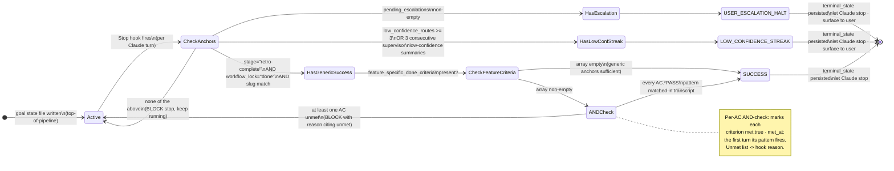

# Goal Conditions — `/plan-w-team` Self-Hosted Goal Evaluator

Authoritative reference for PWT-T5b: the deterministic Stop-hook evaluator that fires after every Claude turn while a `/plan-w-team` run is active and decides whether the pipeline reached a terminal state.

Spec: `docs/specs/pwt-t5b-goal-evaluator.md`
Evaluator hook: `.claude/hooks/plan-w-team-goal-evaluator.sh` (Stop event)
Helper: `.claude/scripts/plan-w-team-surface-status.sh` (emits status blocks the evaluator reads)
State file: `.claude/state/plan-w-team-goal-<SLUG>.json` (written by skill at top-of-pipeline, deleted at retro-complete)
Kill switch: `PLAN_W_TEAM_DISABLE_GOAL=1` — hook exits 0 without evaluation
Companion: `shared/supervisor-protocol.md` (supervisor's per-turn summary block — second evaluator sensor)
Anthropic docs (for context — we no longer use `/goal`): https://code.claude.com/docs/en/goal

## Quick-start: `pwt-goal` helper (for `/goal`-driven autonomous runs)

When you want to start an autonomous run that uses Anthropic's `/goal` command as the outer autonomy loop with `/plan-w-team` as the executor — the pattern you'd actually use for multi-hour or multi-day unattended runs — derive the `/goal` directive from natural language with:

```bash
.claude/scripts/pwt-goal.sh "ship payment API with stripe webhook handling"
```

The script prints a properly-formatted `/goal` command to stdout. Copy and paste it at the start of a fresh `claude` session, or use `--launch` to invoke `claude -p` directly:

```bash
.claude/scripts/pwt-goal.sh --launch "ship payment API with stripe webhook handling"
```

The derived `/goal` command embeds:

- Instruction to use `/plan-w-team` to accomplish the request
- Definition-of-done anchors (transcript markers Anthropic's Haiku evaluator looks for to decide SUCCESS)
- Hard-gate escalation triggers (push-ack, secret-scan-allow, scope-unlock-for-drift, low-confidence streak)
- **No wall-clock or turn caps by design** — the only stopping points are goal-success and hard-gate halts

Template variants for different work types (`--type feature` is default):

```bash
.claude/scripts/pwt-goal.sh --type refactor "extract auth middleware"
.claude/scripts/pwt-goal.sh --type bugfix "fix login redirect on safari"
.claude/scripts/pwt-goal.sh --type docs "update README architecture diagram"
```

Interactive mode prompts for additional DoD criteria beyond the defaults:

```bash
.claude/scripts/pwt-goal.sh -i "ship payment API"
# Enter additional done criteria, one per line. Empty line to finish:
# > stripe webhook signature verification has unit test
# > rate limiting middleware applied to /api/charges
# > <enter>
```

### Two evaluators, two purposes

When you start a session with `/goal` and the goal directive invokes `/plan-w-team`, **two Stop hooks fire after every Claude turn**:

1. **Anthropic's `/goal` Haiku evaluator** — judges your custom condition (with semantic understanding via Haiku)
2. **Our self-hosted goal evaluator** (PWT-T5b/c, this doc) — deterministically checks the 4 terminal anchors + feature-specific criteria injected by Step 1 §1.5

Both blocking = Claude continues. Either allowing alone is not enough; both must allow for Claude to stop. This is belt + braces: Anthropic's evaluator handles the freeform "is the user's intent satisfied" question; ours handles "did the structured pipeline reach its terminal state with all ACs verified."

For interactive sessions where you ask the agent to run `/plan-w-team` (no `/goal` outer loop), only our hook fires — same effect, no LLM tokens, deterministic anchor matching. See §Why self-hosted instead of Anthropic's /goal below.

## Why self-hosted instead of Anthropic's `/goal`

`/goal` is a user-typed slash command. When the agent (Claude) invokes `/plan-w-team` on the user's behalf via the Skill tool, the agent **cannot type `/goal`** to bootstrap the wrapper — slash commands are user-initiated. Net effect with the original T5 design: in agent-driven invocation (the user's actual usage pattern), `/goal` never opens and T5 does nothing.

PWT-T5b replaces the `/goal` wrapper with our own Stop hook that the skill activates by writing a state file. No slash command required. The hook reads the same status/summary blocks the original T5 designed and applies the same 4-state terminal condition — but as deterministic grep-pattern matching, not LLM evaluation. All 4 terminal anchors are concrete enough (exact JSON field values) that no Haiku judgment is needed.

Trade-off: we lose Haiku's flexibility to interpret novel conditions, but we gain:

- Zero tokens per turn (free)
- Faster (no LLM round-trip)
- Deterministic (no eval hallucination)
- Works in agent-driven `/plan-w-team` invocation

## Overview

The evaluator hook fires on every `Stop` event (Claude finishes a turn). It:

1. Returns immediately if `PLAN_W_TEAM_DISABLE_GOAL=1` (kill switch).
2. Returns immediately if no active goal state file exists (no `/plan-w-team` run in progress).
3. Returns immediately if `stop_hook_active=true` in hook input (block-cap protection).
4. Reads the transcript file path from hook input, tails recent lines.
5. Checks for each of the 3 terminal-state anchors via grep.
6. If a terminal state is hit: persists `terminal_state` + `terminal_reason` to state file, exits 0 (let Claude stop).
7. If no terminal state: outputs `{"decision":"block","reason":"..."}` to keep Claude working.

The evaluator **has no semantic intelligence**. It only matches concrete patterns:

1. **`status` block** — emitted by `plan-w-team-surface-status.sh` at the end of every lead-driven stage (Steps 0/1/2/5/6/7/8).
2. **`summary` block** — emitted by the T4 supervisor at the end of every turn during Step 3-4 (see `shared/supervisor-protocol.md`).

Both blocks contain machine-readable JSON. The evaluator greps for specific anchors:

| Terminal state          | Anchor pattern (grep)                                                                                       |
| ----------------------- | ----------------------------------------------------------------------------------------------------------- |
| `SUCCESS`               | `"stage":"retro-complete"` AND `"workflow_lock":"done"`                                                     |
| `USER_ESCALATION_HALT`  | `"pending_escalations":[...]` containing `"push-ack"`, `"secret-scan-allow"`, or `"scope-unlock-for-drift"` |
| `LOW_CONFIDENCE_STREAK` | `"low_confidence_routes":N` where N ≥ 3                                                                     |

**No `TIME_OR_TURN_CAP` terminal state**: the only valid termination signals are goal-success (above) and the three hard-gate / low-confidence anchors. The evaluator does not track turn count or wall-clock and will not auto-stop a run for taking too long. If the pipeline truly stalls without producing those signals, the user halts it manually (`/goal clear` or session interrupt).

## The Condition (copy-paste template)

When `/plan-w-team` opens `/goal`, it uses this condition verbatim (with `<SLUG>` substituted):

```
/goal /plan-w-team SLUG=<SLUG> reaches a terminal state. Terminal states:

(1) SUCCESS: The transcript contains a `status` or `summary` block with
    `workflow_lock: "done"` AND `stage: "retro-complete"`. Ship-readiness
    gate verdict PASS may appear earlier in a stage="ship" status block —
    use that as a corroborating signal but the retro-complete marker is
    the authoritative success anchor.

(2) USER_ESCALATION_HALT: The transcript contains a `status` or `summary`
    block with a non-empty `pending_escalations` array referencing any of
    `push-ack`, `secret-scan-allow`, or `scope-unlock-for-drift`. This is
    a hard-gate awaiting user response — pipeline cannot proceed
    autonomously past these sites.

(3) LOW_CONFIDENCE_STREAK: The transcript contains 3 consecutive supervisor
    `summary` blocks where `goal_progress` mentions "low-confidence" OR
    any status block reports `low_confidence_routes >= 3`. This signals
    the supervisor is confused and should not continue dispatching.

Stop when ANY of (1)–(3) holds. When stopping, state which terminal state
was reached and quote the most recent transcript line that demonstrates it.

There is NO wall-clock or turn cap. The pipeline runs until one of (1)–(3)
fires. If neither fires, keep working — the absence of a terminal anchor
means the work is genuinely not done. User intervention (`/goal clear` or
session interrupt) is the manual escape hatch.
```

The condition is well under `/goal`'s 4000 char limit.

## Terminal-State Reference

| State                   | Transcript anchor                                                                                                                                     | What it means                                                             |
| ----------------------- | ----------------------------------------------------------------------------------------------------------------------------------------------------- | ------------------------------------------------------------------------- |
| `SUCCESS`               | A status block with `stage: "retro-complete"` AND `workflow_lock: "done"` (emitted by `07-retro.md`)                                                  | Pipeline ran end-to-end without escalation; ship gate passed              |
| `USER_ESCALATION_HALT`  | Any status/summary block with non-empty `pending_escalations` containing one of the 3 hard-gate labels                                                | A hard-gate was hit; user must respond before pipeline can proceed        |
| `LOW_CONFIDENCE_STREAK` | Either: 3 consecutive supervisor summary blocks mentioning "low-confidence" in `goal_progress`, OR any status block with `low_confidence_routes >= 3` | Supervisor's decisions are unreliable; do not let it continue dispatching |

**Removed:** an earlier `TIME_OR_TURN_CAP` terminal state was deleted by design (2026-05-19). Wall-clock and turn-count termination conflated "the work is done" with "we've used our budget" — neither is a legitimate stopping signal for autonomous engineering work. The three states above are the only ways a `/plan-w-team` run reaches terminal.

### Evaluator State Machine



**Reading the diagram:**

- The hook is **always active** while the goal state file exists; the kill switch (`PLAN_W_TEAM_DISABLE_GOAL=1`) removes the hook from the path entirely.
- The three terminal states are **mutually exclusive per evaluation**; precedence (USER_ESCALATION_HALT > LOW_CONFIDENCE_STREAK > SUCCESS) only matters for parent-child propagation (next section).
- The `CheckFeatureCriteria` branch is what PWT-T5c adds on top of T5b: a non-empty `feature_specific_done_criteria` array forces an AND-check between generic anchors and every per-AC pattern before SUCCESS fires. With an empty array (or a missing field), behavior is identical to T5b — generic anchors alone fire SUCCESS.
- "BLOCK stop" means the hook exits with `"continue": true` so Claude can't terminate; "let Claude stop" means the hook exits with `"continue": false`. The hook is the only thing standing between the run and termination — wrong hook decision = wrong run lifetime.

### Parent-Child Terminal Propagation (2026-05-20)

When a `/plan-w-team` run delegates work to a worker via `pwt-goal.sh --launch` (or any other `claude --bg` spawn registered via `plan-w-team-register-spawn.sh`), the worker writes its retro-complete anchors to its OWN transcript and state files — never the parent's. Transcript-only anchor sniffing on the parent therefore stalls indefinitely (incident 2026-05-20: 13-min stall after worker shipped).

The evaluator (`.claude/hooks/plan-w-team-goal-evaluator.sh`) handles this by reading worker state files directly. For each active parent goal:

1. Look up the parent's spawned-children registry at `.claude/state/plan-w-team-spawned-children-<PARENT_SLUG>.jsonl`.
2. For each unique `slug` field in the registry, read the worker's `plan-w-team-goal-<WORKER_SLUG>.json`.
3. When every registered worker has a non-null `terminal_state`, propagate the worst-precedence state to the parent:

   ```text
   SUCCESS < LOW_CONFIDENCE_STREAK < USER_ESCALATION_HALT
   ```

   A halted worker halts the parent (must surface to user). A clean worker satisfies parent SUCCESS. Mixed signals win toward the more severe state.

**Fail-open contract**: missing worker state files mark the child non-terminal (parent keeps blocking — correct). Corrupt JSON state files are skipped with a stderr warn (the corrupt file does NOT pin the parent indefinitely). Self-referential rows (registry `slug` == parent `SLUG`) are skipped to prevent infinite hold-open. Registry absent → behavior is byte-identical to pre-fix (backward compatible).

This propagation is automatic — no code changes needed in stage files. As long as spawns are registered via `plan-w-team-register-spawn.sh` (already wired into `pwt-goal.sh --launch` and `plan-w-team-route-prompt.sh` per the self-cleanup work), the parent goal terminates cleanly when its workers do.

The 3 hard-gate labels referenced in `USER_ESCALATION_HALT` are:

- `push-ack` (Step 6 — irreversible push)
- `secret-scan-allow` (Step 6 — security allowlist modification)
- `scope-unlock-for-drift` (Step 2/3 — mid-flight scope expansion)

These are defined in `shared/orchestrator-interception.md` Classifier Table as the 3 `user`-verdict sites.

## Status-Block Schema

Emitted by `plan-w-team-surface-status.sh` at the end of every lead-driven stage:

````
```status
{"slug":"<SLUG>",
 "stage":"<stage-label>",
 "ts":"<ISO8601 UTC>",
 "workflow_lock":"active|done|missing",
 "ship_readiness_gate":"PASS|FAIL|pending|n/a",
 "fleet":{"spawned":N,"completed":N,"failed":N,"running":N,"max_concurrent":N},
 "pending_escalations":[...],
 "low_confidence_routes":N}
````

````

Stage labels in use:
- `scope-challenge` (after Step 0)
- `specification` (after Step 1)
- `task-breakdown` (after Step 2)
- `review` (after Step 5)
- `ship` (after Step 6)
- `post-ship` (after Step 7)
- `retro-complete` (after Step 8 — the SUCCESS anchor)

The supervisor's per-turn summary block (fenced as `summary` not `status`) is documented in `shared/supervisor-protocol.md` §Turn-End Summary Block Contract.

## Feature-Specific Done Criteria (PWT-T5c)

The goal state file optionally carries a `feature_specific_done_criteria` array that extends the SUCCESS terminal condition. Generic anchors alone are insufficient when this array is non-empty — every criterion in it must ALSO appear in the transcript before SUCCESS fires.

### Schema

```jsonc
{
  // ... (existing T5b state fields above)
  "feature_specific_done_criteria": [
    {
      "pattern": "AC1.*PASS",
      "description": "Payment endpoint returns 200 with valid stripe token",
      "met": false,
      "met_at": null
    },
    {
      "pattern": "AC2.*PASS",
      "description": "Secret scan reports 0 findings",
      "met": false,
      "met_at": null
    }
  ]
}
````

| Field         | Type                   | Required | Purpose                                                                                                     |
| ------------- | ---------------------- | -------- | ----------------------------------------------------------------------------------------------------------- |
| `pattern`     | string (grep -E regex) | yes      | Pattern matched against transcript via `grep -E`. Default derivation: `AC<N>.*PASS` for AC entries in spec. |
| `description` | string                 | yes      | Human-readable text from the AC line. Used in block reason when criterion is unmet.                         |
| `met`         | boolean                | yes      | `false` initially. Hook flips to `true` on first match.                                                     |
| `met_at`      | ISO8601 string \| null | yes      | Set to current UTC timestamp when `met` flips. Preserved across subsequent invocations (first-match-wins).  |

### Derivation (Step 1 §1.5)

`01-specification.md` §1.5 reads the spec's `## Acceptance Criteria` section and extracts every `AC<N>:` line. For each, it derives a criterion with pattern `AC<N>.*PASS` and the original line's text (after the `AC<N>:` prefix) as description. Template placeholders (e.g., `[Subject] [verb]`) are skipped. The array is then injected into the goal state file via `jq`.

This is mechanical — no LLM judgment needed. The AC contract in the spec IS the source of truth, and Step 5 review / Step 6 ship already emit `AC<N>: PASS` verification lines that match the derived patterns.

### Evaluator semantics (AND-check)

When the generic SUCCESS anchors appear (`stage="retro-complete"` + `workflow_lock="done"` + slug match), the hook iterates the criteria array:

1. For each `met: false` criterion, run `echo "$RECENT" | grep -E "$pattern"`.
2. On match: persist `{met: true, met_at: <ts>}` atomically (`jq … > tmp && mv tmp`). First match wins — `met_at` is not overwritten on later matches.
3. On no-match: append `description` to the unmet-list.

If the unmet-list is empty: SUCCESS fires. If not: hook demotes terminal back to empty and blocks the stop with a reason citing the unmet criteria descriptions ("Generic SUCCESS anchors present but feature-specific criteria unmet: …").

### Backward compatibility

A goal state file without `feature_specific_done_criteria` (or with `feature_specific_done_criteria: []`) behaves identically to T5b — generic anchors alone fire SUCCESS. Existing T5b state files continue to work unchanged.

### Failure modes

- **Malformed regex** in a `pattern` → hook skips that criterion, continues with others. The criterion stays unmet forever (manual investigation needed).
- **Spec has no AC entries** → derivation injects empty array, evaluator falls back to T5b generic-only SUCCESS.
- **Criterion never matches** (real bug in pipeline or wrong pattern) → pipeline keeps running; eventually surfaces via `LOW_CONFIDENCE_STREAK` (supervisor noticing repeated failure) or via user interrupt. There is no time-based escape — the user is the final stop.

## Kill Switch Contract

| Env var                      | Default | Effect                                                                                                |
| ---------------------------- | ------- | ----------------------------------------------------------------------------------------------------- |
| `PLAN_W_TEAM_DISABLE_GOAL=1` | unset   | Skip top-of-pipeline `/goal` open entirely; pipeline runs as today (lead-driven turn-by-turn polling) |

The kill switch only affects the `/goal` invocation in the skill md. The `plan-w-team-surface-status.sh` helper is unaffected — it remains observability infrastructure (status blocks still appear in the transcript whether or not `/goal` is active).

## /goal Unavailability Fallback

If the running Claude Code version does not have `/goal` (pre-2.1.139), the top-of-pipeline section in `plan-w-team.md` detects this and is a no-op. The pipeline runs unchanged. The helper's status blocks still surface, but no evaluator polls them.

Detection pattern (in the skill md):

```

If /goal command is not available in this Claude Code version, skip the
top-of-pipeline /goal open and proceed directly to Pre-Flight. The
pipeline runs as today — Steps 0–8 in sequence, lead-driven. The
surface-status helper still emits transcript blocks; they're observability
without an evaluator consumer.

```

## Failure Modes

| Failure                                                | Behavior                                                                                                   |
| ------------------------------------------------------ | ---------------------------------------------------------------------------------------------------------- |
| `/goal` command unavailable (older Claude Code)        | Top-of-pipeline section no-ops; pipeline runs as today                                                     |
| Condition string exceeds 4000 chars                    | Truncate to first 3900 + note truncation in skill comment                                                  |
| Helper crashes during stage execution                  | Stage echoes minimal inline status block as fallback; evaluator gets degraded signal                       |
| Supervisor doesn't emit summary blocks during Step 3-4 | Evaluator falls back to stage-end status blocks only (less granular but functional)                        |
| Network failure prevents Haiku evaluator from running  | `/goal` retries per Anthropic's internal logic; pipeline continues regardless                              |
| Evaluator returns "yes" prematurely (false success)    | User reviews final state; can `/goal clear` mid-pipeline if needed                                         |
| Evaluator never returns "yes" (stuck in "no")          | Pipeline keeps blocking stops. User intervention required (`/goal clear`); no automatic time-based escape. |

## Adding a New Terminal State

If future work needs a new terminal state (e.g., T6 adds a "compliance check failed" state):

1. Add a row to the Terminal-State Reference table above with the transcript anchor and meaning.
2. Update the condition template to include the new state as `(5)`.
3. Update `07-retro.md` §8j-quinquies scoring to handle the new terminal reason.
4. If the new state requires a new field in the status block, update the Status-Block Schema section AND `plan-w-team-surface-status.sh` to emit it.

The condition template is the single source of truth — never inline an alternate condition in the skill md or stage files.

## Where This Runs

| Stage                                    | What happens                                                                                        |
| ---------------------------------------- | --------------------------------------------------------------------------------------------------- |
| `plan-w-team.md` top-of-pipeline section | Opens `/goal` with condition above (unless `PLAN_W_TEAM_DISABLE_GOAL=1`)                            |
| Lead stages 00, 01, 02, 04, 05, 06       | End of stage calls `plan-w-team-surface-status.sh` to emit status block                             |
| Step 3-4 (`03-execute.md`)               | Supervisor emits summary block per turn (no helper call here — supervisor protocol owns the signal) |
| Step 8 (`07-retro.md`)                   | Final stage call emits `stage="retro-complete"` status — the SUCCESS terminal anchor                |
| `07-retro.md` §8j-quinquies              | Reads `/goal` terminal state + turn count; scores evaluator health 1-5                              |

```

```
