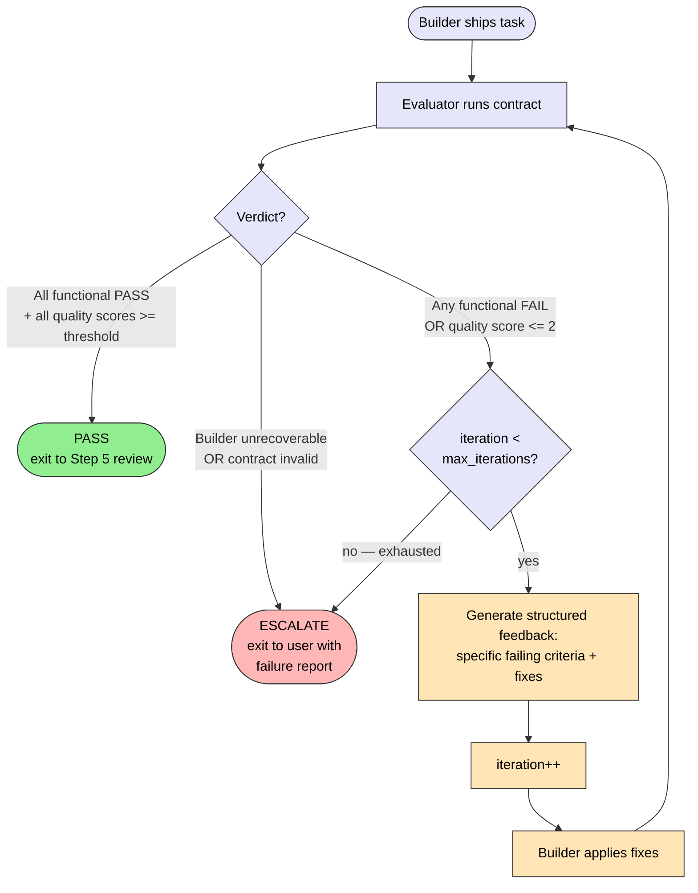

# Sprint Contracts — Acceptance Criteria Format

Sprint contracts are the **primary acceptance criteria format** in every spec. They define testable success criteria BEFORE implementation starts. The evaluator agent (Step 4b) tests build output against these criteria in the iteration loop.

This is NOT an optional addon — it IS the acceptance criteria section. Every spec's `## Acceptance Criteria Contract` section uses this format.

Inspired by Anthropic's "Harness design for long-running application development" (March 2026): converting subjective judgments into gradable criteria enables reliable automated evaluation.

## Required Depth by Feature Type

| Feature Type        | Contract Depth        | Rationale                                                     |
| ------------------- | --------------------- | ------------------------------------------------------------- |
| New feature with UI | Full (all 3 sections) | Playwright testing + quality rubrics add most value here      |
| New backend feature | Functional + Quality  | No Playwright, but criteria and rubrics still drive iteration |
| Bug fix             | Functional only       | "Bug no longer reproduces" is the contract                    |
| Refactor            | Quality only          | "Same behavior, better scores on maintainability/performance" |
| Config/docs only    | Skip contract         | Evaluator not needed — Step 5 review is sufficient            |

## Template

The `## Acceptance Criteria Contract` section in the spec template (Step 1) uses this format:

```markdown
## Acceptance Criteria Contract

### Functional Criteria

Testable assertions. Each must be verifiable by the evaluator without subjective judgment.

- [ ] AC1: [Subject] [verb] [expected outcome]
- [ ] AC2: [Subject] [verb] [expected outcome]

### Quality Rubrics

Gradable criteria on a 1-5 scale. Each rubric has anchor descriptions so the evaluator scores consistently.

| Criterion        | 1 (Poor)            | 3 (Adequate)        | 5 (Excellent)       |
| ---------------- | ------------------- | ------------------- | ------------------- |
| [Criterion name] | [What 1 looks like] | [What 3 looks like] | [What 5 looks like] |

### Playwright Test Plan

(Skip this section for non-web projects)

Steps the evaluator will execute via Playwright MCP to verify functional criteria:

1. Navigate to [URL]
2. [Action] -> verify [expected result]
3. [Action] -> verify [expected result]
```

## Writing Good Criteria

### Functional Criteria — Do's and Don'ts

**Good** (specific, testable, no ambiguity):

- "AC1: Submitting the form with valid email creates a user row in the database"
- "AC2: Submitting with empty email shows 'Email required' error message"
- "AC3: API endpoint GET /users returns 200 with JSON array"
- "AC4: Running `cargo test` passes with 0 failures"

**Bad** (vague, subjective, untestable):

- "The form works correctly" (what does "correctly" mean?)
- "Good error handling" (how does the evaluator verify "good"?)
- "Fast performance" (what threshold? measured how?)
- "Clean code" (this belongs in quality rubrics, not functional criteria)

### Quality Rubrics — Calibration

Rubrics convert subjective quality into repeatable scores. The key is **anchor descriptions** — without them, one evaluator's 3 is another's 5.

**Common rubrics** (use as starting points, customize per feature):

| Criterion           | 1                                    | 3                                 | 5                                                                        |
| ------------------- | ------------------------------------ | --------------------------------- | ------------------------------------------------------------------------ |
| **Error handling**  | Catch-all handlers, swallowed errors | Named error types, basic recovery | Error & Rescue Map fully implemented, typed errors, user-facing messages |
| **Test coverage**   | No tests                             | Happy path covered                | Happy path + edge cases + shadow paths from spec                         |
| **Backward compat** | Breaks existing behavior             | Works but requires migration      | Drop-in replacement, zero breaking changes                               |
| **Code clarity**    | Requires explanation to understand   | Readable with context             | Self-evident, no comments needed                                         |
| **Performance**     | O(n^2) or worse where avoidable      | Reasonable for current scale      | Optimized with benchmarks or analysis                                    |

### Playwright Test Plans — Practical Tips

- Start from the user's perspective, not the developer's
- Each step should map to one functional criterion
- Include negative tests (what happens when things go wrong)
- Account for async operations with `browser_wait_for`

**Example for a login feature:**

```
1. browser_navigate -> http://localhost:3000/login
2. browser_snapshot -> verify email and password fields exist
3. browser_fill_form email="test@example.com", password="password123"
4. browser_click "Sign In" button
5. browser_wait_for "#dashboard" (success redirect)
6. browser_snapshot -> verify "Welcome" heading exists (AC1: successful login)
7. browser_navigate -> http://localhost:3000/login (test invalid case)
8. browser_fill_form email="", password=""
9. browser_click "Sign In" button
10. browser_snapshot -> verify error message visible (AC2: validation errors)
```

## Iteration Behavior

The evaluator uses the contract to drive the iteration loop. Three terminal verdicts: **PASS** (proceed to review), **ITERATE** (loop back to builder with feedback), **ESCALATE** (exit to user — max iterations exhausted or unsafe to retry).

> See diagram below — every evaluator pass exits through exactly one of the three terminal states. The ITERATE arrow re-enters the builder with structured feedback; the iteration counter is the only thing that changes between loops.



Worked example (max_iterations = 3):

```
Iteration 1: Evaluator tests all criteria
  -> 3/5 functional PASS, 2 FAIL
  -> Quality scores: [4, 2, 5]
  -> Verdict: ITERATE (2 functional failures + 1 quality score <= 2)
  -> Feedback: specific fixes for the 3 failures

Iteration 2: Builder applies fixes, evaluator re-tests
  -> 5/5 functional PASS
  -> Quality scores: [4, 4, 5]
  -> Verdict: PASS

Total iterations: 2 (within max of 3)
```

ESCALATE example: if iteration 3 still has failing functional criteria, the evaluator emits ESCALATE — Step 4 stops, user sees the failure report (which criteria failed, what fixes were tried, why retry won't help), and decides whether to relax the contract, hand off to a different builder, or abandon the task.

## Contract Scope

Contracts are **feature-level**, not task-level. The evaluator checks the holistic feature output after all tasks are merged, not individual task commits. This prevents:

- Over-specification of internal implementation details
- Evaluator blocking on intermediate states
- Criteria that only make sense in the context of the full feature

If a feature has multiple independent sub-features (e.g., "email notifications" and "in-app notifications"), each can have its own criteria section within the same contract.

## Iteration Defaults

| Setting            | Default         | Override in spec metadata                    |
| ------------------ | --------------- | -------------------------------------------- |
| Max iterations     | 3               | `max_eval_iterations: N`                     |
| Quality threshold  | All scores >= 3 | `quality_threshold: N`                       |
| Evaluator model    | opus            | `evaluator_model: sonnet` (for cost savings) |
| Playwright enabled | Auto-detect     | `playwright_eval: true/false`                |
