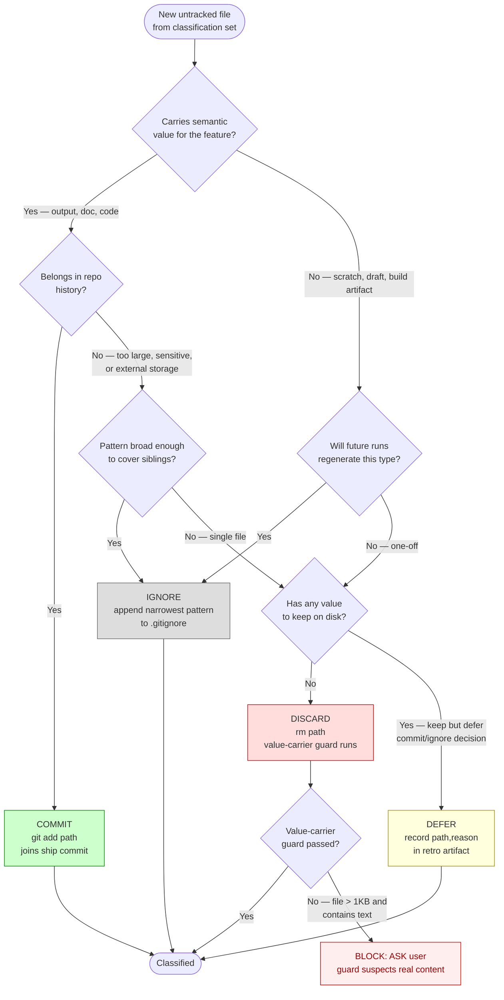

# Untracked File Hygiene (Ship Gate)

Shared reference for `/plan-w-team`'s untracked-file ship gate. Loaded by the preflight (baseline capture), Step 5 (ship gate enforcement), and Step 8 (retro scoring).

## Why this exists

Artifacts accumulate silently across sessions. Pre-commit hooks only fire on staged files — they can't nag about things that never got staged. Without a ship-time gate, `/plan-w-team` leaves behind rot:

- **Real case (parts repo, April 2026):** 26 untracked files from a CLM pipeline run — a mix of legitimate outputs (`outlines/CLM_Treasures_2026-04-06.txt`, `output/CLM_2026-04-13_Chairman_Formatted.html`, `publications/mwb/2026/mwb_2026-04-20.json`) and iteration drafts (`output/.content/*_v1.txt`, `output/.craft_blueprint_*_v1.md`, `output/.research_*_v2.md`). Nobody decided "commit or ignore?" at session end, so they rotted.
- **Real case (claude-pattern repo, February 2026):** 12 `obs-*.png` Playwright QA screenshots saved to repo root instead of `.playwright-mcp/`. Sat for two months because no gate forced a decision.

The gate forces an explicit classification for every **new** untracked file a run introduces. It is intentionally narrow — it does NOT clean up pre-existing dirt, and it NEVER auto-deletes without a decision.

## Baseline capture (preflight)

At the very start of a `/plan-w-team` run (immediately after board preflight), snapshot the current untracked set:

```bash
SLUG="<feature-slug>"  # e.g., plan-w-team-untracked-ship-gate
mkdir -p .claude/state
git ls-files --others --exclude-standard | sort \
  > .claude/state/plan-w-team-untracked-baseline-"$SLUG".txt
```

This file:

- Lives under `.claude/state/`. To prevent leakage, add these two patterns to the project's `.gitignore` (claude-pattern ships them; consumer repos must add them manually on first use — sync scripts don't touch `.gitignore`):
  ```gitignore
  .claude/state/plan-w-team-untracked-baseline-*.txt
  .claude/state/plan-w-team-retro-*.json
  ```
- Survives compaction because it's on disk, not in agent memory
- Is keyed by slug so parallel `/plan-w-team` runs on different features don't collide
- Is deleted at the end of a successful Step 8 retro (see "Cleanup" below)

If `.claude/state/` does not exist, `mkdir -p` creates it — never fail preflight on this.

## Classification set (ship time)

At the start of Step 5 (Ship), compute the classification set — the NEW untracked files the run introduced:

```bash
SLUG="<feature-slug>"
BASELINE=".claude/state/plan-w-team-untracked-baseline-$SLUG.txt"

if [ ! -f "$BASELINE" ]; then
  echo "⚠ Ship gate skipped: no baseline at $BASELINE"
  echo "  Reason: likely --ship-only or --resume run. Hygiene cannot be verified."
  echo "  Retro will note: hygiene-skipped"
  # Proceed to ship in degraded mode
else
  CURRENT=$(git ls-files --others --exclude-standard | sort)
  CLASSIFICATION_SET=$(echo "$CURRENT" | comm -23 - "$BASELINE")

  if [ -z "$CLASSIFICATION_SET" ]; then
    echo "✓ untracked hygiene: clean (0 new untracked files)"
    # Silent pass — proceed to ship
  else
    echo "Ship gate: $(echo "$CLASSIFICATION_SET" | wc -l | tr -d ' ') new untracked files need classification:"
    echo "$CLASSIFICATION_SET"
    # Enter classification loop (see Decision Matrix below)
  fi
fi
```

The classification set is the exact list of files the current run introduced — nothing more. Pre-existing dirt is the responsibility of a future run (or a separate cleanup session), not this one.

## Decision Matrix

> See diagram below — every untracked file the run introduced flows through this tree exactly once. Terminal states (COMMIT / IGNORE / DISCARD / DEFER) are mutually exclusive; nothing exits unclassified.



For every file in the classification set, the agent (or user) picks exactly ONE:

| Decision    | Meaning                                                                                     | Action the gate applies                                                                      |
| ----------- | ------------------------------------------------------------------------------------------- | -------------------------------------------------------------------------------------------- |
| **COMMIT**  | File belongs in the repo as part of this feature                                            | `git add <path>` — file joins the ship commit                                                |
| **IGNORE**  | Artifact type should never be tracked (build output, screenshots, local DB, editor scratch) | Append narrowest covering pattern to `.gitignore`; stage `.gitignore`; do NOT stage the file |
| **DISCARD** | Stale scratch file with no value                                                            | `rm <path>` — subject to the value-carrier guard (see below)                                 |
| **DEFER**   | Keep on disk, out of this ship, needs a written reason in retro                             | Leave untouched; record `{path, reason}` in Step 8 retro artifact                            |

**After applying decisions, re-run the diff.** If any entries remain unclassified, the gate prints them and aborts the ship:

```
✗ Cannot ship: N untracked files undecided:
  - path/to/file1
  - path/to/file2
Every entry must be COMMIT, IGNORE, DISCARD, or DEFER.
```

DEFER is the escape hatch, not the default. A run that defers everything scores poorly in the retro.

## IGNORE pattern guidance

Prefer the **narrowest pattern** that covers the artifact family. Too-broad patterns silently hide future real work.

| Situation                                             | Good                                       | Bad                                     |
| ----------------------------------------------------- | ------------------------------------------ | --------------------------------------- |
| 12 QA screenshots at repo root named `obs-*.png`      | `obs-*.png` (line at root)                 | `*.png` (hides all images)              |
| SQLite state file `apps/server/db.sqlite`             | `apps/server/*.sqlite*`                    | `*.sqlite*` (too broad)                 |
| Build output in a single dir `dist/`                  | `dist/` (trailing slash)                   | `*.js` (catches source)                 |
| Pipeline intermediate `output/.content/*_v1.txt`      | `output/.content/`                         | `*_v1.txt` (catches unrelated drafts)   |
| Local-only editor state `.vscode/local-settings.json` | `.vscode/local-settings.json` (exact path) | `.vscode/` (hides team-shared settings) |

Rules of thumb:

1. **Directory-scoped > glob**. `output/.cache/` is safer than `*.cache`.
2. **Prefix > suffix**. `obs-*.png` is narrower than `*.png`.
3. **Exact path > pattern** for one-off files.
4. **Double-check the project's existing `.gitignore`** before adding — duplicate patterns are a no-op but clutter the file.

## DISCARD value-carrier guard

The gate refuses to `rm` any path ending in a **value-carrying extension** without a second confirmation:

```
.md  .txt  .json  .html  .yml  .yaml  .sql  .py  .ts  .tsx  .rs  .go
```

These extensions carry real work 99% of the time. The parts repo case is the cautionary tale — `output/.research_publications_CLM_Treasures_2026-04-06.md` is a real research artifact, NOT scratch, even though it's in an output directory and looks transient.

When the guard trips, the gate prompts:

```
⚠ DISCARD target looks like real content: output/.research_publications_CLM_Treasures_2026-04-06.md
  (matches value-carrier extension .md)
  Discard anyway? [y/N]
```

Default is N. Only `y` (or `yes`) proceeds with `rm`. Anything else → classify as DEFER or IGNORE instead.

Extensions NOT in the guard list (`.png`, `.jpg`, `.log`, `.tmp`, `.pid`, `.lock`, `.cache`, `.tsbuildinfo`, `.pyc`, etc.) pass through `rm` without a second prompt because they're almost always safe to discard.

## Worked Examples

### Example 1: parts repo, CLM pipeline (26 untracked)

**Classification set** (simulated run that produced all 26):

```
outlines/CLM_Treasures_2026-04-06.txt
outlines/clm_assignments_2026-04-13.txt
output/.active_agents.json
output/.active_agents.json.lock
output/.content/CLM_Treasures_2026-04-06_content_v1.txt
output/.content/CLM_Treasures_2026-04-06_content_v2.txt
output/.craft_blueprint_CLM_Treasures_2026-04-06_v1.md
output/.craft_blueprint_CLM_Treasures_2026-04-06_v2.md
output/.fidelity_map_CLM_Treasures_2026-04-06.md
output/.illustration_options_CLM_Treasures_2026-04-06.md
output/.illustration_workshop_CLM_Treasures_2026-04-06.md
output/.illustration_workshop_CLM_Treasures_2026-04-06_1.md
output/.illustration_workshop_CLM_Treasures_2026-04-06_2.md
output/.pipeline_checkpoint.json
output/.research_completeness_audit_CLM_Treasures_2026-04-06_v1.md
...
output/CLM_2026-04-13_Chairman_Formatted.html
publications/digests/mwb/mwb_2026-04-20.md
publications/mwb/2026/mwb_2026-04-20.json
```

**Correct classification:**

| Group                                           | Count | Decision   | Reason                                                                                                     |
| ----------------------------------------------- | ----- | ---------- | ---------------------------------------------------------------------------------------------------------- |
| `output/CLM_2026-04-13_Chairman_Formatted.html` | 1     | **COMMIT** | Final publication output, real work product                                                                |
| `publications/**`                               | 2     | **COMMIT** | Published content, belongs in repo                                                                         |
| `outlines/*.txt`                                | 2     | **COMMIT** | Source inputs for the pipeline                                                                             |
| `output/.content/*_v1.txt`, `_v2.txt`           | 2     | **IGNORE** | Intermediate iteration drafts, pattern: `output/.content/*_v*.txt`                                         |
| `output/.craft_blueprint_*_v1.md`, `_v2.md`     | 2     | **IGNORE** | Iteration drafts, pattern: `output/.craft_blueprint_*_v*.md`                                               |
| `output/.research_*_v1.md`, `_v2.md`            | 4     | **IGNORE** | Iteration drafts, pattern: `output/.research_*_v*.md`                                                      |
| `output/.illustration_*.md`                     | 4     | **IGNORE** | Workshop scratch, pattern: `output/.illustration_*.md`                                                     |
| `output/.fidelity_map_*.md`                     | 1     | **IGNORE** | Intermediate, pattern: `output/.fidelity_map_*.md`                                                         |
| `output/.active_agents.json{,.lock}`            | 2     | **IGNORE** | Runtime state, pattern: `output/.active_agents.json*`                                                      |
| `output/.pipeline_checkpoint.json`              | 1     | **DEFER**  | Uncertain — might need to commit for resumption. Reason: "need to check if pipeline reads this on restart" |

**Resulting `.gitignore` additions** (appended as a single block):

```gitignore
# CLM pipeline intermediate artifacts (added via /plan-w-team ship gate)
output/.content/*_v*.txt
output/.craft_blueprint_*_v*.md
output/.research_*_v*.md
output/.illustration_*.md
output/.fidelity_map_*.md
output/.active_agents.json*
```

**Ship commit contents:**

- 5 COMMIT files staged
- `.gitignore` diff staged
- 1 DEFER entry recorded in `.claude/state/plan-w-team-retro-<slug>.json`

This classification decision — per file, with explicit reasons — is exactly what was missing when those files accumulated silently.

### Example 2: claude-pattern, obs-\*.png QA screenshots (12 files)

**Classification set:**

```
obs-dashboard-all-events.png
obs-dashboard-current.png
obs-dashboard-fixed.png
obs-dashboard.png
obs-eval-analytics-tab.png
obs-eval-live-tab.png
obs-eval-resource-bottom.png
obs-eval-resource-usage.png
obs-eval-session-filter.png
obs-live-activity.png
obs-review-full.png
obs-two-sessions.png
```

**Correct classification:** All 12 → **IGNORE** with pattern `obs-*.png` at repo root.

Why not DISCARD? They might be referenced in docs or debugging notes. Why not COMMIT? They're QA artifacts, not product code. Why not DEFER? The category is clear, no uncertainty. IGNORE is the right call and the pattern is unambiguous.

**Resulting `.gitignore` line:**

```gitignore
# Playwright QA screenshots (added via /plan-w-team ship gate)
/obs-*.png
```

Note the leading `/` to anchor at repo root — prevents the pattern from matching `some/nested/obs-foo.png` elsewhere.

### Example 3: Clean run (0 new untracked)

```
✓ untracked hygiene: clean (0 new untracked files)
```

Silent pass. Zero overhead. Retro logs "hygiene: clean, 0 new files".

## Retro scoring (Step 8)

The retro self-assessment includes an **Untracked Hygiene** dimension scored 1–5:

| Score | Anchor                                                                                          |
| ----- | ----------------------------------------------------------------------------------------------- |
| 1     | Many files deferred without clear reasons; gate skipped without justification                   |
| 2     | Most files classified but several DEFER with vague reasons                                      |
| 3     | All files classified; 1–2 DEFER with documented reasons; some IGNORE patterns too broad         |
| 4     | All files classified; 0–1 DEFER; IGNORE patterns narrow and appropriate                         |
| 5     | Clean run (0 new untracked) OR all files COMMIT/IGNORE/DISCARD with narrow, justified decisions |

Report format in the retro artifact:

```markdown
### Untracked Hygiene

- Baseline size: 26 (pre-existing)
- Classification set: 5 new files
- Resolved: 5 COMMIT / 0 IGNORE / 0 DISCARD / 0 DEFER
- Deferrals: none
- .gitignore edits: none
- Score: 5
```

Or with deferrals:

```markdown
### Untracked Hygiene

- Baseline size: 26 (pre-existing)
- Classification set: 26 new files
- Resolved: 5 COMMIT / 20 IGNORE / 0 DISCARD / 1 DEFER
- Deferrals:
  - `output/.pipeline_checkpoint.json` — Reason: "need to check if pipeline reads this on restart, will decide in follow-up session"
- .gitignore edits: 6 patterns added
- Score: 4 (one defer with partial reason; deduct 1 for lack of concrete follow-up action)
```

## Cleanup

At the end of a successful Step 8 retro, delete the baseline file:

```bash
rm -f ".claude/state/plan-w-team-untracked-baseline-$SLUG.txt"
```

**Why delete?** The baseline is scoped to a single run. Leaving stale baselines around pollutes `.claude/state/` and could confuse a future run if slugs collide. Failed runs (abort before retro) leave the baseline intact so `--resume` can read it.

**Orphan baseline cleanup (deferred):** If stale baselines accumulate from crashed runs, a future enhancement to `session-start.sh` can sweep baselines older than 7 days. Not in this ship's scope.

## Integration with existing lifecycle

- **Preflight** (in `plan-w-team.md`): runs the baseline capture one-liner
- **Step 5 (Ship)** (in `05-ship.md`): enforces the classification gate before final commit
- **Step 8 (Retro)** (in `07-retro.md`): scores the hygiene dimension and cleans up the baseline

All three touch points reference this document. Do not duplicate bash snippets or decision matrices across stages — link here.

## Related feedback

See memory: `feedback_sync_auto_commit_bundling.md` — sync-all-projects.sh pre-check is the precedent for "prose gates that refuse risky operations". Same design philosophy applied at a different layer.
