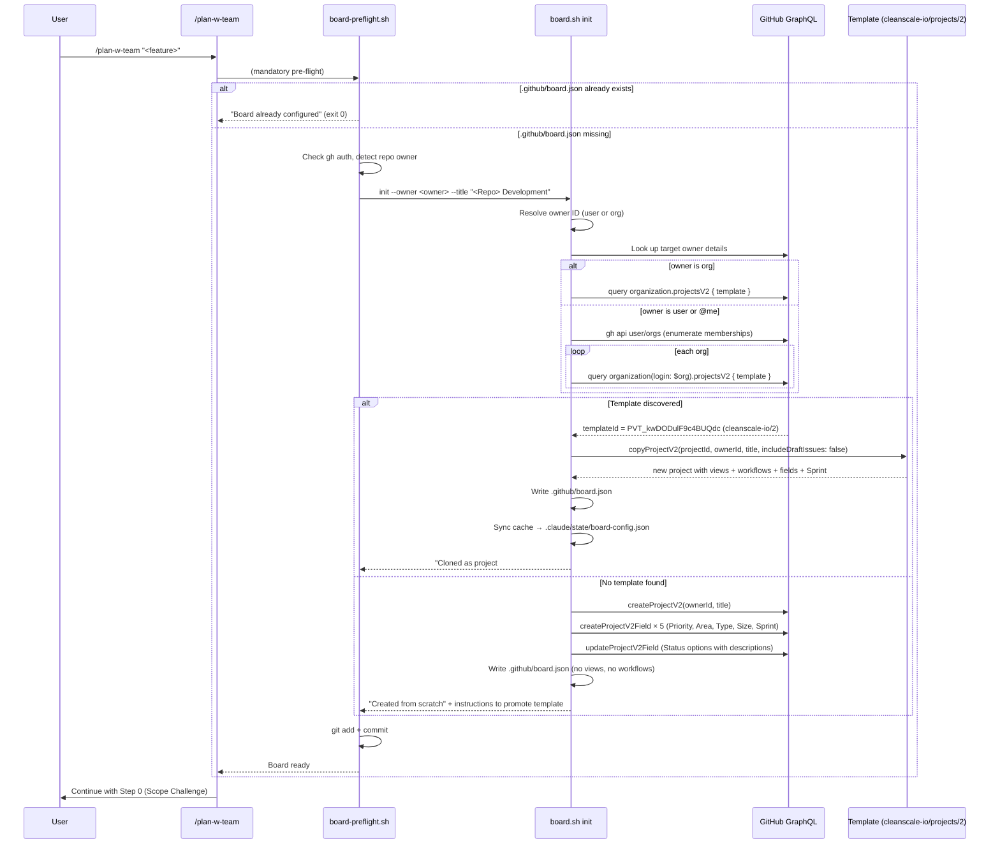

# Board Template Clone — Operations Runbook

> **Last Updated:** 2026-04-10
> **Audience:** Claude (via `/plan-w-team`) and humans debugging board bootstrap failures
> **Script:** `scripts/board.sh`, `.claude/scripts/board-preflight.sh`
> **Spec:** `docs/specs/template-based-board-bootstrap.md`
> **User-facing guide:** `docs/operations/BOARD.md`

This runbook is the **single source of truth** for the template-clone board bootstrap system. It covers the architecture, the canonical template, every failure mode, and exact recovery procedures. Read this when something goes wrong with `board-preflight.sh`, `board.sh init`, or `board.sh template-promote`.

---

## Table of Contents

1. [Why This System Exists](#1-why-this-system-exists)
2. [The Two-Tier Ownership Pattern](#2-the-two-tier-ownership-pattern)
3. [The Canonical Template](#3-the-canonical-template)
4. [End-to-End Flow](#4-end-to-end-flow)
5. [Discovery Chain](#5-discovery-chain)
6. [The Copy Mutation](#6-the-copy-mutation)
7. [What Gets Inherited (and What Doesn't)](#7-what-gets-inherited-and-what-doesnt)
8. [Failure Modes & Recovery](#8-failure-modes--recovery)
9. [Runbook: Common Procedures](#9-runbook-common-procedures)
10. [Debugging Toolkit](#10-debugging-toolkit)
11. [Key Invariants](#11-key-invariants)
12. [Known Gotchas](#12-known-gotchas)
13. [Hard Constraints Discovered Live](#13-hard-constraints-discovered-live)

---

## 1. Why This System Exists

### The Original Problem

Before template-clone bootstrap existed, `board.sh init` created a project from scratch using `createProjectV2` plus a loop of `createProjectV2Field` calls. The result:

- **5 custom fields** were created (Priority, Area, Type, Size, + Status with options)
- **Zero views** were added (the new project showed only GitHub's default "View 1")
- **Zero workflows** were enabled (merging a PR didn't move a card to Done)
- **No Sprint field** (iteration fields cannot be created via mutation at all)
- **No status descriptions** (the helper text visible next to each Status option)

Users had to replicate their canonical configuration by hand in every new repo's board — adding Kanban + Table views, enabling the "Item closed" and "Pull request merged" workflows, and typing status descriptions. This took 5-10 minutes per repo and was error-prone.

### The GraphQL Wall

The obvious fix — "just create the views and workflows programmatically" — is **impossible** because GitHub's Projects v2 GraphQL API does not expose the necessary mutations:

| Desired mutation                | Exists?                                |
| ------------------------------- | -------------------------------------- |
| `createProjectV2View`           | NO                                     |
| `createProjectV2Workflow`       | NO                                     |
| `enableProjectV2Workflow`       | NO                                     |
| `updateProjectV2Workflow`       | NO                                     |
| `deleteProjectV2Workflow`       | YES (the only workflow mutation)       |
| `createProjectV2IterationField` | NO (only the `ProjectV2Field` variant) |

The only mutation that can produce a fully-configured board is **`copyProjectV2`** — which clones an existing project including views, workflows (with their enabled state), Sprint/iteration fields, and status descriptions.

### The Solution

1. Configure **one** canonical project manually in the GitHub UI, with every view, workflow, and field you want every future repo to have.
2. Mark that project as a template via `markProjectV2AsTemplate`.
3. On every new `board.sh init`, discover the template via GraphQL introspection and clone it via `copyProjectV2`.
4. Fall back to from-scratch creation only when no template is discoverable.

---

## 2. The Two-Tier Ownership Pattern

The naive plan is "let the user promote any project as their template." That plan is **blocked by a hard GitHub constraint**:

> `UNPROCESSABLE: Only projects owned by an Organization can be marked as a template.`

Verified live on 2026-04-10: `markProjectV2AsTemplate` rejects user-owned (`@me`) projects. You cannot turn a personal project into a template. Period.

However, **`copyProjectV2` supports cross-owner copy**: an org-owned template can be cloned into a user account, and the clone inherits everything (views, workflows, fields, descriptions). Verified on smoke test project #7 and Parts retrofit project #8 and Claude Pattern retrofit project #10 — all three were cloned from `cleanscale-io/projects/2` into `@me` and came back fully configured.

This produces the two-tier pattern:

```
┌─────────────────────────────────────────────────────────────────┐
│                                                                 │
│   ORG TIER (templates only live here)                           │
│   ─────────────────────────────────────                         │
│   cleanscale-io/projects/2  "Standard Repo Template"            │
│   template: true                                                │
│        │                                                         │
│        │ copyProjectV2(templateId, targetOwnerId)               │
│        │                                                         │
│        ▼                                                         │
│   ─────────────────────────────────────                         │
│   CLONE TIER (clones live in any owner)                         │
│                                                                 │
│   veronelazio/projects/10  "Claude Pattern Development"         │
│   veronelazio/projects/8   "Parts Development"                  │
│   veronelazio/projects/1   "CleanRev Development"               │
│   ... any org's projects ...                                    │
│                                                                 │
└─────────────────────────────────────────────────────────────────┘
```

The template lives in **one org**. Clones land **anywhere** — user accounts or other orgs — because `copyProjectV2` takes `ownerId` as a free parameter.

---

## 3. The Canonical Template

### Current Template (verified 2026-04-10)

| Attribute          | Value                                            |
| ------------------ | ------------------------------------------------ |
| **Title**          | Standard Repo Template                           |
| **Owner**          | `cleanscale-io` (organization)                   |
| **Project number** | 2                                                |
| **URL**            | https://github.com/orgs/cleanscale-io/projects/2 |
| **Node ID**        | `PVT_kwDODulF9c4BUQdc`                           |
| **`template`**     | `true`                                           |
| **Visibility**     | Private                                          |
| **Creator**        | veronelazio                                      |
| **Created**        | 2026-04-10                                       |

### Template Contents

| Layer         | Contents                                                                                                                                                                            |
| ------------- | ----------------------------------------------------------------------------------------------------------------------------------------------------------------------------------- |
| **Views**     | 2 — `Kanban Board` (BOARD_LAYOUT), `Table` (TABLE_LAYOUT)                                                                                                                           |
| **Workflows** | 7 total, 4 enabled:                                                                                                                                                                 |
|               | • Auto-add sub-issues to project ✓                                                                                                                                                  |
|               | • Auto-archive items ✓                                                                                                                                                              |
|               | • Auto-close issue                                                                                                                                                                  |
|               | • Item added to project                                                                                                                                                             |
|               | • Item closed → Status: Done ✓                                                                                                                                                      |
|               | • Pull request linked to issue                                                                                                                                                      |
|               | • Pull request merged → Status: Done ✓                                                                                                                                              |
| **Fields**    | Title, Assignees, Status, Labels, Linked pull requests, Milestone, Repository, Reviewers, Parent issue, Sub-issues progress, **Priority**, **Area**, **Type**, **Size**, **Sprint** |
| **Status**    | Backlog → Todo → In Progress → Blocked → Review → Done → Archived (each with description)                                                                                           |
| **Priority**  | P0, P1, P2, P3                                                                                                                                                                      |
| **Area**      | api, web, admin, website, mobile, db, shared, infra, docs                                                                                                                           |
| **Type**      | feature, bug, chore, infra                                                                                                                                                          |
| **Size**      | S, M, L, XL                                                                                                                                                                         |

### How the Template Was Created

1. `CleanRev Development` (personal project #1) was originally built by hand as the "reference" board with all views, workflows, and custom fields.
2. `markProjectV2AsTemplate` failed on CleanRev because it's user-owned.
3. A workaround using `copyProjectV2` cloned CleanRev into `cleanscale-io` org as project #2, retaining all configuration (cross-owner copy is allowed even when the source is a user-owned project).
4. `scripts/board.sh template-promote 2 --owner cleanscale-io` marked it `template: true`.
5. From that moment on, every `board.sh init` with a user target discovers `cleanscale-io/projects/2` via the org-enumeration chain (Section 5) and clones it.

---

## 4. End-to-End Flow



---

## 5. Discovery Chain

The `_init_find_template` function in `.claude/scripts/board.sh` (and `scripts/board.sh`) implements the discovery chain. It uses different strategies depending on the target owner type.

### Case A: Target is an organization

```bash
board.sh init --owner my-org --title "..."
```

Straightforward — query the org directly:

```graphql
query {
  organization(login: "my-org") {
    projectsV2(first: 50) {
      nodes {
        id
        number
        title
        template
      }
    }
  }
}
```

The first project with `template: true` wins.

### Case B: Target is a user (or `@me`)

```bash
board.sh init --owner @me --title "..."
```

User-owned projects cannot be templates (hard constraint — see Section 13). So we look at the user's **org memberships** and search each org:

```bash
# Step 1: list orgs the user belongs to
gh api user/orgs  # for @me
gh api users/$user/orgs  # for named user

# Step 2: for each org, query template projects
for org in $orgs; do
  gh api graphql -f query="
    query {
      organization(login: \"$org\") {
        projectsV2(first: 50) {
          nodes { id number title template }
        }
      }
    }"
  # if any node has template: true, use it and break
done
```

The first template found across all orgs wins. Ordering is determined by `gh api user/orgs`'s natural order (typically alphabetical by login).

### Case C: No template discoverable

If the target is user-owned and the user has zero org memberships, or none of their orgs contain a template project, `_init_find_template` returns non-zero and `do_init` falls through to the from-scratch path.

**This is not an error.** It's the intended degraded mode. The user gets a board with custom fields but no views/workflows, plus an on-screen message explaining how to promote a template for future runs.

### Skip Flag

To force from-scratch creation even when a template exists:

```bash
board.sh init --owner @me --title "..." --no-template
```

Useful for testing the fallback path or when you want a bare board that won't auto-inherit configuration drift from the template.

---

## 6. The Copy Mutation

```graphql
mutation {
  copyProjectV2(
    input: {
      projectId: "PVT_kwDODulF9c4BUQdc" # template node ID
      ownerId: "U_kgDOAE0L5Q" # target owner node ID (user or org)
      title: "Claude Pattern Development" # new project title
      includeDraftIssues: false # do NOT copy any draft items from template
    }
  ) {
    projectV2 {
      id
      number
      url
    }
  }
}
```

### Parameters

| Parameter            | Required | Purpose                                                                     |
| -------------------- | -------- | --------------------------------------------------------------------------- |
| `projectId`          | Yes      | Node ID of the template project to clone                                    |
| `ownerId`            | Yes      | Node ID of the target owner (user or org, can differ from template's owner) |
| `title`              | Yes      | Title for the new project. Must be unique within the target owner           |
| `includeDraftIssues` | Yes      | Set `false` — we only want the structure, not the template's sample items   |

### Cross-Owner Semantics

- Template owned by `cleanscale-io` (org) + `ownerId` = `veronelazio` (user) → **allowed, verified live**
- Template owned by `cleanscale-io` (org) + `ownerId` = `other-org` → **allowed, standard case**
- Template owned by `@me` (user) + any `ownerId` → **impossible** because user projects can't be templates

### Title Uniqueness

GitHub rejects the mutation if `title` collides with an existing project under `ownerId`. If the preferred title is taken, append a suffix:

```bash
board.sh init --owner @me --title "Claude Pattern Development ($(date +%Y-%m-%d))"
```

There is no built-in rename-on-conflict — the caller must provide a unique title.

---

## 7. What Gets Inherited (and What Doesn't)

### Inherited by the clone

- All **views** — name, layout (BOARD/TABLE/ROADMAP), filters, sort order, grouping, swimlanes, visible field config
- All **workflows** — name, trigger, action, **and enabled state**
- All **custom fields** — SingleSelect (Priority, Area, Type, Size), Number, Date, **Iteration (Sprint)**, Text
- All **single-select options** — name, color, **description**
- All **status options** — name, color, description (status descriptions are NOT set-able from scratch; only cloning preserves them)
- Project title (overridden by `title` parameter)
- Project short description and README (if set on template)

### NOT inherited

- **Items** (issues, draft issues, PRs in the template) — cleared because `includeDraftIssues: false`
- **Item field values** — because there are no items
- **Collaborators/access** — the clone inherits the new owner's access, not the template's
- **`template` flag** — the clone is a regular project, not itself a template

### NOT touchable by us post-clone

Because GraphQL has no mutations for these, once the clone exists you cannot programmatically:

- Add, remove, or reorder views
- Rename views
- Change view layout or swimlane grouping
- Enable/disable workflows (you can only `deleteProjectV2Workflow`)
- Create new iteration fields (no `createProjectV2IterationField` mutation)

The template is the only place where these can be set. **To change a view or workflow globally, edit the template, and all future clones will inherit the change.** Existing clones are frozen snapshots.

---

## 8. Failure Modes & Recovery

Every known failure mode and exact recovery procedure.

### FM-1: `gh` not authenticated

**Symptom**

```
PREFLIGHT ERROR: gh CLI not authenticated.
Run: gh auth login
```

Or from `board.sh init` directly:

```
gh: You are not logged into any GitHub hosts.
```

**Diagnosis**

```bash
gh auth status
```

**Recovery**

```bash
gh auth login
# Follow prompts: github.com → HTTPS → browser auth
gh auth status  # verify
```

Then re-run `./.claude/scripts/board-preflight.sh`.

---

### FM-2: `gh` missing `project` scope

**Symptom**

```
GraphQL error: Your token has not been granted the required scopes to execute this query.
```

Happens because `gh auth login` by default doesn't request `project` scope.

**Diagnosis**

```bash
gh auth status --show-token
# Look at "Token scopes:" line. Must include 'project' (or 'repo' for basic)
```

**Recovery**

```bash
gh auth refresh -h github.com -s project
gh auth status  # re-verify scopes
```

Then re-run the board command.

---

### FM-3: Template lookup returned empty

**Symptom**

`_init_find_template` completes without error but finds no template. `board.sh init` proceeds to from-scratch path. Output includes:

```
No template project found on owner 'my-org' (or its member orgs)
```

**Diagnosis**

Run the discovery query manually to see what GraphQL returns:

```bash
# For a user target
gh api user/orgs --jq '.[].login'
# For each org returned, check for templates
gh api graphql -f query='
query {
  organization(login: "cleanscale-io") {
    projectsV2(first: 50) {
      nodes { number title template }
    }
  }
}'
```

**Recovery — if a template SHOULD exist but isn't found:**

1. Verify the template's `template` field is actually `true`:
   ```bash
   gh api graphql -f query='query { organization(login:"ORG") { projectV2(number:N) { title template } } }'
   ```
2. If `template: false`, re-promote it:
   ```bash
   scripts/board.sh template-promote N --owner ORG
   ```
3. Verify the user's org memberships include the org holding the template:
   ```bash
   gh api user/orgs --jq '.[].login'
   ```
   If the org is missing, the user needs to either (a) join the org, or (b) move the template to an org they belong to.

**Recovery — if no template exists yet:**

Follow Section 9.1 ("Setting Up a New Canonical Template") to create one.

---

### FM-4: Template promote rejected (user-owned project)

**Symptom**

```
Only projects owned by an Organization can be marked as a template.

  This project is owned by user 'veronelazio'. GitHub does not allow
  user-owned projects to become templates.

Recommended workflow:
  1. Create a new project in one of your organizations
  2. Configure it ...
  3. Promote it as a template ...
```

**Diagnosis**

This is the hard GitHub constraint from Section 13. `board.sh template-promote` now detects user targets and rejects the mutation before calling GraphQL (to avoid a confusing raw API error).

**Recovery**

Follow Section 9.1 exactly: create a project in an org you control, configure it, then promote it.

---

### FM-5: `copyProjectV2` failed

**Symptom**

```
copyProjectV2 returned null
```

Or a GraphQL error like:

```
Resource not accessible by integration
Could not resolve to a ProjectV2 with the id ...
```

**Possible causes**

1. **Template was deleted or unmarked between discovery and copy.** Race condition.
2. **Insufficient permissions** — the authenticated user doesn't have access to the template org.
3. **Title conflict** — the target owner already has a project with that exact title.
4. **Owner ID format is stale.** GitHub recently deprecated `nextGlobalId`, the script should use login-based lookup.

**Diagnosis**

```bash
# 1. Is the template still a template?
gh api graphql -f query='query { organization(login:"cleanscale-io") { projectV2(number:2) { title template } } }'

# 2. Can the caller read the template?
gh api graphql -f query='query { organization(login:"cleanscale-io") { projectV2(number:2) { id title } } }'

# 3. Does target already have a project with that title?
gh project list --owner @me --format json | jq '.projects[] | .title'
```

**Recovery**

- Template missing/unmarked → follow Section 9.1 to re-promote.
- Permission error → `gh auth refresh -s project read:org`.
- Title conflict → pass a unique `--title` with a timestamp suffix, or delete the conflicting project.

---

### FM-6: Clone succeeded but `.github/board.json` write failed

**Symptom**

```
Board created on GitHub but .github/board.json write failed
```

Now there's an orphaned project on GitHub and no local config pointing at it.

**Diagnosis**

Check filesystem permissions on `.github/`:

```bash
ls -ld .github/
```

Check the dangling project exists:

```bash
gh project list --owner @me --format json | jq '.projects[] | {number, title}'
```

**Recovery**

1. Manually write `.github/board.json` by hand or re-sync:
   ```bash
   # Get the project number from the list output, then:
   cat > .github/board.json <<EOF
   {
     "project_number": <N>,
     "owner": "@me",
     "owner_type": "user",
     "schema_version": 1,
     "fields": { ... copy from any other board.json ... }
   }
   EOF
   scripts/board.sh sync  # populate cache
   ```
2. Or abandon the orphaned project and retry:
   ```bash
   gh project delete <N> --owner @me
   ./.claude/scripts/board-preflight.sh
   ```

---

### FM-7: Project exists on GitHub but `.github/board.json` points at a deleted project

**Symptom**

```
BOARD ERROR: Could not resolve field/option IDs
```

Or on any `board.sh` command:

```
Could not resolve to a ProjectV2 with the number <N>
```

Happens when you manually deleted the project on GitHub but left `.github/board.json` behind. Preflight sees the file and assumes the board is configured.

**Recovery — retrigger the full preflight clone path:**

```bash
# 1. Confirm the project is actually gone
gh api graphql -f query='query { viewer { projectV2(number: N) { title } } }'
# Expect: "Could not resolve..." error

# 2. Remove local config and cache
rm .github/board.json .claude/state/board-config.json

# 3. Run preflight to clone from template
./.claude/scripts/board-preflight.sh

# 4. Preflight auto-commits; push when ready
git push origin main
```

---

### FM-8: `.github/board.json` exists but points at the wrong owner

**Symptom**

Commands succeed silently but against the wrong project — cards appear in the wrong board.

**Diagnosis**

```bash
cat .github/board.json
# Check "owner" and "project_number" fields
```

Compare to what you see in the GitHub UI.

**Recovery**

Delete `.github/board.json` and re-run preflight (Section 9.3 "Re-initializing an Existing Repo").

---

### FM-9: Stale cache after editing the board in GitHub UI

**Symptom**

Adding cards or moving status fails with:

```
BOARD ERROR: Could not find option 'In Progress' for field 'Status'
```

Because option IDs changed when you renamed a column or re-created the field.

**Recovery**

```bash
scripts/board.sh sync
```

This re-fetches all field and option IDs from GitHub. Safe to run any time.

---

### FM-10: Pagination error on verification queries

**Symptom**

```
MISSING_PAGINATION_BOUNDARIES: You must provide a `first` or `last` value
  to properly paginate the `views` connection.
```

Verified 2026-04-10. GitHub's GraphQL API requires explicit pagination arguments on all connection fields. Happens when you copy-paste an old query.

**Fix**

Always include `(first: N)` on every connection in the query:

```graphql
views(first: 10) { ... }
workflows(first: 20) { ... }
fields(first: 20) { ... }
projectsV2(first: 50) { ... }
items(first: 100) { ... }
```

`board.sh` itself already does this correctly — this error typically shows up only in ad-hoc debugging queries.

---

### FM-11: Consumer repo out of date (running old board.sh without template support)

**Symptom**

Running `board.sh init` in an older repo never attempts template discovery. Output goes straight to from-scratch creation.

**Diagnosis**

```bash
grep -c 'template-promote' scripts/board.sh
# Expect: 5+ matches (help text, dispatch, function definition)
# If 0: the script is stale
```

**Recovery**

```bash
cd /Users/veronelazio/Developer/Private/claude-pattern
./.claude/scripts/sync-to-project.sh /path/to/consumer-repo
```

Or trigger auto-sync by opening a Claude Code session in the consumer repo (it detects the sync version bump and re-syncs automatically).

---

## 9. Runbook: Common Procedures

### 9.1 Setting Up a New Canonical Template

Run this once per org-ecosystem. If the template already exists at `cleanscale-io/projects/2`, skip.

```bash
# 1. Pick an org you control. If you don't have one, create it at:
#    https://github.com/account/organizations/new
ORG=cleanscale-io

# 2. Start by cloning an existing well-configured board (if you have one).
#    This is faster than building from scratch because you keep views/workflows.
cd /path/to/any/repo/with/well-configured/board
scripts/board.sh clone-schema --to-owner $ORG --title "Standard Repo Template"

# OR: create a new project from scratch and configure it in the UI
scripts/board.sh init --owner $ORG --title "Standard Repo Template"
#    Then open the GitHub UI and:
#    - Add a Kanban Board view (swimlanes by Area, sorted by Priority)
#    - Add a Table view (all custom fields visible)
#    - Project Settings → Workflows → enable "Item closed" → Set Status: Done
#    - Project Settings → Workflows → enable "Pull request merged" → Set Status: Done
#    - Project Settings → Custom fields → add Sprint (iteration field)
#    - Status field → edit each option → add description text

# 3. Get the project number from the UI URL or:
gh project list --owner $ORG

# 4. Mark it as a template
scripts/board.sh template-promote <N> --owner $ORG

# 5. Verify
gh api graphql -f query='
query {
  organization(login: "'$ORG'") {
    projectV2(number: <N>) {
      title
      template
      views(first: 10) { totalCount }
      workflows(first: 20) { totalCount nodes { name enabled } }
    }
  }
}'
```

From now on, every `board.sh init --owner @me` (or any org you belong to) will auto-discover and clone this template.

### 9.2 Updating the Canonical Template

Templates are not versioned, and clones don't auto-update. To change what every future board will inherit:

```bash
# 1. Open the template in the GitHub UI
open https://github.com/orgs/cleanscale-io/projects/2

# 2. Make your changes:
#    - Add/remove/reorder views
#    - Enable/disable workflows
#    - Add/remove custom fields
#    - Edit status options or descriptions

# 3. That's it. The next board.sh init (any repo) will inherit the changes.
```

**Existing boards will NOT auto-update.** If you need to propagate changes to existing boards, use 9.3 (re-init from template, destroys cards) or manually replicate in each board.

### 9.3 Re-initializing an Existing Repo from the Current Template

Destroys the existing board (including all cards). Use when the board is empty or when you're willing to lose card history for the sake of getting the latest template configuration.

```bash
# 1. Read the current board number from .github/board.json
CURRENT=$(python3 -c "import json; print(json.load(open('.github/board.json'))['project_number'])")
echo "Current project: $CURRENT"

# 2. Check the board is actually empty (or you don't care about the cards)
gh api graphql -f query='
query {
  viewer {
    projectV2(number: '$CURRENT') {
      items(first: 5) { totalCount }
    }
  }
}'

# 3. Delete the GitHub project
gh project delete $CURRENT --owner @me

# 4. Remove local config (preflight will re-create both)
rm .github/board.json .claude/state/board-config.json

# 5. Run preflight to clone from template
./.claude/scripts/board-preflight.sh

# 6. Preflight auto-commits .github/board.json. Push when ready.
git push origin main
```

### 9.4 Initializing a New Repo

Usually automatic via `/plan-w-team`:

```bash
# From inside the new repo
cd /path/to/new/repo
/plan-w-team "my first feature"
# Preflight runs automatically, discovers template, clones, commits
```

Or manually if the repo doesn't use `/plan-w-team`:

```bash
cd /path/to/new/repo
cp /path/to/claude-pattern/.claude/scripts/board.sh scripts/board.sh
chmod +x scripts/board.sh
./scripts/board.sh init --owner @me --title "My Repo Development"
git add scripts/board.sh .github/board.json
git commit -m "chore: initialize GitHub Projects board"
```

### 9.5 Unmarking a Template (Stop Using It)

```bash
# Get the node ID of the template
TEMPLATE_ID=$(gh api graphql -f query='
query { organization(login:"cleanscale-io") { projectV2(number:2) { id } } }' \
  --jq '.data.organization.projectV2.id')

# Unmark
gh api graphql -f query='
mutation($id: ID!) {
  unmarkProjectV2AsTemplate(input: { projectId: $id }) {
    projectV2 { id template }
  }
}' -f id="$TEMPLATE_ID"
```

After this, `board.sh init` will not discover it anymore. Existing clones are unaffected.

### 9.6 Testing the Template-Clone Path in a Throwaway Project

Non-destructive — creates a clone, verifies it, deletes it.

```bash
TEST_TITLE="Template Clone Test $(date +%s)"

# Create
scripts/board.sh init --owner @me --title "$TEST_TITLE"

# Find the new project number
TEST_NUM=$(gh project list --owner "@me" --format json \
  | jq -r '.projects[] | select(.title=="'"$TEST_TITLE"'") | .number')

echo "Created test project: $TEST_NUM"

# Verify it has views and workflows
gh api graphql -f query='
query {
  viewer {
    projectV2(number: '$TEST_NUM') {
      views(first: 10) { totalCount nodes { name } }
      workflows(first: 20) { totalCount nodes { name enabled } }
    }
  }
}'

# Clean up
gh project delete $TEST_NUM --owner @me
rm -f .github/board.json .claude/state/board-config.json
```

Expected: `views.totalCount == 2`, `workflows.totalCount == 7` (4 enabled).

---

## 10. Debugging Toolkit

### Quick-check: Is the board set up correctly?

```bash
# Config file present?
test -f .github/board.json && echo "YES" || echo "NO"

# What does it point at?
cat .github/board.json | jq '{project_number, owner, owner_type}'

# Does the project still exist on GitHub?
PN=$(jq -r .project_number .github/board.json)
gh api graphql -f query='
query {
  viewer {
    projectV2(number: '$PN') {
      title
      url
      views(first: 10) { totalCount }
      workflows(first: 20) { totalCount nodes { enabled } }
    }
  }
}' 2>&1
```

### Inspect a project's full configuration

```bash
# For user-owned
gh api graphql -f query='
query {
  viewer {
    projectV2(number: 10) {
      title url template
      views(first: 10) { totalCount nodes { name layout } }
      workflows(first: 20) { totalCount nodes { name enabled } }
      fields(first: 30) { totalCount nodes { ... on ProjectV2FieldCommon { name dataType } } }
      items(first: 5) { totalCount }
    }
  }
}' | python3 -m json.tool

# For org-owned (replace veronelazio/cleanscale-io with your org)
gh api graphql -f query='
query {
  organization(login: "cleanscale-io") {
    projectV2(number: 2) {
      title url template
      views(first: 10) { totalCount nodes { name layout } }
      workflows(first: 20) { totalCount nodes { name enabled } }
    }
  }
}' | python3 -m json.tool
```

### List all templates the current user can access

```bash
# Step 1: list orgs
gh api user/orgs --jq '.[].login'

# Step 2: for each org, list templates
for org in $(gh api user/orgs --jq '.[].login'); do
  echo "=== $org ==="
  gh api graphql -f query='
  query($org: String!) {
    organization(login: $org) {
      projectsV2(first: 50) {
        nodes { number title template url }
      }
    }
  }' -f org="$org" --jq '.data.organization.projectsV2.nodes | map(select(.template)) | .[] | "\(.number): \(.title) — \(.url)"'
done
```

### Introspect the GraphQL schema

Useful when `gh api graphql` returns mysterious errors.

```bash
# List available mutations on ProjectV2
gh api graphql -f query='
{ __schema { mutationType { fields(includeDeprecated: false) { name } } } }' \
  --jq '.data.__schema.mutationType.fields[].name' | grep -i project

# Describe an input type
gh api graphql -f query='
{ __type(name: "ProjectV2SingleSelectFieldOptionInput") { inputFields { name type { name kind ofType { name } } } } }'

# List valid colors
gh api graphql -f query='
{ __type(name: "ProjectV2SingleSelectFieldOptionColor") { enumValues { name } } }'
```

### Force re-sync of local cache

```bash
scripts/board.sh sync
cat .claude/state/board-config.json | jq '.fields | keys'
```

---

## 11. Key Invariants

These must always be true. If any is violated, the system is in an inconsistent state.

1. **Exactly one `.github/board.json` per repo.** Never checked in as a duplicate, never absent on a repo that has an active board.
2. **`.github/board.json.project_number` always refers to an existing project on GitHub.** If the project is deleted, the file must be deleted too (Section 9.3).
3. **`.claude/state/board-config.json` is gitignored.** Per-machine cache, never committed.
4. **The canonical template has `template: true`.** Verified by `cleanscale-io/projects/2`.
5. **The canonical template lives in an organization.** User-owned templates are impossible.
6. **`scripts/board.sh` and `.claude/scripts/board.sh` are identical.** Both are kept in sync by the sync-to-project pipeline. Divergence is a bug.
7. **The pre-commit hook bumps `.claude/.sync-version` on every commit to claude-pattern.** Consumer repos auto-sync on session start when they see a newer version.
8. **Every `board.sh init` either (a) clones from template, or (b) falls through to from-scratch. It never partially succeeds.** Partial failures must abort cleanly.
9. **`.github/board.json.schema_version == 1` currently.** Any bump requires a migration function in `board.sh sync`.

---

## 12. Known Gotchas

### Gotcha 1: Two similar board.json files

- `.github/board.json` — **real** board config, points at the project this repo uses
- `.claude/state/board-config.json` — **cache**, contains field/option IDs for fast lookup

They look similar but serve different purposes. Always commit the first, never commit the second.

### Gotcha 2: `--owner @me` vs `--owner <username>`

- `@me` uses the authenticated user and resolves to user-owned projects
- `<username>` looks up the user by login but still creates user-owned projects

For the discovery chain, they behave identically (both enumerate user/orgs). But `@me` is preferred because it doesn't hardcode a username into `.github/board.json`.

### Gotcha 3: Template `title` parameter is NOT the final title after rename

If you pass `--title "X"` and `board.sh` renames it post-clone (because X was taken), the logs show the rename but `.github/board.json` gets the final title. Always check `.github/board.json` for the actual title.

Actually, current `board.sh` does NOT auto-rename on conflict; it aborts. This is a planned improvement (see the Deferred Items section of the spec).

### Gotcha 4: Workflow count differs between from-scratch and cloned

- From-scratch projects get **6 default workflows** from GitHub, none enabled
- Cloned projects get **7 workflows** (template has Auto-add sub-issues enabled, which became part of its "default set")

Don't assume `workflows.totalCount == 6` means something is missing. For cloned boards, expect 7.

### Gotcha 5: `includeDraftIssues: false` also excludes regular issues

Despite the parameter name, `includeDraftIssues: false` clears **all items** from the clone — draft issues AND regular issues on the template. We want this, but if the template has important items you wanted to copy, they'll be lost.

Always keep the canonical template empty. Use it for structure only, not content.

### Gotcha 6: `template: true` flag is per-project, not cloned

When you copy a template, the clone is NOT itself a template. `copyProjectV2` always returns a regular project. If you want the clone to become a new template, you must call `markProjectV2AsTemplate` explicitly on the clone (and it must be org-owned).

---

## 13. Hard Constraints Discovered Live

These constraints are not obvious from the schema docs. They were uncovered during live API testing on 2026-04-10 while implementing this system. They reshape how the architecture must be deployed, and they are baked into the current implementation.

### Constraint 1: Templates are org-only

`markProjectV2AsTemplate` rejects user-owned projects:

```
UNPROCESSABLE: Only projects owned by an Organization can be marked as a template.
```

**Implication:** A user with no org membership cannot use the template system at all. A user with orgs must host their canonical template in one of those orgs.

**How we handle it:** `board.sh template-promote` detects user targets client-side and rejects with a clear error message explaining the constraint and recommending the correct workflow. We never hit the raw GraphQL error.

### Constraint 2: Cross-owner copy works

`copyProjectV2(projectId: <org template>, ownerId: <user>)` is permitted and produces a fully-configured board in the user's account. Verified by smoke test (project #7), Parts retrofit (project #8), and Claude Pattern retrofit (project #10) — all three templates under `@me` cloned from `cleanscale-io/projects/2`.

**Implication:** We can keep the canonical template in one org and clone into any owner we control.

### Constraint 3: Template discovery must follow the user → org chain

When `board.sh init --owner @me` runs, the script enumerates `gh api user/orgs` and queries each org's `projectsV2 { template }` list. The first template found wins. Without this, the system would never find templates for user-owned targets.

**Implication:** The user must be a member of the org holding the template. If they're removed from the org, discovery stops working for new inits.

### Constraint 4: Default workflows differ between brand-new and cloned projects

A from-scratch board has **6 default workflows**. A clone inherits **7 workflows** (the source had `Auto-add sub-issues to project` enabled, which becomes part of the template's default set).

**Implication:** Don't write assertions like `workflows.totalCount == 6` — the number depends on whether the board was cloned or from-scratch. Check by name instead.

### Constraint 5: No mutations for views or workflows

There is **no** `createProjectV2View`, `createProjectV2Workflow`, or `enableProjectV2Workflow` mutation. The only workflow mutation is `deleteProjectV2Workflow`. You cannot build a fully-configured board programmatically — the only option is to clone one.

**Implication:** This is the whole reason the template system exists. From-scratch creation can never match a hand-configured template. We must clone.

### Constraint 6: GraphQL connections require explicit pagination

All connection fields (`views`, `workflows`, `fields`, `projectsV2`, `items`) require `first:` or `last:` arguments. Missing them returns:

```
MISSING_PAGINATION_BOUNDARIES: You must provide a `first` or `last` value
  to properly paginate the `<name>` connection.
```

**Implication:** Every query in this runbook and every query in `board.sh` includes explicit pagination. Don't copy-paste old queries without checking.

### Constraint 7: `ProjectV2SingleSelectFieldOptionInput` schema drift (2026-04-09)

GitHub changed the schema for option inputs:

- `description: String!` is now **required** (was optional). Pass `""` if empty.
- `id` is no longer accepted — option IDs are regenerated on update.
- `TEAL` is no longer a valid color. Valid colors: GRAY, BLUE, GREEN, YELLOW, ORANGE, RED, PINK, PURPLE.

**Implication:** `board.sh` sends `description: ""` on every option and uses only the 8 valid colors. This is already fixed; re-verify if you see option creation failures.

---

## Related Documentation

- **`docs/specs/template-based-board-bootstrap.md`** — Full spec with requirements, acceptance criteria, and deferred items
- **`docs/operations/BOARD.md`** — User-facing daily usage guide
- **`.claude/commands/plan-w-team/shared/board-integration.md`** — How `/plan-w-team` stages interact with the board
- **`.claude/scripts/board-preflight.sh`** — The preflight script run by `/plan-w-team`
- **`scripts/board.sh`** — The CLI tool implementing all board operations
- **Memory:** `reference_github_projects_v2_api.md` — GitHub Projects v2 GraphQL schema drift notes
