# /plan-w-team Test Harness — Conventions

**Stack-agnostic by design**: this bats harness tests the `/plan-w-team` skill's
own bash tooling — not your product. Product test runners (jest, pytest, cargo
test, go test, etc.) are auto-detected by Step 6 ship; pattern names like `aws`
in `secret-scan.sh` refer to leaked-credential shapes (AKIA-prefix), not
deployment targets.

The test harness lives at `tests/skill/`. Anti-fragmentation lock-in: there is
**one harness, one runner, one `make test-skill` target**. Do not add parallel
runners, alternate frameworks, or "fast-only" test subsets — every variant
fragments coverage and lets regressions hide.

## End-to-End Testing Framework (TESTING-FRAMEWORK)

```mermaid
flowchart LR
    Dev[Developer edits<br/>PWT script or stage file] --> Hook[.githooks/pre-commit<br/>tracked gate — fires only when wired]
    Hook -->|PWT path touched| Run[tests/skill/run.sh<br/>canonical entry point]
    Hook -->|other path| Skip[skip — exit 0]

    Run --> Bootstrap[bootstrap<br/>vendored bats-core under .bats/]
    Bootstrap --> Discover[discover .bats files]
    Discover --> Cases[cases/*.bats<br/>unit tests per script]
    Discover --> Scenarios[scenarios/*.bats<br/>E2E integration<br/>via harness-shim.sh]

    Cases --> Bats[bats runner<br/>TAP output]
    Scenarios --> Shim[harness-shim.sh<br/>fake Claude Code harness]
    Shim --> Bats

    Bats --> Archive[results/runs/-ts-.json<br/>+ latest.json pointer]
    Bats --> Verdict{all pass?}
    Verdict -->|yes| Green[exit 0 — commit proceeds]
    Verdict -->|no| Red[exit 1 — commit blocked]

    classDef dev fill:#e3f2fd,stroke:#1565c0
    classDef hook fill:#fff3e0,stroke:#e65100
    classDef run fill:#f3e5f5,stroke:#6a1b9a
    classDef test fill:#e8f5e9,stroke:#2e7d32
    classDef ok fill:#c8e6c9,stroke:#2e7d32
    classDef bad fill:#ffebee,stroke:#c62828
    class Dev dev
    class Hook,Skip hook
    class Run,Bootstrap,Discover,Bats,Archive run
    class Cases,Scenarios,Shim test
    class Green ok
    class Red bad
```



**Reading the diagram:** every PWT-touching edit goes through
`tests/skill/run.sh`. `.githooks/pre-commit` is the canonical **tracked** gate
definition, but it only fires when `core.hooksPath` points at `.githooks/` (or
the file is installed into `.git/hooks/`) — see
[Pre-commit guard](#pre-commit-guard-githookspre-commit) below; a green
`make test-skill` is the authoritative pre-ship requirement regardless of hook
wiring. `harness-shim.sh` is the fake harness that lets scenarios test the route
hook → worker spawn → systemMessage delivery flow without spinning up real
`claude --bg` processes. Test counts are dynamic — run `tests/skill/run.sh` for
the live number (the suite spans bats cases, bats scenarios, shell `.test.sh`
integration tests, and TS analyzer tests; any hardcoded count here goes stale).
Adding a behavior that crosses the hook ↔ /goal boundary belongs in
`scenarios/`; everything else belongs in `cases/<script>.bats`.

## Layout

Representative, not exhaustive — `cases/` and `scenarios/` hold many more files
than shown (discovery is dynamic; `run.sh` globs `*.bats`), so this block
illustrates the shape rather than inventories the contents:

```
tests/skill/
├── run.sh                    # single canonical entry point (auto-bootstraps bats-core)
├── run-scenarios.sh          # dev-iteration sub-runner for scenarios/ only (NOT canonical)
├── harness-shim.sh           # fake Claude Code harness used by scenarios/
├── CONVENTIONS.md            # this file
├── helpers/
│   ├── test_helper.bash      # sandbox, assertions, repo paths
│   └── scenario_helper.bash  # scenario-specific helpers (run_shim, assert_simctx_*)
├── cases/
│   ├── secret-doc-sync.bats  # one .bats file per script under test
│   ├── snippet-lint.bats
│   ├── symmetry-check.bats
│   ├── harness-shim.bats     # unit tests for harness-shim.sh
│   ├── r2-sentinels.bats     # regression suite for known-fixed defects
│   └── …                     # one .bats file per script under test (many more)
├── scenarios/                # E2E integration scenarios (hook → harness → /goal)
│   ├── imperative-nl-one-worker.bats
│   ├── descriptive-prose-zero-workers.bats
│   ├── goal-cap-aborts-spawn.bats
│   ├── worker-self-cleanup.bats
│   └── …                     # one scenario per shipped integration bug (many more)
├── results/
│   ├── latest.json           # pointer to most recent run
│   └── runs/
│       └── 2026-04-18T19-50-00Z.json    # per-run archive
└── .bats/                    # vendored bats-core (gitignored, auto-cloned)
```

`run.sh` also discovers tests **outside** this directory (one runner, every
surface): shell integration tests (`*.test.sh`) under `.claude/scripts/`,
`.claude/hooks/` (which includes `.claude/hooks/tests/`), and
`tests/version-uplift/`; and TypeScript analyzer tests (`*.test.ts`) under
`.claude/scripts/` and `.claude/hooks/` — see "TypeScript test phase" below.

### `cases/` vs `scenarios/` — when to put a test where

- **`cases/<script>.bats`** — unit tests for one shell script under
  `.claude/scripts/` or `.claude/hooks/`. Sandbox the script, feed it fixtures,
  assert exit codes and output. Deterministic, no spawn, fast. The bulk of the
  suite lives here.

- **`scenarios/<name>.bats`** — E2E integration tests that exercise the _path_
  between hook, harness, manifest, `pwt-goal.sh`, and the `/goal` evaluator.
  They use `harness-shim.sh` (the fake Claude Code harness) to feed a real
  user-prompt fixture through the actual shipping hook and assert on the
  simulated assistant context the shim emits. Add a scenario when a bug ships
  past `cases/` — the scenario is the runnable regression test that proves the
  integration is preserved across hook/manifest/script refactors. Authored to
  mirror Playwright-style flow tests.

### `harness-shim.sh` — the authoritative simulator

`harness-shim.sh` is the fake Claude Code harness used by every scenario. It
pins the **harness delivery contract** that scenarios assert against:

| Hook stdout field   | Harness behavior                                                    |
| ------------------- | ------------------------------------------------------------------- |
| `systemMessage`     | DELIVERED to assistant as a `hook_system_message` attachment        |
| `additionalContext` | **DROPPED** (confirmed 2026-05-21 in v2.1.148 — 0 of 20 deliveries) |
| `decision`          | Pass-through metadata                                               |

If Claude Code's harness behavior changes in a future release, **update the shim
AND the contract table here in lockstep**. Scenarios are authored against the
shim, not against the real harness directly, so the shim is the single point of
contract maintenance.

## Running

```bash
# Run everything (default)
tests/skill/run.sh
# or
make test-skill

# Run a single file (DEV ITERATION ONLY — never replaces full run)
tests/skill/run.sh cases/secret-doc-sync.bats

# Run only the E2E scenarios subset (DEV ITERATION ONLY — pre-commit calls run.sh)
tests/skill/run-scenarios.sh
tests/skill/run-scenarios.sh imperative-nl-one-worker.bats   # single scenario

# Bootstrap bats without running tests
tests/skill/run.sh --setup
```

### Why `run-scenarios.sh` is NOT a parallel runner

It might look like `run-scenarios.sh` violates the anti-fragmentation lock-in.
It does not:

- `tests/skill/run.sh` is the **only** canonical runner. It discovers both
  `cases/` and `scenarios/` and runs them as one suite. Pre-commit
  (`.githooks/pre-commit`) and `make test-skill` invoke `run.sh`, not
  `run-scenarios.sh`.
- `run-scenarios.sh` exists for one purpose: fast iteration on the E2E subset
  while authoring a new scenario. It does not have an alternate discovery rule,
  an alternate filter ("only fast scenarios"), or an alternate archival format.
- Adding a `test-skill-fast`, `test-skill-changed-only`, or any other
  subset-with-filter target IS forbidden — that is the original
  anti-fragmentation rule unchanged.

If you find yourself wanting "just run X and skip Y", run
`tests/skill/run.sh path/to/file.bats` (the single-file dev shortcut already
supported by the canonical runner) — do not add a new runner script.

### TypeScript test phase (`*.test.ts`)

The import-coupling analyzer (`.claude/scripts/plan-w-team-import-coupling.ts`)
is a hard pre-fork spawn gate (03-execute.md), and its fixture tests are
TypeScript (`plan-w-team-import-coupling.test.ts`) — neither bats nor shell.
`run.sh` discovers `*.test.ts` under `.claude/scripts/` and `.claude/hooks/` and
runs each file via `tsx` (global `tsx` on PATH, else the repo-local
`node_modules/.bin/tsx`) as **Phase 2b of the single suite** — not via a
parallel npm/vitest entry point (anti-fragmentation rule unchanged).

Toolchain contract (consumer-repo safe):

- **Runner found** → the files run, and a failure fails the whole suite (exit
  1), exactly like a bats or shell-test failure.
- **No runner found** (e.g. a consumer repo without a node toolchain) → the
  phase emits a loud `[SKIP] <file>: no TS runner` line per file and does NOT
  fail the suite. `npm install` in the repo root enables it.
- **Runner found but a runtime npm dep is missing** (e.g. a machine-global
  `tsx` in a repo without `node_modules/typescript` — the analyzer imports
  `typescript` at runtime, which tsx does not bundle) → same contract: a loud
  `[SKIP] <file>: missing npm dep` line per file, suite stays green. Without
  this probe every assertion crashed with "Cannot find module 'typescript'"
  in dep-less consumer repos — env noise reported as a red suite.
- Escape hatch: `SKILL_SKIP_TS_TESTS=1` (mirrors `SKILL_SKIP_SHELL_TESTS`).

Unlike the shell phase, the TS phase also runs in single-file TARGET mode — it
is one hard-gate suite, and a silently-rotting spawn gate is worse than the
wait.

### Pre-commit guard (`.githooks/pre-commit`)

`.githooks/pre-commit` is the canonical **tracked** gate definition — the
version-controlled source of truth for what the gate checks. It is **dormant by
default**: git only runs it when `core.hooksPath` points at `.githooks/` (or
when its logic is installed into `.git/hooks/pre-commit`). Activate with:

```bash
git config core.hooksPath .githooks
```

The hook refuses commits that stage any file under:

- `.claude/commands/plan-w-team*`
- `.claude/hooks/plan-w-team-*`
- `.claude/scripts/pwt-goal*`

unless `tests/skill/run.sh` exits 0. Bypass with `git commit --no-verify` (use
sparingly — every bypass is an unprotected change to the skill that runs your
autonomous /plan-w-team sessions).

The runner archives every full run to `results/runs/<timestamp>.json` and
updates `results/latest.json`. This produces a longitudinal record so you can
answer "did this start failing today, or has it been flaky for a week?" without
re-running history.

`make test-skill` is the contract used by pre-commit (when `/plan-w-team` files
are staged) and by the ship-gate review. A green `make test-skill` is the
**authoritative pre-ship requirement regardless of hook wiring** — the
pre-commit hook is a convenience layer that automates the same check, not the
requirement itself. There is intentionally no `test-skill-quick` or
`test-skill-changed-only` target — the cost of a full run is small and the cost
of a missed regression is large.

## BDD Test Naming

Every `@test` description follows this shape:

```
@test "<component>: given <precondition>, when <action>, then <outcome>" {
  ...
}
```

Examples:

```bash
@test "secret-doc-sync: given scanner has 18 patterns, when sync runs, then doc shows 18 rows" { ... }
@test "secret-doc-sync: given doc is in sync, when --check runs, then exit code is 0" { ... }
@test "secret-doc-sync: given pattern added to scanner, when --check runs, then exit code is 1" { ... }
@test "snippet-lint: given a malformed bash block, when lint runs, then it reports file:block-index" { ... }
@test "symmetry-check: given orphan reader path, when check runs, then exit code is 4" { ... }
```

Why this shape:

- **`<component>`** scopes the test to one script, making failure triage
  instant. A failure in `secret-doc-sync: ...` points straight at
  `secret-doc-sync.sh` — no detective work.
- **`given/when/then`** forces the author to articulate the precondition (the
  setup the test needs) and the outcome (the assertion). If you can't state both
  clearly, the test is probably untestable as designed.
- **One assertion per concept** per test. Multi-assertion tests obscure which
  condition broke. If you need to verify three properties of one outcome, write
  three tests sharing a setup helper.

This convention is **ratchet-enforced** by `cases/r10-naming-ratchet.bats`
(added 2026-06-09): every NEW `@test` description in `cases/` + `scenarios/`
must match the `<comp>: given X, when Y, then Z` shape, while the 410
pre-ratchet legacy names (AC-numbered and sentinel-ID styles like `AC1:` /
`P9b:` / `CS-4`) are grandfathered in `cases/r10-legacy-allowlist.txt`. The
allowlist may only SHRINK — renaming or deleting a legacy test without removing
its allowlist line fails the ratchet, and a size cap blocks additions. If you
have a legitimate reason to break the shape in a new test, you don't: encode the
sentinel ID in the component slot (e.g.
`p9b-gh-actions: given ..., when ..., then ...`).

## Sandbox Discipline

Tests that mutate state MUST use the `sandbox` helper:

```bash
setup() {
  load "$BATS_TEST_DIRNAME/../helpers/test_helper.bash"
  sandbox            # cd to fresh tmp dir, exports SANDBOX_DIR
  sandbox_git_init   # if the script under test needs a git repo
}

teardown() {
  teardown_sandbox   # safety-checks path is under /tmp, then rm -rf
}
```

Never write to `$REPO_ROOT` from a test. The harness's **state-leak guard**
(R6) enforces this for the one tree where a leak does real damage: `run.sh`
brackets the bats phase with a before/after `git status --porcelain --
.claude/state` snapshot and fails the run (exit 1, `state_leaked: true` +
`leaked_paths` in the archival JSON) if a test introduced new `.claude/state`
dirt — the dmarc-monitor watermark class. The diff is additive (`comm -13`) so
it tolerates the permanently-dirty per-run baseline. The guard skips cleanly
without git and is bypassable via `SKILL_SKIP_STATE_LEAK_GUARD=1`. Note the
scope: it watches `.claude/state`, not all of `$REPO_ROOT` — a test that writes
elsewhere outside its sandbox is still a bug, just not one this guard catches.
Use the `sandbox` helper for anything that mutates state.

### Run-state writes MUST be redirected (goal / manifest / supervisor-progress)

The most common R6 leak is a test that drives a script which writes a **per-run
state artifact** — `plan-w-team-goal-<slug>.json`, `plan-w-team-manifest-<slug>.json`,
`plan-w-team-spawned-children-<slug>.jsonl`, `plan-w-team-stage-events-<slug>.json`,
`supervisor-progress-<slug>.json`, or any other `.claude/state/plan-w-team-*`
family member (see `shared/state-artifacts.md`) — into the LIVE `.claude/state`
tree instead of the sandbox. A scenario author MUST redirect every such write to
per-test tmp using the EXISTING contract (no phantom env vars):

- **`sandbox` + `CLAUDE_PROJECT_DIR="$SANDBOX_DIR"`** — most evaluator/hook
  scenarios. The hook resolves its state dir from `CLAUDE_PROJECT_DIR` (and
  `$PWD/.claude/state` when run with `cd "$SANDBOX_DIR"`), so both land in the
  sandbox. See `scenarios/goal-evaluator-stale-skip.bats` and
  `scenarios/goal-evaluator-sup-yield-sid.bats` for the canonical pattern.
- **`PWT_PROJECT_ROOT_OVERRIDE="$SANDBOX_DIR"`** — for `pwt-goal.sh` and friends
  that derive the project root themselves (see
  `scenarios/worker-only-seeds-goalstate.bats`).
- **`STATE_DIR="$SANDBOX_DIR/.claude/state"`** — for scripts that honor an
  explicit `STATE_DIR` override (e.g. `plan-w-team-cleanup-stale-goal-states.sh`;
  see `.claude/scripts/plan-w-team-cleanup-orphan-families.test.sh`).

Why this rule is load-bearing: the goal-evaluator treats a leaked non-terminal
`plan-w-team-goal-*.json` as live work, and the session-start janitor (PASS 2)
will eventually reap a leaked orphan family — both are _runtime_ foot-guns, not
just test noise. A leak the R6 guard catches at commit time is the cheap failure;
a leak that escapes into a real `.claude/state` is the expensive one
(`docs/specs/goalstate-test-leak-hardening.md`).

## Consumer scenarios (`scenarios.local/`)

`cases/` and `scenarios/` are the **source-owned** corpus: `sync-to-project.sh`
copies them into every consumer and gitignores both, so the vendored copy is
overwritable on checkout and never accidentally committed. A consumer that wants
its own product/E2E scenarios MUST put them in the sibling directory
`tests/skill/scenarios.local/` — **not** in the synced `scenarios/` dir.

Why the boundary matters:

- **Ownership.** The consumer-gitignore self-heal ignores `tests/skill/scenarios/`
  with a trailing slash, which does not match `scenarios.local/`. So a consumer's
  `scenarios.local/` stays **tracked by the consumer** with zero gitignore
  change, while the synced `scenarios/` stays ignored. A scenario authored in the
  synced dir lands in a _tracked-yet-ignored_ trap (git keeps a stale tracked
  copy, silently overwrites it on checkout) — exactly the dmarc-monitor incident.
- **Sync never reaps it.** The R5 reconciliation in `sync-to-project.sh` untracks
  only the source-owned set (computed live from claude-pattern's own
  `git ls-files tests/skill/cases tests/skill/scenarios`); nothing in
  `scenarios.local/` is ever in that set, so consumer scenarios are never touched.
- **Both runners discover it.** `run.sh` (canonical, gates `make test-skill`) and
  `run-scenarios.sh` (the consumer pre-commit's dev runner) both walk
  `scenarios.local/`. Miss one and consumer tests silently stop running.

**State discipline for consumer scenarios.** A `scenarios.local/` scenario that
drives a product script which writes repo state MUST redirect that state to a
per-test tmp dir via the `sandbox` helper and the existing
`PWT_PROJECT_ROOT_OVERRIDE` contract — never let it touch the live
`.claude/state` tree. This is the same sandbox contract as every other test (no
phantom env vars); the R6 state-leak guard fails the run if a scenario leaks.

## What to Cover

- **Helper scripts** (`secret-scan.sh`, `secret-doc-sync.sh`,
  `plan-w-team-snippet-lint.sh`, `plan-w-team-symmetry-check.sh`, `board.sh`):
  every documented exit code, plus the happy path.
- **R2 sentinels** (`r2-sentinels.bats`): one test per known-fixed defect (R2-1
  through R2-7 from the original `/plan-w-team-followups` retro). These guard
  against regression of bugs we've already paid to find.
- **NOT covered**: LLM-driven prompts, agent reasoning, scope-challenge
  subjective decisions. The harness is for deterministic shell behavior only.

## Adding a Test

1. Pick the right `.bats` file (or create `cases/<script>.bats` for a new
   script).
2. Use the BDD naming convention.
3. Use the sandbox helpers — never touch `$REPO_ROOT`.
4. Run `tests/skill/run.sh cases/<file>.bats` for fast iteration.
5. **Before commit**: run `tests/skill/run.sh` (full suite) — pre-commit will
   too.
